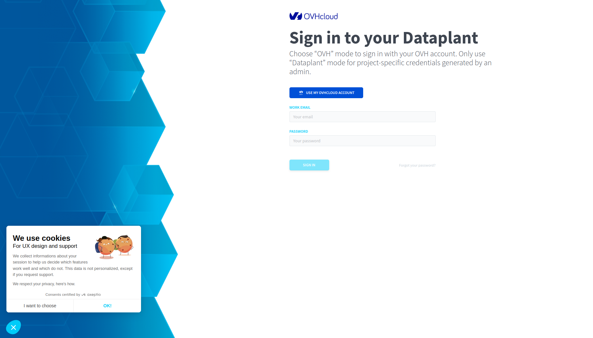
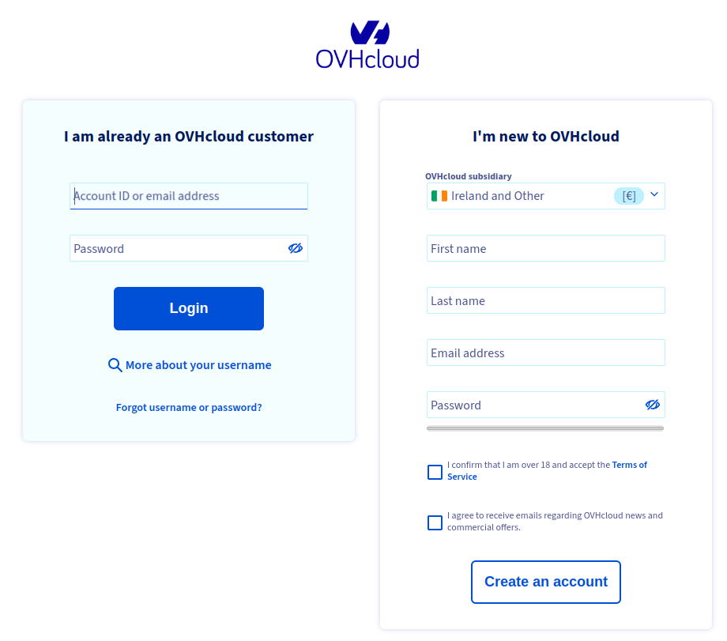

## How to access the Data Platform <small>Beta</small>

> [!warning]
>
> Data Platform is currently only deployed as a beta version. If you experience any difficulties and/or would like to discuss your experience with other users on discord <https://discord.gg/ovhcloud>, or get in touch on our community platform: <https://community.ovh.com/en/>.
> 

### Signin

Click [here](https://hq-fp.dataintegration.ovh.net) to access the Data Platform.

- If you are already an OVHcloud customer, click `USE MY OVHCLOUD ACCOUNT` link, then fill the form with your account ID or email address and your password.

- If you are not an OVHcloud customer but have received an invitation, enter your email address and password [here](https://hq-fp.dataintegration.ovh.net).

### Signup

If you are not an OVHcloud customer, you need to create an OVHcloud account from : <https://www.ovh.com/auth/?action=gotomanager&from=https://www.ovh.co.uk/&ovhSubsidiary=GB>.

Once you have created your OVHcloud account, signin to the Data Platform with your credentials