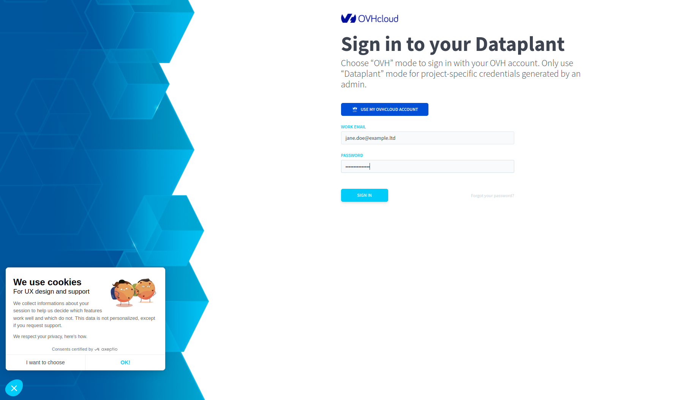

## How to access the Data Platform <small>Alpha</small>

> [!warning]
>
> Data Platform is currently only deployed as an alpha version. If you experience any difficulties and/or would like to discuss your experience with other users on discord <https://discord.gg/ovhcloud>, or get in touch on our community platform: <https://community.ovh.com/en/>.
> 

> [!warning]
>
> During the alpha, only invited users can access to the Data Platform.
>

### Signin

Click [here](https://hq-fp.dataintegration.ovh.net) to access the Data Platform.

- If you are an administrator, click on `USE MY OVHCLOUD ACCOUNT` link, then fill the form with your account ID or email address and your password:

> [!primary]
>
> The administration account needs to be linked to a NIC.
>

- If you are a regular user, fill the Login/Password form [here](https://hq-fp.dataintegration.ovh.net):

> [!primary]
>
> Regular users do not need an OVHcloud account to onboard.
>

### Signup

If you are not an OVHcloud customer, click [here](https://hq-fp.dataintegration.ovh.net) to access the Data Platform, then on `USE MY OVHCLOUD ACCOUNT` link and fill the form with your own informations as follow:

