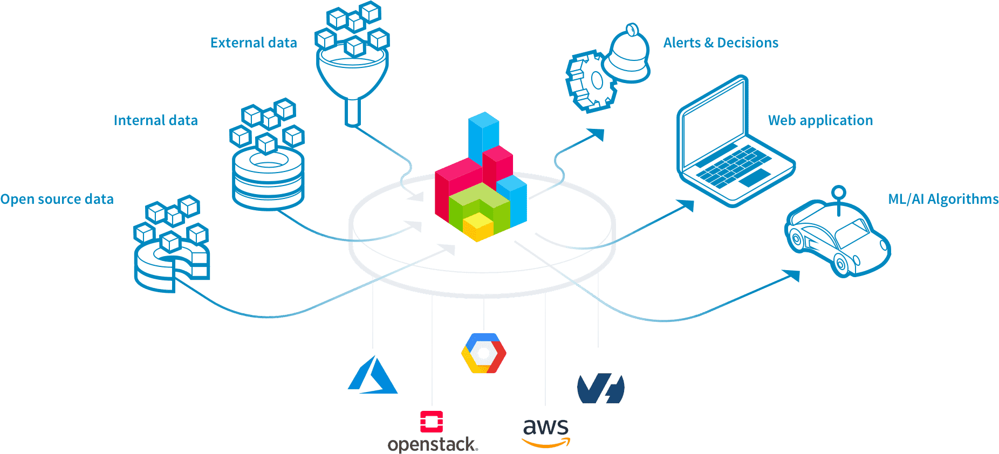
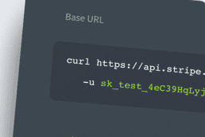

## Welcome to the Data Platform documentation portal !

By following this documentation, you’ll discover what **the Data Platform Platform** can do for you, uncover how to master its features and functionality, and learn how to use it to its full potential to **build any AI application** your heart desires.

### What is the Data Platform?

In a nutshell, the Data Platform is the first and only **end-to-end cloud-native platform designed to help you create, deploy and scale any analytics or AI application** your organization needs.

Let’s face it; building a data-intensive application is a very complex and daunting task.  
The Data Platform **hides all the technical complexities generated by your project and automatically manages them for you**, helping you focus on your business requirements and value. It will accelerate by 10x your project time-to-delivery, compared to other tools and platforms.

The Data Platform is **fully cloud-native** in its approach to building, deploying, and managing modern applications in cloud computing environments. It allows modern software teams to make highly scalable, flexible, and resilient analytics and AI applications on which they can iterate quickly.  
By using the Data Platform, you can focus on building software products instead of worrying about the underlying infrastructure. Your project will live and thrive on any public cloud from the get-go. It also offers you the option to deploy your project on-premise within your own servers, offering you complete leeway in the way you define your cloud architecture, and manage your data operations.

{.thumbnail}

### Platform design philosophy

The Data Platform enables organizations (whole companies, business units, departments, or individuals) to create and deploy robust and scalable cloud-native AI applications while leveraging the latest cloud technologies, architectures and software.

When we set out to create the Data Platform, we followed a simple design philosophy: **to offer an elegant solution that enables users to take on any data challenge and accelerate the application development cycle**. Following this inspiration, we designed a platform that hides technical complexities, and removes the need to make uncertain technological decisions or bend over backward to make them work, through 4 simple levels of automation:

{.thumbnail}

When working with the Data Platform, organizations create their own personal environments called Projects. Projects host all your data processes, models, algorithms and web applications. The physical data, in turn, is stored in a storage engine.

> [!primary]
>
>Access to the Projects is usually shared collaboratively, following **user access levels** defined by your organization. For example, a first group of users can be working on data access and transformation, another on the AI models, and a third on the web application interface.
>

A Project contains **all the components you need to manage your data's life cycle**, processes and rules and user access rights to make your data Projects a success. All these components are included in the illustration below. You can click on a component to learn more about it, or simply follow the guide’s logical flow, which will help you use the Data Platform in the most helpful way.

### What is an AI Application ?

So, what is an AI Application, you might ask? At Data Platform, we consider an *AI Application* to be any application that uses data for analytics, dashboarding, alerting, real-time automation, or to gain business insight using artificial intelligence or Machine Learning predictive models.

The data used by an AI Application can come from a variety of sources, including internal databases, ERP systems, IoT, and external datasets such as open-source or public information (weather, news, etc.).

### Finding Your Way Around This Documentation

We’re excited to have you on board ! There are four sections in this documentation that you can browse to discover the Data Platform, from the most basic to the more advanced. Anyone can use the Data Platform, from non-technical professionals to technical developers.

<a class="landing-link" href="/pages/public_cloud/data_platform/general/getting_started">
   
   

      <h2>GETTING STARTED</h2>
      
You’d like to get up and running as quickly as possible? No problem, we’ve got you covered! Check out this awesome Getting Started tutorial, which will help you build a Project using sample datasets.

   

</a>

<a class="landing-link" href="/pages/public_cloud/data_platform/getting-further">
   
   

      <h2>GETTING FURTHER</h2>
      
You can't get enough of the Getting Started guide and want to see hands-on tutorials for more advanced use cases? Check out our Getting Further guide series!

   

</a>

<a class="landing-link" href="/pages/public_cloud/data_platform/product">
   
   

      <h2>PLATFORM DOCUMENTATION</h2>
      
Starting out with Data Platform? Still unsure of what’s called what and figuring out how every feature works? This is for you.

   

</a>

<a class="landing-link" href="/pages/public_cloud/data_platform/technical">
   
   

      <h2>DEVELOPER DOCUMENTATION</h2>
      
You’re an advanced user and are exploring what’s under the hood, check out our component’s API Reference and SDK functions.

   

</a>

### Additional Resources

Looking for more information about the platform? At Data Platform we’re all about giving as much information as possible.

    <a class="landing-block" href="https://hq-fp.dataintegration.ovh.net/#/features">
        

        <h3>Roadmap</h3>
        
Help us prioritize on the next sweet feature by sharing your feedback on product suggestions.

    </a>
    <a class="landing-block" href="https://github.com/orgs/ovh/projects/16/views/6?sliceBy%5Bvalue%5D=Data+Platform">
        

        <h3>Changelog</h3>
        
Check out the latest product’s new feature releases, bug fixes and updates every Thursday.

    </a>
    <a class="landing-block" href="https://public-cloud.status-ovhcloud.com/">
        

        <h3>Status</h3>
        
Watch out for all ongoing maintenance, downtimes or service interruptions on our clusters.

    </a>

