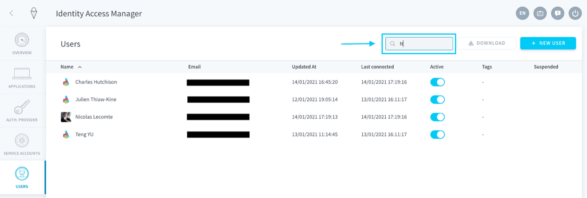
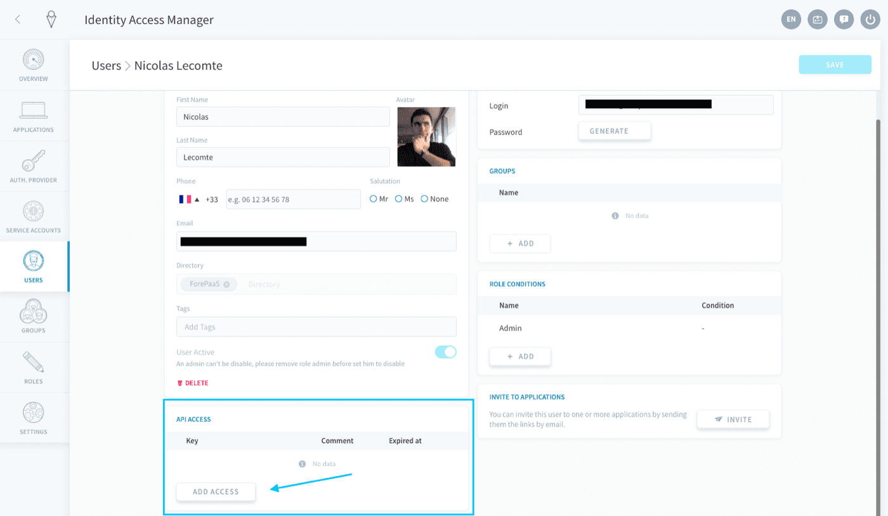
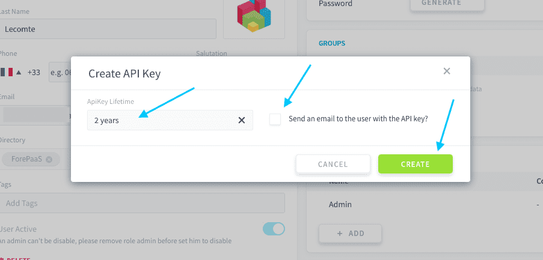
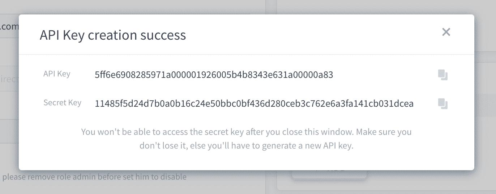
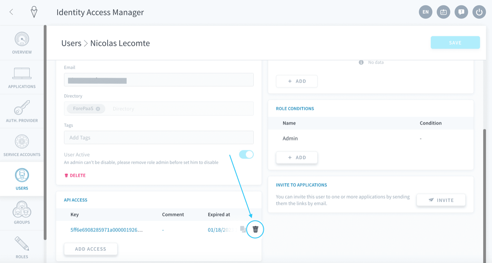
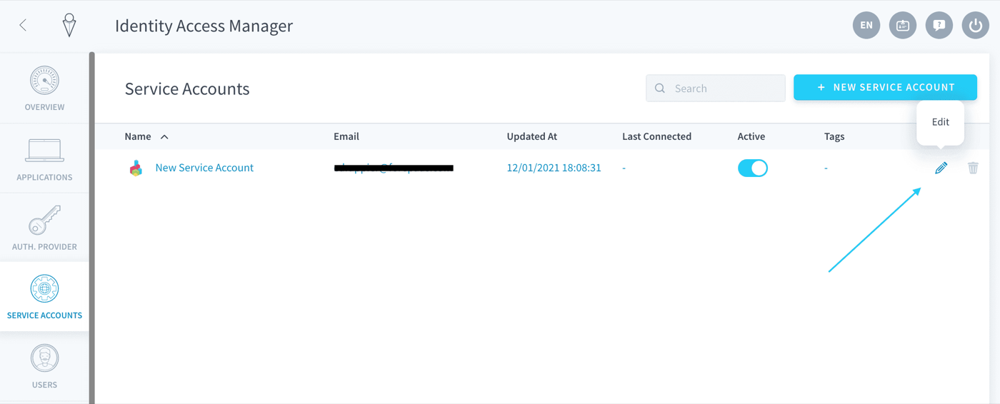
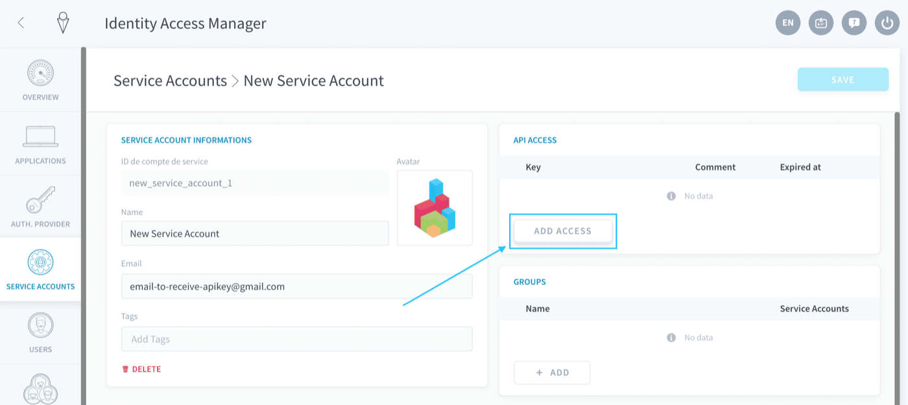
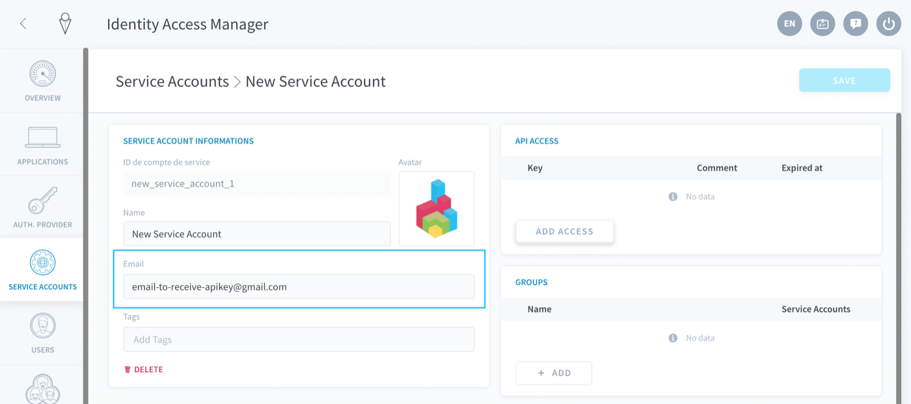
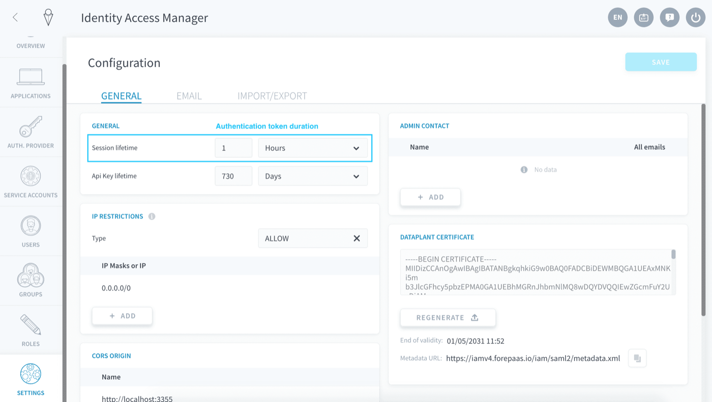

## Objective

If you want to connect to the Data Platform from outside of the platform, you will need to generate **API and secret keys** to authenticate. The *API key* is the public key associated to the user who is connecting to an API. The *secret key* is the private key known only to the user. The combination of the two is used to authenticate, through the generation of temporary [authentication tokens](#generate-an-authentication-token).

API and secret keys can be generated per [user](/pages/public_cloud/data_platform/product/iam/users/users) or [service account](/pages/public_cloud/data_platform/product/iam/users/service-accounts).

* [Generate new API/secret keys](#generate-a-new-set-of-api-and-secret-keys)
    * [For a user](#for-a-user)
    * [For a service account](#for-a-service-account)
* [Generate an authentication token](#generate-an-authentication-token)

## Generate a new set of API and secret keys

### For a user

Navigate to the **Users** tab of the Identity Access Manager. Search for the user for which you want to generate API & Secret keys, using the search bar on the top right if needed. Edit the user.

{.thumbnail}

In the user's settings, scroll down to the **API Access** panel and click on *Add access*.

{.thumbnail}

Select the lifetime of the keys (i.e. the expiration date from today) and whether you want to send an email to the user with the API & secret key information. Then press **Create**.

> [!primary]
>  The *Default* value can be changed in your Identity Access Manager settings.

{.thumbnail}

A new window will open with the API and secret key values.

> [!warning]
> After closing the window, there is no way to view the secret key again. Make sure you keep a record a the keys either by sending an email to the user or storing them in your code.

{.thumbnail}

To delete a key, hover over the key that you would like to delete and click on the **trash** 🗑️ icon. Once the key is deleted, the credentials for the keys will become inactive and cannot be use to authenticate anymore.

{.thumbnail}

### For a service account

Navigate to the **Service Accounts** tab of the Identity Access Manager. Search for the service account for which you want to generate API & Secret keys, using the search bar on the top-right if needed.

{.thumbnail}

In the service account settings, locate the **API Access** panel and click on *Add access*.

{.thumbnail}

After that, the [process is the same as for users](#for-a-user). Note that if you want to send an email with a record of the API and secret keys, you need to fill in an email address for the service account.

{.thumbnail}

## Generate an authentication token

### Generation scripts

Once you've created API & secret keys, you need to generate a dynamic authentication token in order to authenticate to ForePaaS via an API endpoint. Authentication tokens are only active for a short time: this duration can be configured in your IAM settings.

{.thumbnail}

To generate a token, simply run the command samples below.

> [!tabs]
> **cURL**
>> 
>> ```bash
>> curl --request POST \
>>  --url https://{project_subdomain}.eu.dataplatform.ovh.net/iam/login \
>>  --header 'Content-Type: application/json' \
>>  --data '{
>>    "auth_mode": "apikey",
>>    "apikey": "",
>>    "secretkey": ""
>>  }'
>> ```
>>
> **Python 3+**
>>
>> ```python
>> import requests
>>
>> url = "https://{project_subdomain}.eu.dataplatform.ovh.net/iam/login"
>>
>> payload = {
>>   "auth_mode": "apikey",
>>   "apikey": "",
>>   "secretkey": ""
>> }
>>
>> response = requests.request("POST", url, data=payload)
>>
>> print(response.text)
>> ```

> [!warning] 
> Make to update the **{project_subdomain}** else your calls won't go through.  
[How to find your Project subdomain](/pages/public_cloud/data_platform/product/project/config-ids#project-subdomain).

## Go further

Join our [community of users](/links/community).