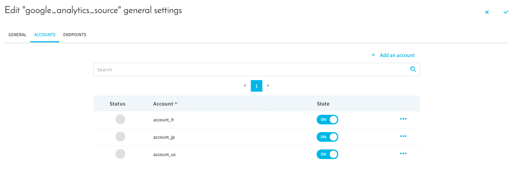
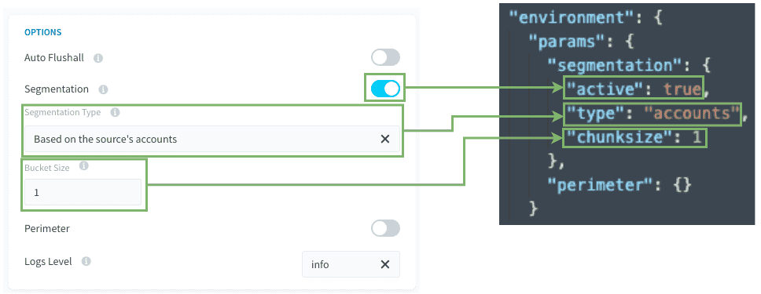
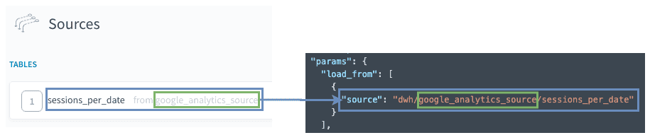
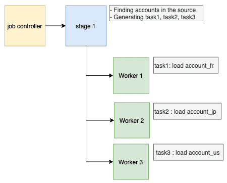

## Objective

For sources like social media which are user account specific, it is possible to configure multiple accounts for the same source within the data manager component. You can then leverage these accounts to split an DPE action using that source in several tasks, where each task will retrieve the data from one or more accounts.

- [Prerequisites](/pages/public_cloud/data_platform/getting-further/segmentation/source-accounts#prerequisites)
- [How to use this type of segmentation](/pages/public_cloud/data_platform/getting-further/segmentation/source-accounts#how-to-use-this-type-of-segmentation)
- [How does it work behind the scenes](/pages/public_cloud/data_platform/getting-further/segmentation/source-accounts#behind-the-scenes)

## Prerequisites

Before using this segmentation type, some points **must be checked**: 

- You already configured a source in the Data Catalog having some accounts such as below

{.thumbnail}

### Compatibility

This segmentation option is only compatible with the following actions and sources:

| Action Types | Source Types |
|          ---        |          ---          | 
| <ul><li>Load</li><li>Custom</li></ul> | <ul><li>**API**: Facebook, Twitter, Google Analytics, YouTube Private, YouTube Public, LinkedIn</li></ul> |

## How to use this type of segmentation?

To configure this segmentation option select *Based on the source's accounts* in the "Segmentation Type" dropdown.

{.thumbnail}

**Bucket size / chunksize:** Set how many accounts will be managed for each task. 
(default = 1)

### Load actions 

The [Load action source](/pages/public_cloud/data_platform/product/dpe/actions/load/00-load-index) will be the base of the segmentation.

{.thumbnail}

### Custom actions 

Make sure that the key `params.load_from[0].source` indicates the address of the source: 
*dwh/SOURCE_NAME/ENDPOINT_NAME*

> [!primary]
> Please check the previous screenshot for an example of the advanced JSON mode.

### Other tips

#### Load from only one set of accounts.

You can hard-code a list of account(s) you want to load, adding a key "values" as shown below.
It can be useful if you need to retrieve an history of a newly created account without retrieving all data from all accounts set.

The configuration would look like this:
 
```json
 "environment": {
    "params": {
      "segmentation": {
        "active": true,
        "type": "accounts",
        "values": ["account_jp","account_fr"]
        "chunksize": 1
      }
    }
  }
```

The values must correspond to the **account keys** set in the source, as you can see in the first use-case screen. (in the example : account_fr, account_jp, account_us).

if "values" is not present, the job will retrieve data from all set accounts in the source that are enabled.

## Behind the scenes

If your action has a segmentation **Based on the source's accounts**,
when executing the action, or the action in a workflow:

1. The Job Controller splits the action into multiple tasks, each with a different account (or set of accounts, depending on the `chunksize` configuration) amongst the accounts set in the source
2. Then each **worker** executes **each task one by one**.  
This means that there is no issue for having hundreds of tasks, your action will be parallelized regarding the number of workers.

{.thumbnail}

## Go further

Join our [community of users](/links/community).