## Objective

This tutorial demonstrates how to use the [Trino Connector](/pages/public_cloud/data_platform/product/data-catalog/sources/connectors/trino) to extract data from one project into another on the Platform.

* [Introduction](#introduction)
    * [Requirements](#requirements)
    * [Concepts overview](#concepts-overview)
    * [Use the Trino Connector](#use-the-trino-connector)
        * [Steps to follow at source project](#steps-to-follow-at-source-project)
        * [Steps to follow at destination project](#steps-to-follow-at-destination-project)
* [Using the extracted data](#using-the-extracted-data)

## Introduction

### Requirements

To follow this tutorial, you need to be familiar with the [Data Catalog](/pages/public_cloud/data_platform/product/data-catalog/00-data-catalog-index), [Analytics Manager](/pages/public_cloud/data_platform/product/am/00-analytics-manager-index), [Identity Access Manager](/pages/public_cloud/data_platform/product/iam/00-iam-index) and you should preferably have done the [Getting Started guide](/pages/public_cloud/data_platform/getting-started/00-getting-started-index). The essential is that you know what [Sources](/pages/public_cloud/data_platform/product/data-catalog/sources/00-sources-index) are for and how to use them.

### Concepts Overview

It is common to have multiple projects running across the platform. In the scenario where you would want to extract and transfer data from an existing project into another, the *Trino Connector* does the work. 

This is made possible thanks to the [managed Trino query engine](/pages/public_cloud/data_platform/product/am/resources) which is part of the [Analytics Manager](/pages/public_cloud/data_platform/product/am/00-analytics-manager-index) service. It allows to query the datasets of the project - and can be connected to from the external world.

This tutorial will follow a two-step process:

- Make the required changes at the **source project** to allow the extraction of data.
- Use the Trino Connector at the **destination project** as a source to move the data.

Now let's see how all of this works in practice!

## Use the Trino Connector

### Steps to follow at source project

The first few steps involve the use of the [Analytics Manager](/pages/public_cloud/data_platform/product/am/00-analytics-manager-index) and the [Identity Access Manager](/pages/public_cloud/data_platform/product/iam/00-iam-index).

1. Make sure the **Trino Query Engine** is activated. This can be found in the *Resources* tab within the *Analytics Manager*.

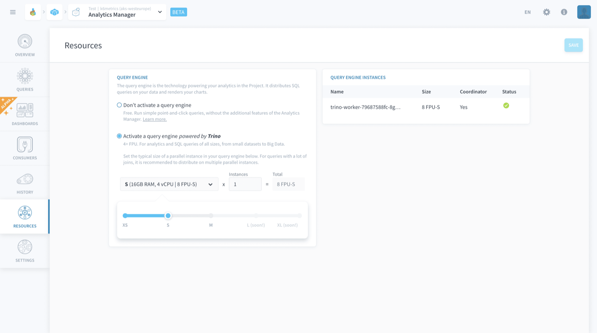{.thumbnail}

2. Create a new query in SQL mode and find the *catalog* and *schema* names you want to connect to.

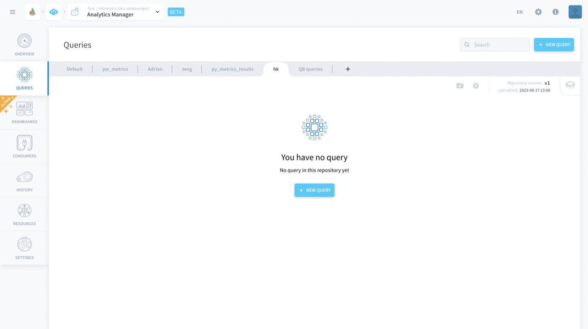{.thumbnail}

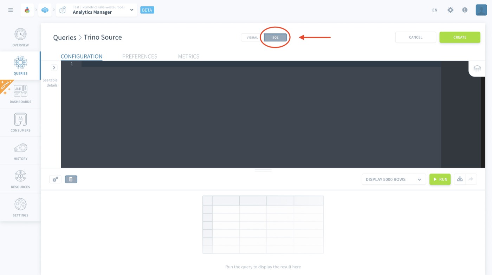{.thumbnail}

Execute the following SQL commands to retrieve the source *catalog* and *schema*:

```sql
SHOW CATALOGS
```

copy/save the catalog you need as **CATALOG_NAME**

{.thumbnail}

```sql
SHOW SCHEMAS FROM CATALOG_NAME 
```

copy/save the schema you need as **SCHEMA_NAME**

> [!primary]
> Make sure to replace *CATALOG_NAME* with the chosen source Catalog

You can see the list of available schemas to choose from the selected *catalog*.
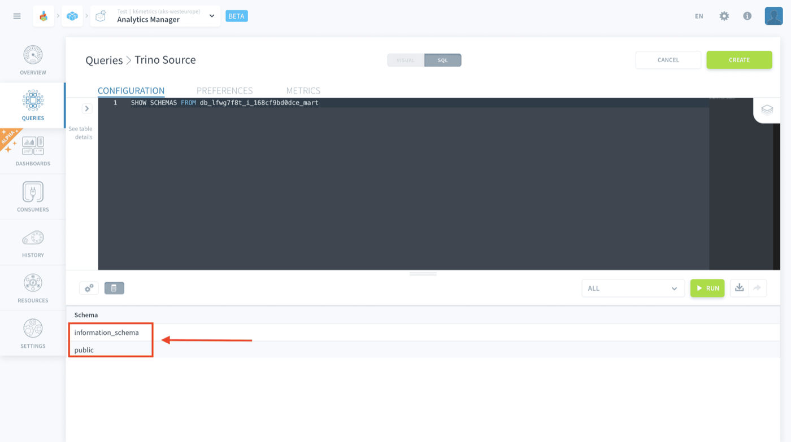{.thumbnail}

3. Open the *Identity Access Manager* and create a new service account for the purpose of this transfer.

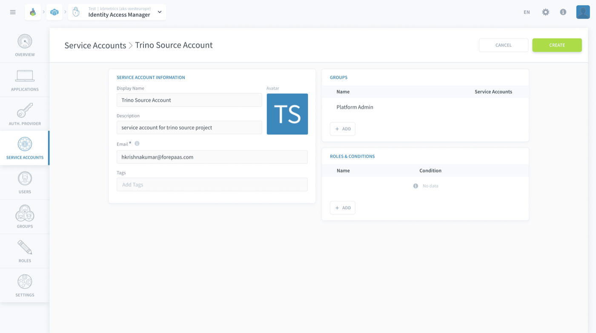{.thumbnail}

> [!primary]
> Make sure to add *Platform Admin* as the group for this service account

Once the service account has been successfully create, you need to generate a key for the *API Access*. Click on the add button as shown in the picture below, followed by create.

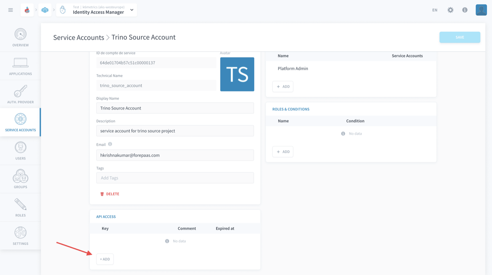{.thumbnail}

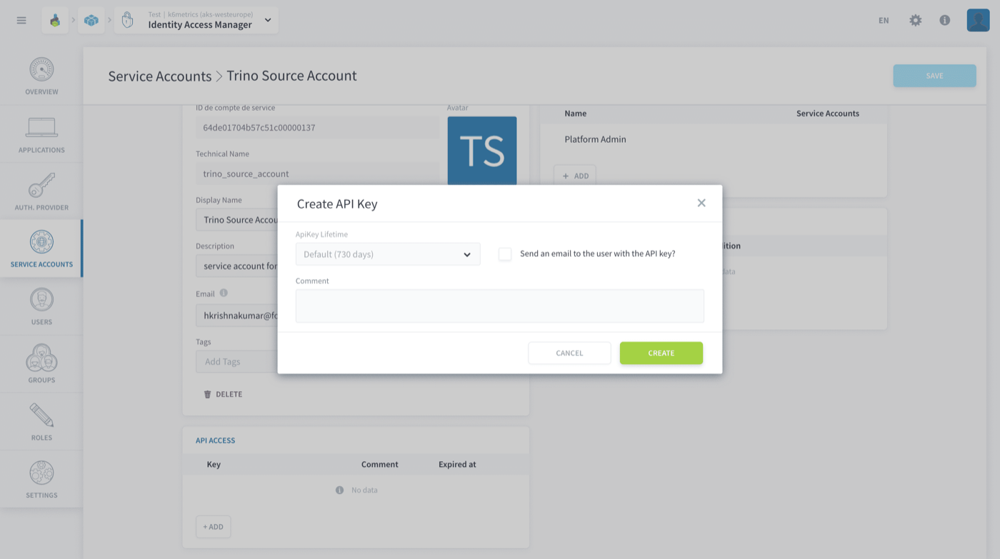{.thumbnail}

You will be provided with the *API Key* and the *Secret Key*. Make sure to copy and save them securely as you wont be able to access the *Secret Key* once you leave this page.

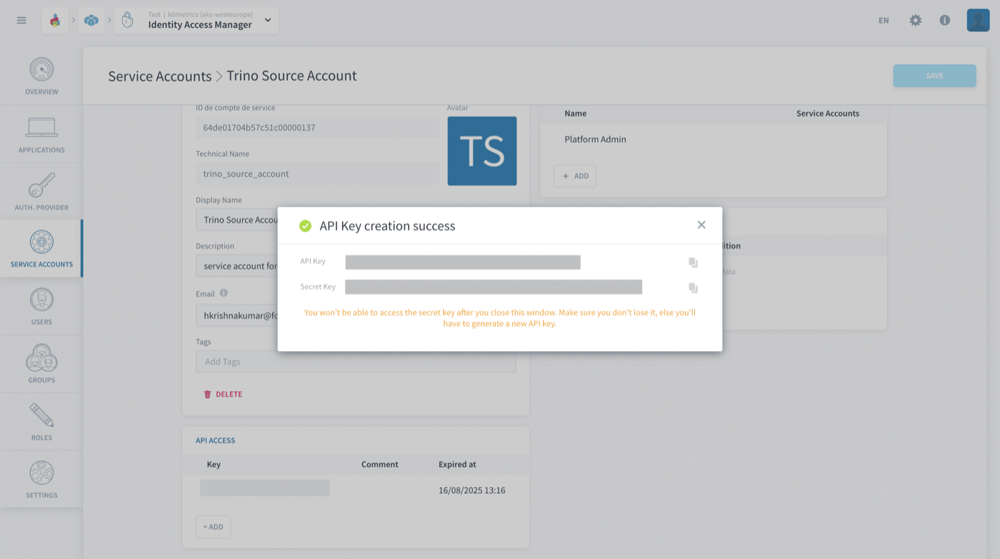{.thumbnail}

You have successfully completed all the steps required at the source project, the next part of the tutorial will be continued on the destination project.

### Steps to follow at destination project

1. Proceed to the *Data Catalog* and add a new Trino Source.

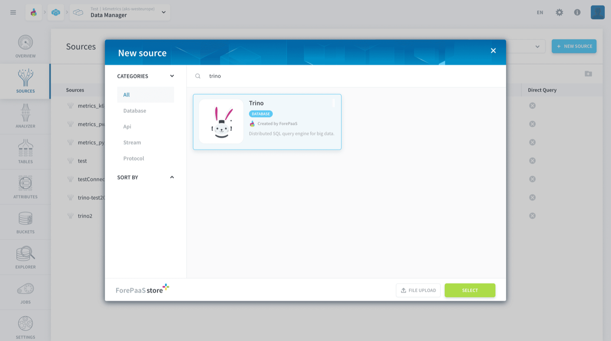{.thumbnail}

2. Fill in the details as given below and click on connect

 - **Host:** replace by your ***source*** *Project_Name* + `-query.eu.dataplatform.ovh.net`
 - **Port:** 443
 - **Catalog:** replace with your *CATALOG_NAME*
 - **Schema:** replace with your *SCHEMA_NAME*
 - **Username:** replace with *API_KEY*
 - **Password:** replace with *SECRET_KEY*
 - **SSL:** activated

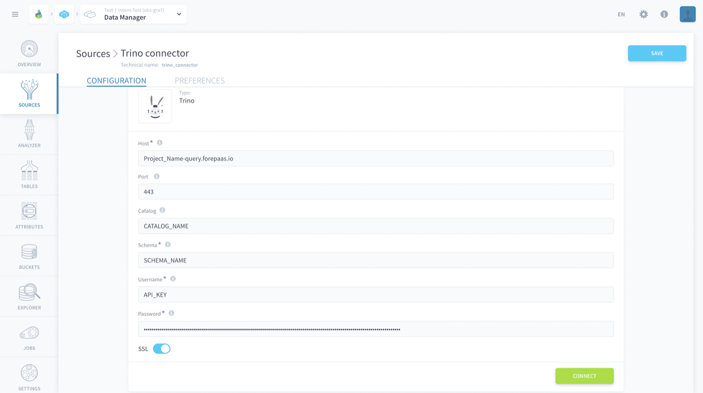{.thumbnail}

3. Once the Trino Connection has been successfully established, the list of available tables will be populated. Click on the box next to table name you desire to extract from the source and click create.

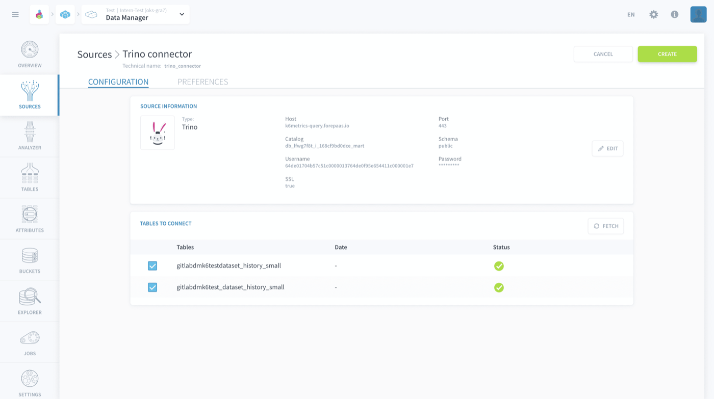{.thumbnail}

## Using the extracted data

Once all the previous steps have been completed, you can visit the *Analyzer* tab within the *Data Catalog* to verify the extracted tables.

To use this extracted data you can follow **step three** of the [Getting Started](/pages/public_cloud/data_platform/getting-started/app-init/dpe) Tutorial.

## Go further

Join our [community of users](/links/community).