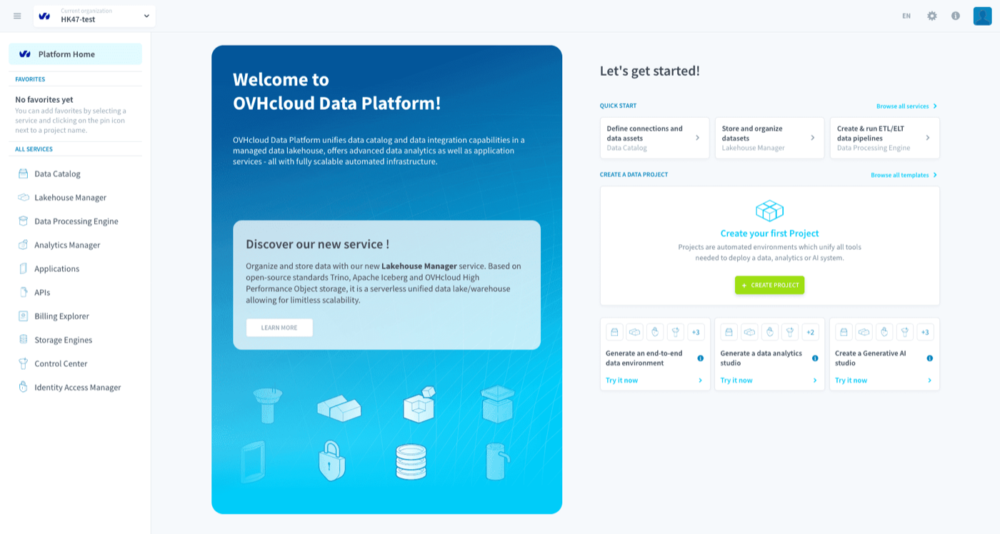
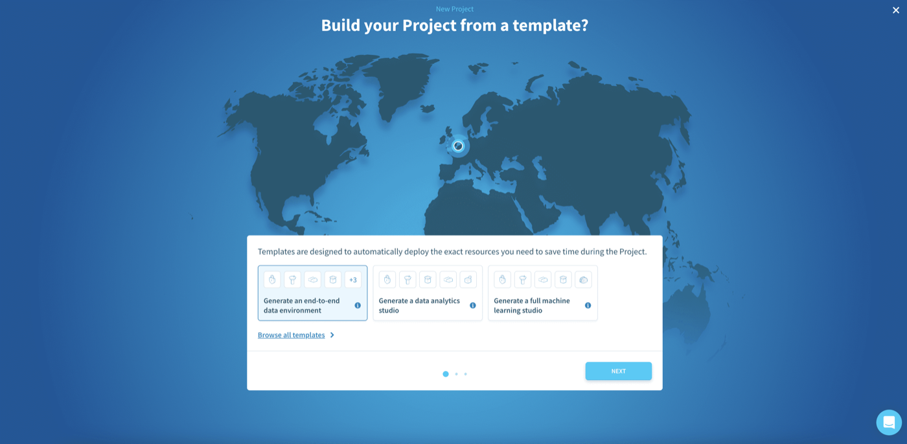

## Objective

The Getting Started guide will teach you **how to create an analytics project using the Platform**, through concrete examples and best practices. At the end of this tutorial, you will be completely self-sufficient. You’ll be able to create and deploy your own customized analytics application with sophisticated data processing and machine learning predictions.

The guide uses sample data, and demonstrates how to build an analytics application with predictive insights correlating subway traffic in the city of Chicago with weather variables and the time of the year.

{.thumbnail}
*Photo by <a href="https://unsplash.com/fr/@skylargereld?utm_source=unsplash&utm_medium=referral&utm_content=creditCopyText">Skyler Gerald</a> on <a href="https://unsplash.com/fr/photos/jeMnUm2fG8s?utm_source=unsplash&utm_medium=referral&utm_content=creditCopyText">Unsplash</a>*

This Getting Started guide is organized into two tutorials. The first tutorial will show you how to build your first application using the Platform. In the second tutorial, you will learn how to set-up and train a machine learning model using historical data, in order to add smart recommendations to your analytics application.

Sounds interesting and exciting? Then let’s get started. Each tutorial only takes about **1 hour** to complete.

> [!primary]
> We recommend using **Chrome** as your default browser. If you're using a different browser and face any issues, check out the link to our support portal to get in touch.

## Setting-up your environment

Before you start working with data, you will need to set-up a working project environment. Your working environment is called a **Project**. It includes all the necessary tools and dedicated compute and storage resources you’ll need to build your analytics application. 

{.thumbnail}

When asked, choose the template to create an **end-to-end project**. This will instantiate all the services on the Platform to be ready to use in your project.

{.thumbnail}

Proceed with the creation. Once you have spinned up a Project, open it to [move on to creating your first application](/pages/public_cloud/data_platform/getting-started/app-init/00-app-init-index)!

## Your feedback is gold!

We are really excited that you are getting your hands on the platform. Our support & product teams are truly dedicated to making your experience as smooth as possible. For that to happen **don't hesitate to reach out directly** and **don't hold back for sharing feedback** even without filters. We'd rather know what works and what doesn't, it's all about the learning experience!

## Go further

Join our [community of users](/links/community).