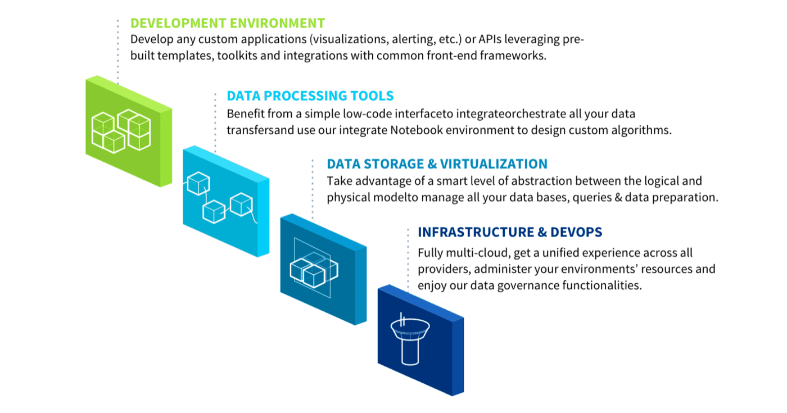

## Objective

Welcome to the **Data Platform product documentation**!

This product documentation was designed with you in mind. Our goal is to help you be more successful with your Projects, by ensuring that you get the most out of Data Platform, and that you actually have a great experience using it.

You will acquire an in-depth comprehension of the Platform by reading through this guide. We have included **thorough reviews of every component and detailed explanations of the functionalities available** and how to make the best use of them. This guide also includes illustrated examples and visuals to help you better understand new concepts and features.

## Data Platform design philosophy

Data Platform enables organizations (whole companies, business units, departments, or individuals) to create and deploy robust and scalable cloud-native AI applications while leveraging the latest cloud technologies, architectures and software.

When we set out to create the Platform, we followed a simple design philosophy: **to offer an elegant solution that enables users to take on any data challenge and accelerate the application development cycle**. Following this inspiration, we designed a platform that hides technical complexities, and removes the need to make uncertain technological decisions or bend over backward to make them work, through 4 simple levels of automation:

{.thumbnail}

When working with the Platform, organizations create their own personal environments called [Projects](/pages/public_cloud/data_platform/product/project/00-project-index). Projects host all your data processes, models, algorithms and web applications. The physical data, in turn, is stored in a [storage engine](/pages/public_cloud/data_platform/product/storage-engine).

> [!primary]
> Access to the Projects is usually shared collaboratively, following **user access levels** defined by your organization. For example, a first group of users can be working on data access and transformation, another on the AI models, and a third on the web application interface.

A Project contains **all the components you need to manage your data's life cycle**, processes and rules and user access rights to make your data Projects a success. All these components are included in the illustration below. You can click on a component to learn more about it, or simply follow the guide’s logical flow, which will help you use the Platform in the most helpful way.

## Get started now!

When a Project is launched over 60+ microservices are being deployed in production. automatically provisions the machines on the cloud provider selected in less than 8 minutes without any input from the user. Check-out the articles below to get your first Project ready for action. 

[Learn how to create a project in 4 simple steps](/pages/public_cloud/data_platform/product/project/project_creation)
[Read more about the Platform services](/pages/public_cloud/data_platform/product/project/00-project-index)

## Go further

Join our [community of users](/links/community).