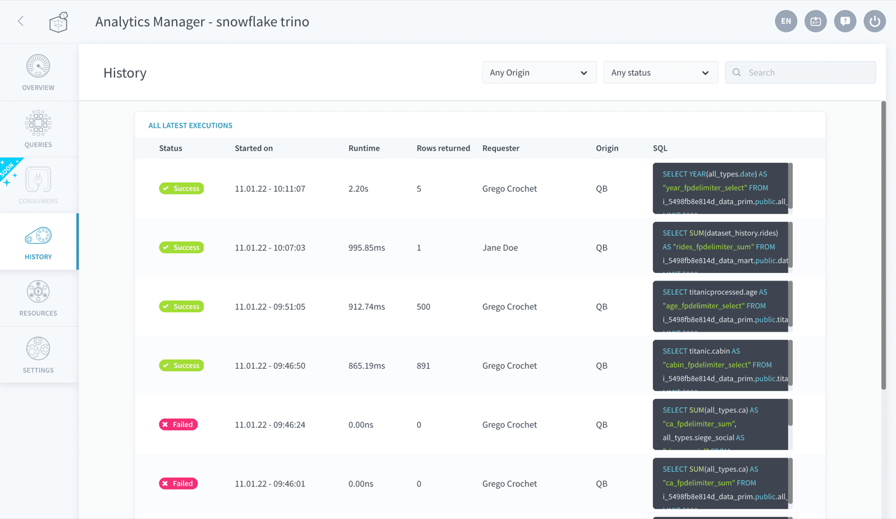

## Objective

The history tab allows you to see the list of the latest query executions such as:

- queries ran from the Analytics Manager interface
- queries passed on from an [API](/pages/public_cloud/data_platform/product/api-manager/00-api-manager-index) (or an [application](/pages/public_cloud/data_platform/product/app-manager/00-app-manager-index))
- queries executed on the fly in the [Lakehouse Manager Explorer](/pages/public_cloud/data_platform/product/lakehouse-manager/explorer)

{.thumbnail}

A *SQL* column is displayed to show the **actual query string executed by the Analytics Manager** behind the scenes. This query is automatically converted from the original query written by the user (either in [SQL](/pages/public_cloud/data_platform/product/am/queries/sql#write-queries-in-the-sql-editor) or using the [visual builder](/pages/public_cloud/data_platform/product/am/queries/visual)) which usually has a much simpler syntax. Typically, the Analytics Manager will automatically:

- append engine/database/schema information when necessary to route the query to the correct [data source](/pages/public_cloud/data_platform/product/data-catalog/sources/00-sources-index) or [storage engine](/pages/public_cloud/data_platform/product/storage-engine) 
- replace the [virtual attributes](/pages/public_cloud/data_platform/product/lakehouse-manager/attributes#virtual-attributes) with their corresponding SQL definition

> [!primary]
> It is necessary to activate a [query engine](/pages/public_cloud/data_platform/product/am/resources) in order to see the query history.

## Go further

Join our [community of users](/links/community).