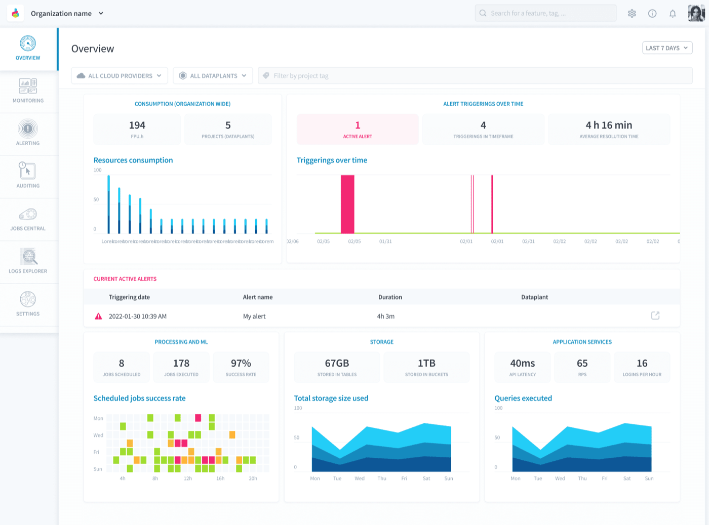
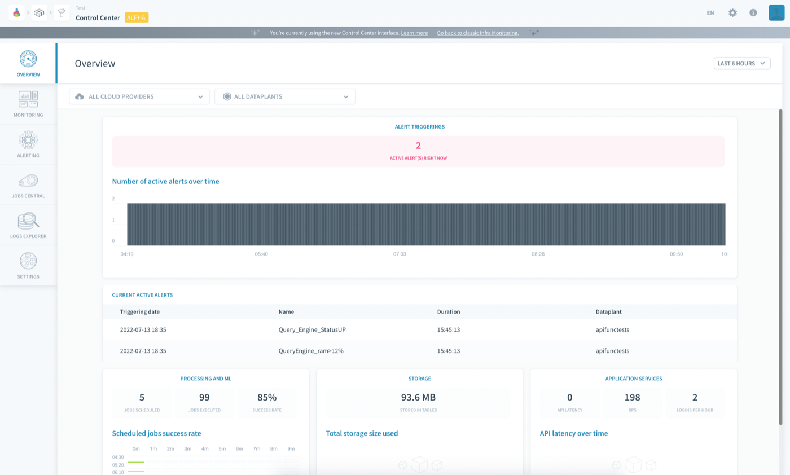
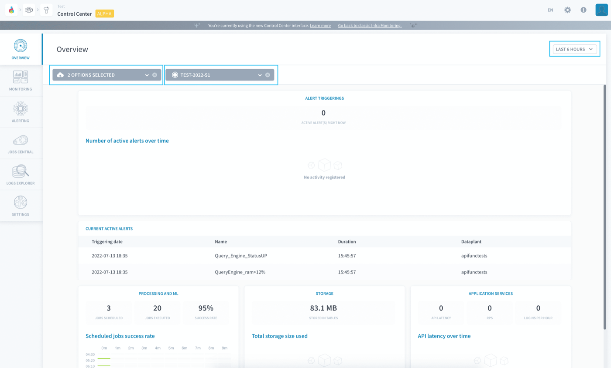

## Objective

The Control Center allows Project administrators to get full observability on each service and component in their data Project. They can see across their data pipelines, applications, and deployed instances to **collect metrics, monitor performance, drill-down on logs, set up alerts when issues arise, and ensure scalability** by adding more resources on any service as needed.

{.thumbnail}

The Control Center can be opened either at the Project's level from the Project home page, or at the organization's level from the header buttons. At the organization's level, all Projects are called and return their respective metrics.

{.thumbnail}

Most metrics can be filtered by timeframe, Project and cloud provider.

{.thumbnail}

Check out the following features in the Control Center product documentation.

- [Monitoring](#monitoring)
- [Alerting](#alerting)
- [Jobs Central](#jobs-central)
- [Logs Explorer](#logs-explorer)
- [Scale components in your Project](#scale-components-in-your-Project)

## Monitoring

Use laser-sharp monitoring features to get detailed feedback on what is happening in terms of CPU, memory, storage, network usage and more, to anticipate and detect performance issues on deployed production-critical components.

[Discover monitoring panels](/pages/public_cloud/data_platform/product/cc/monitoring)

## Alerting

Configure alerts to get notifications on performance problems for specific components, such as jobs failure, health checks or high CPU/memory usage. Fine-tune trigger conditions and get notified to take action as soon as issues arise.

[Learn how to configure alerts](/pages/public_cloud/data_platform/product/cc/alerting/00-alerting-index)

## Jobs Central

Audit and track your job executions, from data processing workloads to AI training tasks, all from a single centralized location.

[Learn how to configure alerts](/pages/public_cloud/data_platform/product/cc/job-central)

## Logs Explorer

Explore and download all your logs for on-the-spot troubleshooting. For each deployed instance in your Project, watch current activity in real-time or drill-down on past logs on the timeframe of your choice.

[Explore logs from the Control Center](/pages/public_cloud/data_platform/product/cc/logs)

## Scale components in your Project

the Platform **scales on-demand** and allocates resources dynamically depending on your requirements. Any PoC Project can therefore be operationalized in a couple of clicks. You can then adjust the performance of your application on demand.

The following elements can be scaled from the Control Center:

- [Project APIs](/pages/public_cloud/data_platform/product/api-manager/00-api-manager-index) *can be scaled horizontally and vertically*
- [Applications](/pages/public_cloud/data_platform/product/app-manager/00-app-manager-index) *can be scaled horizontally and vertically*
- The Application Service component: *an infrastructure service to control APIs and apps, can be scaled vertically*
- The Query Builder Legacy *can be scaled vertically*
- [Query engines](/pages/public_cloud/data_platform/product/am/resources) *can be scaled horizontally and vertically*
- [Storage engines](/pages/public_cloud/data_platform/product/storage-engine) *can be scaled horizontally and vertically*
- [Data Processing Engine jobs](/pages/public_cloud/data_platform/product/dpe/jobs/execution-preferences/resources) *can be scaled horizontally and vertically*

Increase the vertical/horizontal resources for the desired component in the [monitoring panel](/pages/public_cloud/data_platform/product/cc/monitoring) for its respective component.

[Allocate more resources to a component in the Control Center](/pages/public_cloud/data_platform/product/cc/monitoring#allocate-more-resources-to-a-component-in-the-control-center)

## Go further

Join our [community of users](/links/community).