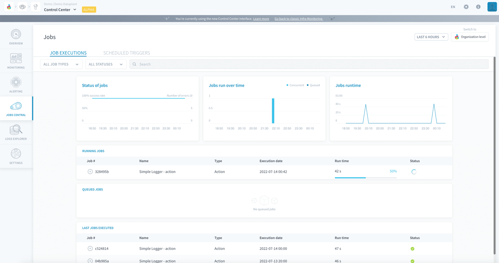
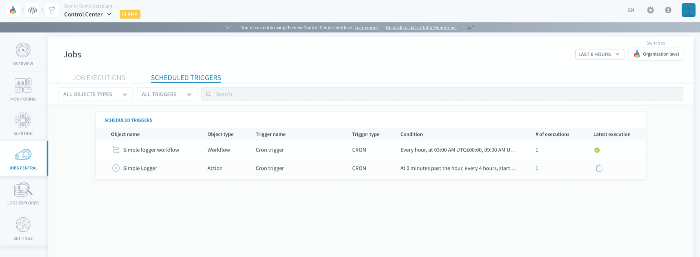

## Objective

The Jobs Central is the watchtower from where all job executions on the platform - past, present, queued and scheduled - can be monitored. 

On the platform, a 'job' (or 'job execution') is the unitary execution of code, which can be either launch manually from UI or API, or scheduled based on triggers. Many elements on the platform, such as [Data Processing Engine workflows](/pages/public_cloud/data_platform/product/dpe/workflows/00-workflows-index) and [ML pipelines](/pages/public_cloud/data_platform/product/ml/pipelines/00-pipelines-index) are executed in the form of jobs. The computing power allocated to this job is usually set by the user. Some other processes on the platform, like the physical build of your data model, are also jobs fully managed by the platform

{.thumbnail}

If the page is opened at the organization level, all jobs across all Projects will be visible.

- [Monitor job executions](/pages/public_cloud/data_platform/product/cc/job-central#monitor-job-executions)
- [Monitor scheduled job triggers](/pages/public_cloud/data_platform/product/cc/job-central#Monitor-scheduled-job-triggers)

## Monitor job executions

The *Job executions* page lists the executions of the following types of jobs:

- [Data Processing Engine actions](/pages/public_cloud/data_platform/product/dpe/actions/00-actions-index) job executions
- [Data Processing Engine workflows](/pages/public_cloud/data_platform/product/dpe/workflows/00-workflows-index) job executions
- [Machine Learning dataset generation](/pages/public_cloud/data_platform/product/ml/pipelines/execute/00-execute-index#dataset-generation-jobs) jobs
- [Machine Learning training](/pages/public_cloud/data_platform/product/ml/pipelines/execute/00-execute-index#training-jobs) jobs
- [Machine Learning testing](/pages/public_cloud/data_platform/product/ml/pipelines/execute/00-execute-index#testing-jobs) jobs
- [Data Catalog metadata extract](/pages/public_cloud/data_platform/product/data-catalog/analyzer/extract-metadata) jobs
- Lakehouse Manager physical build jobs

If needed, this page can be filtered on only the executions that have triggered by a CRON schedule.

## Monitor scheduled job triggers

The *Scheduled triggers* page lists all the CRON-triggers that have been set on the following elements:

- [Data Processing Engine actions and workflows](/pages/public_cloud/data_platform/product/dpe/jobs/execution-preferences/00-execution-preferences-index#triggers) 
- [Machine Learning pipelines](/pages/public_cloud/data_platform/product/ml/pipelines/execute/triggers)

It allows you to have an overview of the recurrent computing activity on your Projects.

{.thumbnail}

## Go further

Join our [community of users](/links/community).