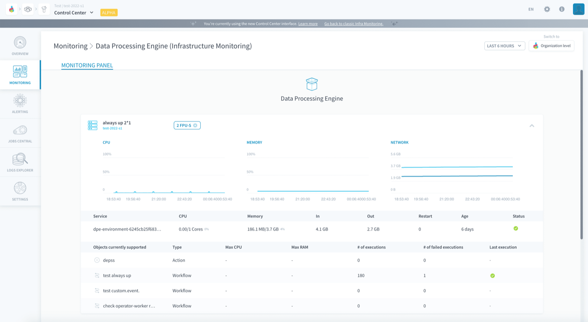
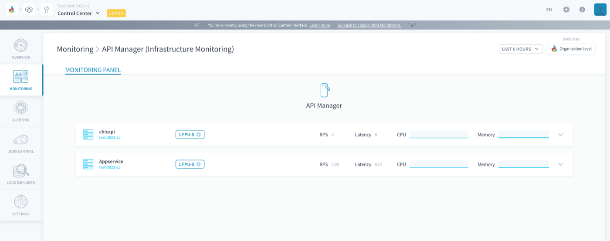
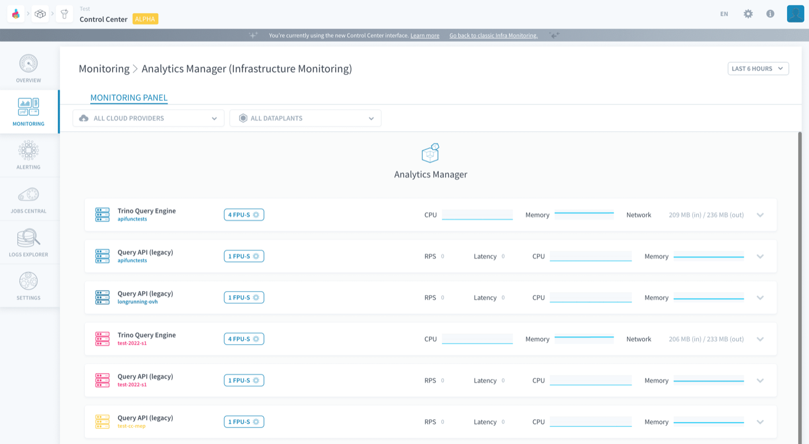
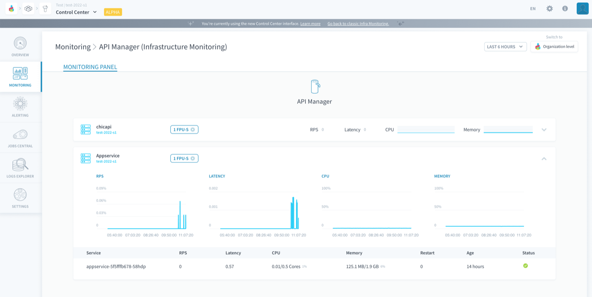
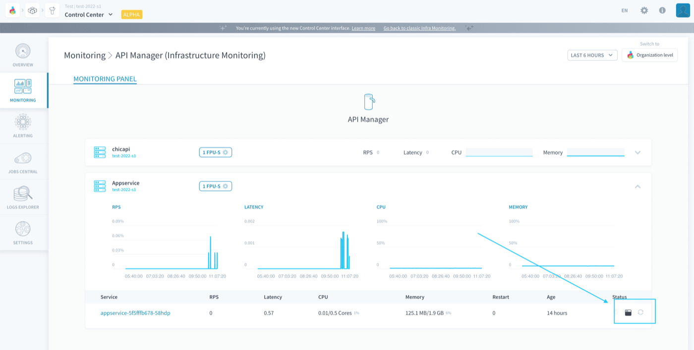
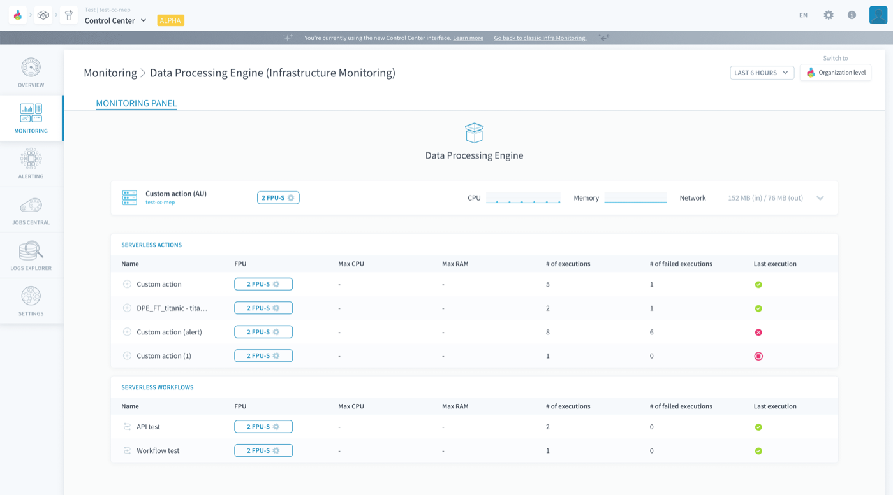
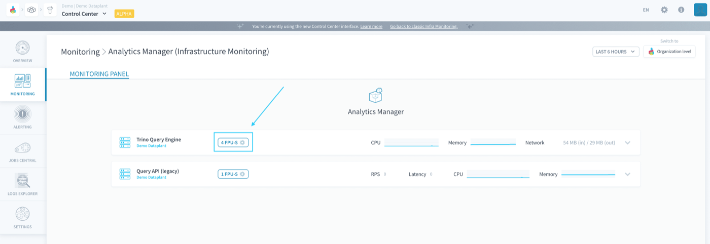
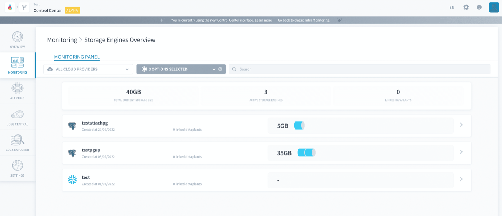

## Objective

Monitoring panels are **dashboards built to monitor key infrastructure metrics** about all the elements in a Project. Giving a bird's-eye view of your entire data Project's health status, from your data processing job executions to the RAM usage of your APIs and apps, monitoring panels can even be opened at the level of the [organization](/pages/public_cloud/data_platform/product/organisations/orga_settings) to keep an eye on all your Projects at once.

{.thumbnail}

By default, Projects come with a few default monitoring panels, to watch the basic metrics of your data system, and react to failures by allocating more resources.

- [The Platform default monitoring panels](#the-platform-default-monitoring-panels)
    - [Allocate more resources to a component in the Control Center](#allocate-more-resources-to-a-component-in-the-control-center)
- [Custom monitoring panels](#custom-monitoring-panels)

## The Platform default monitoring panels

A few monitoring panels are available by default when you open the Control Center: *Infrastructure Monitoring* and *Overview* panels. Those panels are non-editable and give you insight on the active services in your data Project.

### *Infrastructure Monitoring* panels

Those panels give you full visibility on all the infrastructure elements deployed in [each component of your Project](/pages/public_cloud/data_platform/product/project/00-project-index#what-are-the-components-of-a-project), and allow you to edit the allocated resources of jobs and deployments.

They generally list the following things:

- [Deployed instances](#deployed-instances)
- If applicable, [serverless executions](#serverless-executions)

#### Deployed instances

Displayed with a server icon, Infrastructure Monitoring panels list **all instances that are currently deployed**, along with their metrics.

{.thumbnail}

If the monitoring panel is opened at the level of the organization, each different Project will be color coded (cyan, grey blue, navy blue, pink red, and so on). Each deployed instance visible on the monitoring panel will bear the colors of its Project.

{.thumbnail}

Each deployed instance shows [CPU](https://en.wikipedia.org/wiki/CPU_time) usage *(in % of total allocated)*, [RAM](https://en.wikipedia.org/wiki/Random-access_memory) usage *(in % of total allocated)* and **Network** *(total in and out traffic since the birth of the service - in GB of data moved)*. Some instances, mostly APIs, also show [requests-per-second (RPS)](https://en.wikipedia.org/wiki/Web_server#requests_per_second) and [Latency](https://en.wikipedia.org/wiki/Latency_(engineering)) *(in s)* metrics.

Those values are displayed both at the level of the deployment, as well as broken down per worker in it - in which case only the instant current value is displayed. The **age** of each worker (time elapsed since it was created or last hard-rebooted), as well as the number of automatic **restarts** over its age is also shown.

{.thumbnail}

It is possible to check the execution logs of each worker in the deployment, and to reboot it if needed.

{.thumbnail}

Finally, some deployments show additional informations:

- [Always-up deployments](/pages/public_cloud/data_platform/product/dpe/jobs/execution-preferences/00-execution-preferences-index#always-up) show the [actions](/pages/public_cloud/data_platform/product/dpe/actions/00-actions-index) / [workflows](/pages/public_cloud/data_platform/product/dpe/workflows/00-workflows-index) that use them
- [Model APIs](/pages/public_cloud/data_platform/product/ml/pipelines/execute/00-execute-index#deployment-jobs) show the [machine learning models](/pages/public_cloud/data_platform/product/ml/models/00-models-index) that are deployed on them

#### Serverless executions

When it is applicable to the component, the corresponding monitoring panel displays the [serverless](/pages/public_cloud/data_platform/product/dpe/jobs/execution-preferences/00-execution-preferences-index#serverless) jobs with their execution metrics (status, runtime, etc). Executed objects are ranked by descending value of latest computing power consumption, making this view typically useful to watch at a glance the jobs that run fine and those that need increased attention or computing power.

{.thumbnail}

#### Allocate more resources to a component in the Control Center

For the components that can be scaled horizontally, you can **parallelize their workload** on several containers by selecting the number of parallel instances on which they will run.

For the components that can be scaled vertically, you can allocate **more computing power** by increasing the number of Data Platform Units (DPU) of each instance. The DPU is a unit of processing capability, representing access to a certain amount of CPU and memory, as such:

* **DPU**: general processing - corresponds to approximately *1 CPU* and *2 GB of RAM*, based on hardware availability. 

Increase the vertical/horizontal resources for the desired component by clicking on the **gears** button.

{.thumbnail}

### *Overview* panels

Those panels give you a high-level overview of the organization-level products you are using for your Projects: [Projects](/pages/public_cloud/data_platform/product/project/00-project-index).and [storage engines](/pages/public_cloud/data_platform/product/storage-engine).

{.thumbnail}

They are integrated with the rest of the platform, and allow you to edit configurations such as the allocated resources of storage engine instances.

## Custom monitoring panels

This feature will soon be available! 

## Go further

Join our [community of users](/links/community).