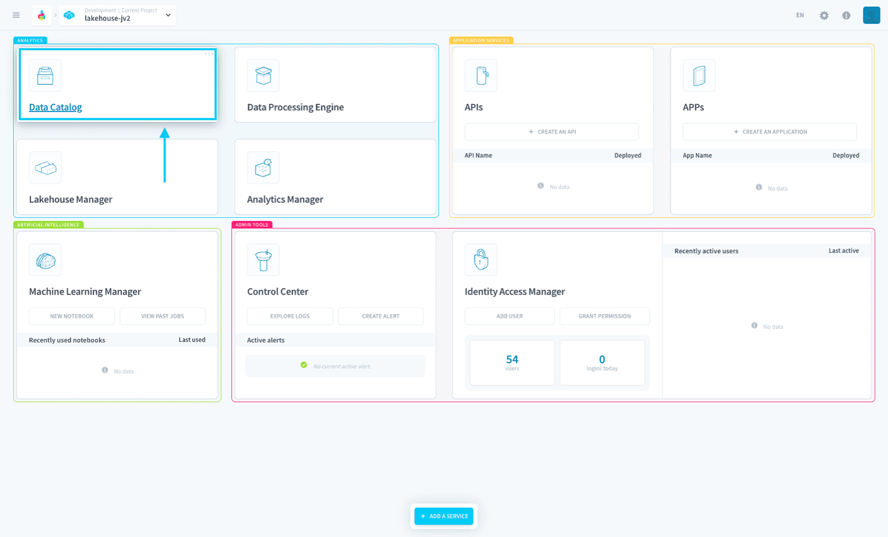

## Objective

The Data Catalog is the **central repository for all your Project's data Sources**.

It allows you to manage all your sources by letting you connect to your [data sources](/pages/public_cloud/data_platform/product/data-catalog/sources/00-sources-index), [analyze](/pages/public_cloud/data_platform/product/data-catalog/analyzer/00-analyzer-index) them, and add [blueprint rules](/pages/public_cloud/data_platform/product/data-catalog/analyzer/add-blueprint-rules) for setting formatting standards.

{.thumbnail}

As the Data Catalog is one of the main components and has vast features, it can be a little difficult for first-timers to understand its full usage well. 

Fortunately, we have prepared a detailed tutorial explaining each sub-component!

[Check-out the Data Catalog's key concepts](/pages/public_cloud/data_platform/product/data-catalog/understanding-data-catalog-further)

## Go further

Join our [community of users](/links/community).