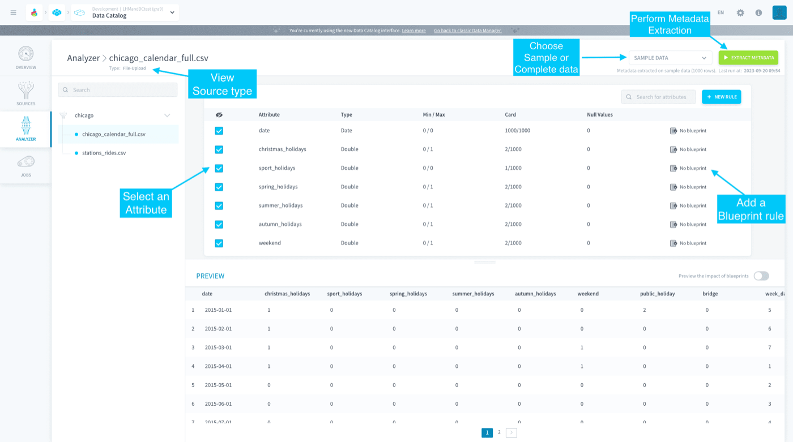

## Objective

The Analyzer carries out the first step of **data quality and control** on your sources before the data is even loaded in your Platform databases.

{.thumbnail}

The Analyzer allows you to perform the following tasks:

* **Metadata Extraction:** Metadata are structured sets of data providing information on your actual source data. 

* **Blueprint Rules Management:** The Blueprints correspond to a set of cleaning rules that can be applied to a data source, in order to set structure standards for your data.

[Learn how to extract metadata](/pages/public_cloud/data_platform/product/data-catalog/analyzer/extract-metadata)

[Learn how to add blueprint rules](/pages/public_cloud/data_platform/product/data-catalog/analyzer/add-blueprint-rules)

## Go further

Join our [community of users](/links/community).