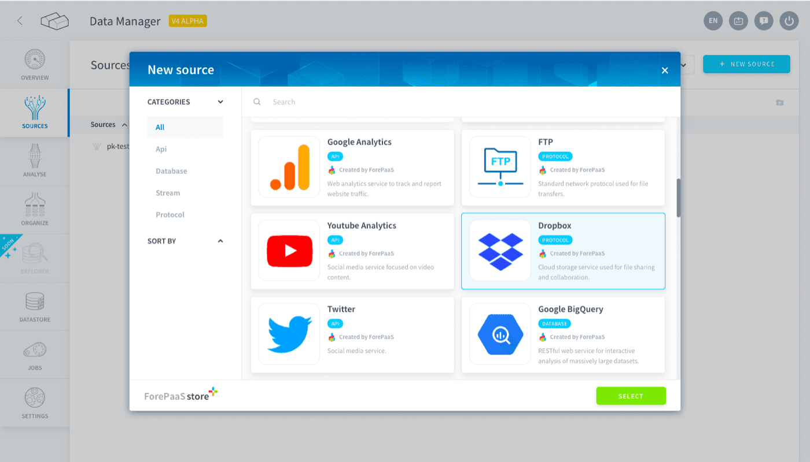
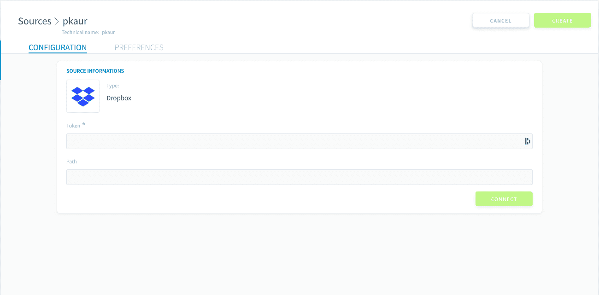
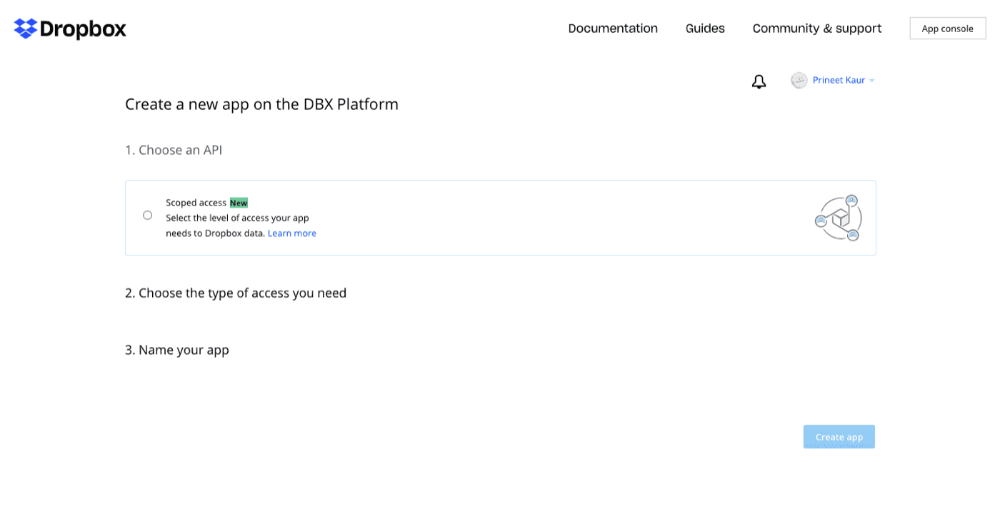
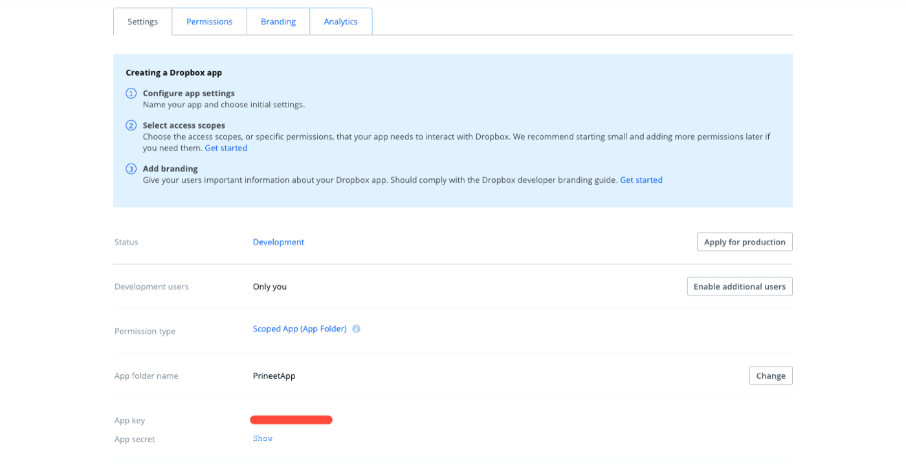
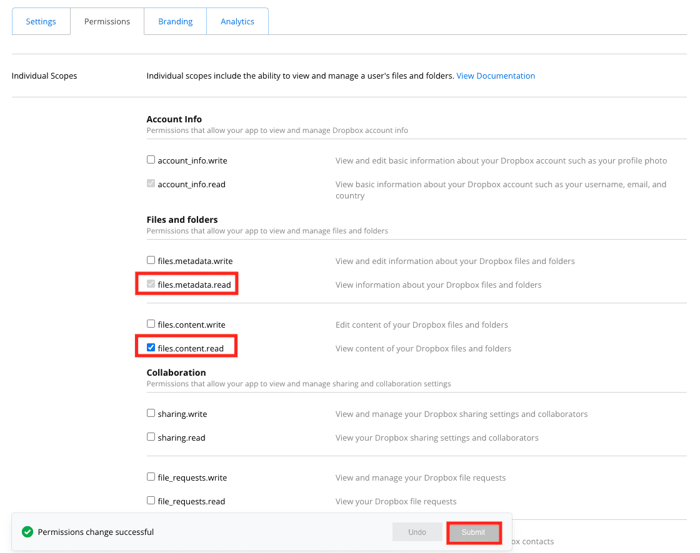
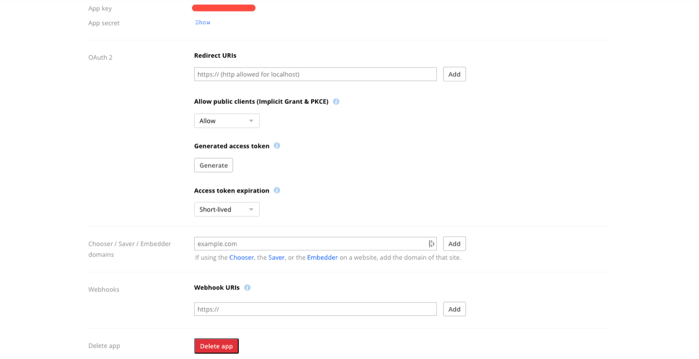

## Objective

Dropbox is a cloud storage service used for file sharing and collaborative work. The Platform allows you to collect data you stored on Dropbox and import it directly into your platform. 

{.thumbnail}

* [Add a Dropbox source on the Platform](#add-a-dropbox-source-on-the-platform)
    * [Configuration screen overview](#configuration-screen-overview)
    * [Learn how to get a Dropbox token](#learn-how-to-get-a-dropbox-token)
    * [Configuring your source](#configuring-your-source)

## Add a Dropbox source on the Platform 

### Configuration screen overview

Once you have found *Dropbox* in the **Platform store**, click on *Select* and you will be able to see the configuration screen as shown below -

{.thumbnail}
 
### Learn how to get a Dropbox token

* Go to https://www.dropbox.com/developers/apps/create

You will see the below screen to Create an App –

{.thumbnail}

* Do the following steps –

   1. Choose an `API`
   2. Choose the type of access you need - `App Folder` or `Full Dropbox` 
   3. Give your app a `Name`
   4. Click on `Create app` 

* Once your application has been created, you will be redirected to the settings page – 

{.thumbnail}

* Go into the `Permissions` tab, then make sure `files.metadata.read` and `files.content.read` permissions are enabled. Then click on Submit.

{.thumbnail}

{.thumbnail}

* Going back to `Settings` tb Click on `Generate` under `Generated access token` 

* Set `Access token expiration` to `No expiration`

* Copy your `token` 

### Configuring your source

When creating the source, you will be required to input the following information :

- Token: The access key to your app (generated in the previous step).
- Path: The path to the folder.

> [!primary]
> If the token is an application token linked to a folder, you don't need to put anything in the Path field 

Once you add the above details click on *Connect* and then on the *Create* button on the top right-hand corner.

> [!warning]
> Don't forget to name your source before creating it. The technical name cannot be changed after creating the source and will be used when trying to open the source using the [SDK](/pages/public_cloud/data_platform/technical/sdk/dpe/00-dpe-index).

## Go further

Join our [community of users](/links/community).