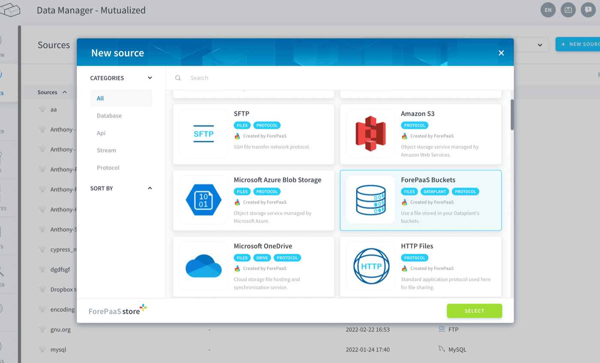
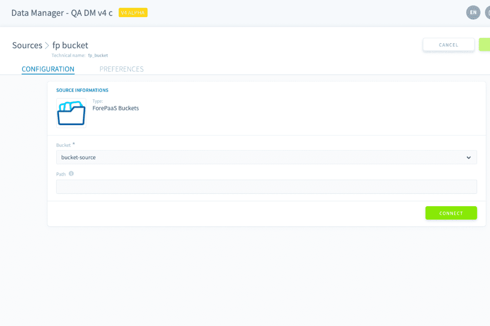
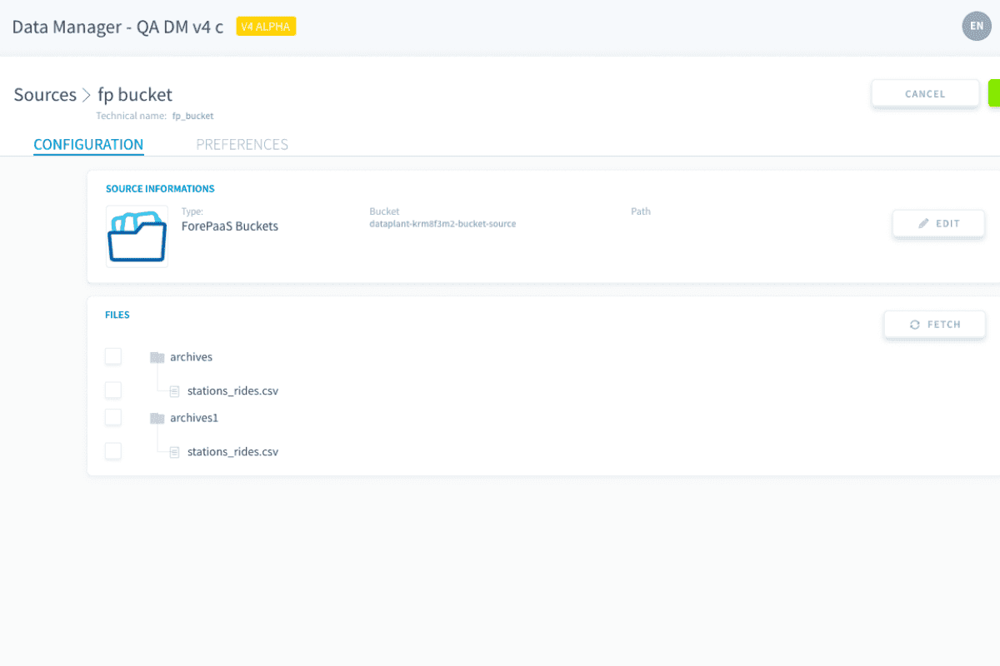
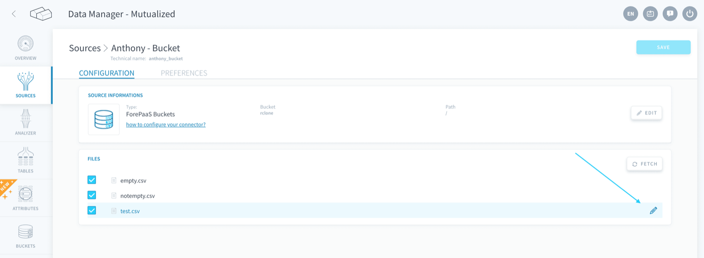
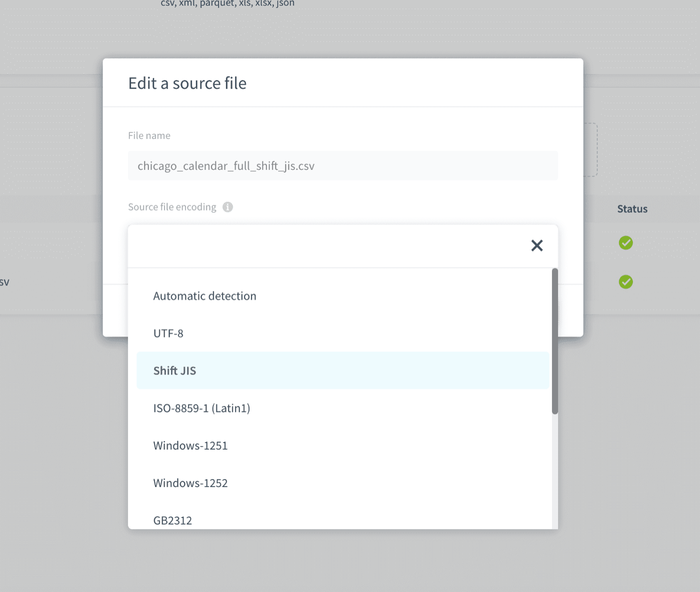

## Objective

The connector allows you to use files stored in your [Project's buckets](/pages/public_cloud/data_platform/product/lakehouse-manager/buckets) as data sources.

> [!primary]
> Buckets are a traditional file-based storage system and allow you to organize unstructured data

{.thumbnail}

* [Add a Buckets source](#add-a-buckets-source)
    * [Configuration screen overview](#configuration-screen-overview)
    * [Configuring your source](#configuring-your-source)
    * [Supported files and sizes](#supported-files-and-sizes)

## Add a Buckets source 

### Configuration screen overview

Once you have found *Buckets* in the **the Platform store**, click on *Select* and you will be able to see the configuration screen as shown below -

{.thumbnail}

### Configuring your source

When creating the source, you will be required to input the following information :

- **Bucket:** The name of the Bucket from which you want to find the source files
- **Path:** The optional path to the subfolder containing the source files

Once you add the above details click on *Connect* and 
you will see the files in your bucket. An example is shown below:

{.thumbnail}

Then click on the *Create* button on the top right-hand corner to create your source.

> [!warning]
> Don't forget to name your source before creating it. The technical name cannot be changed after creating the source and will be used when trying to open the source using the [SDK](/pages/public_cloud/data_platform/technical/sdk/dpe/00-dpe-index).

The encoding of the source files is automatically detected by the Platform. However, if the automatic detection fails, you have the ability to specify the file encoding by clicking on the **pen icon** next to each source object:

{.thumbnail}

Select the encoding of your source object in the dropdown selection.

{.thumbnail}

### Supported files and sizes

The Datastore allows an **S3 compatible object** store, which allows you to store any unstructured data. 

> [!warning]
> There is a 10 GB size limit on files handled by the Data Store.

## Go further

Join our [community of users](/links/community).