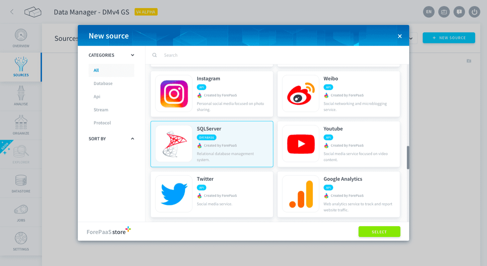
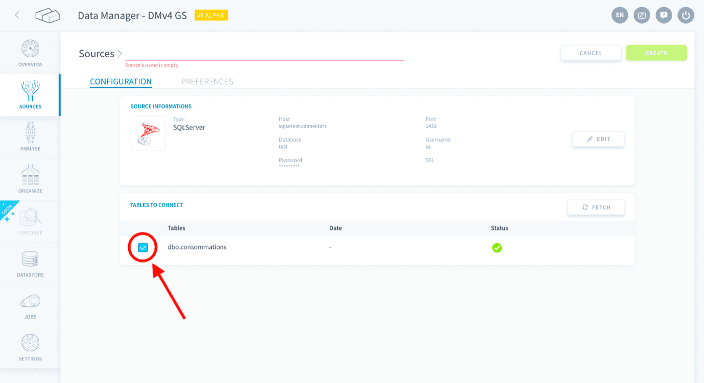

## Objective

Microsoft SQL Server is a relational database management system. The Platform allows you to use the tables in a SQL Server database as sources for your application.

{.thumbnail}

* [Add a SQL Server source on the Platform](#add-a-SQL-Server-source-on-the-Platform)
    * [Configure your connection](#configure-your-connection)
    * [Select the tables you want](#select-the-tables-you-want)

## Add a SQL Server source on the Platform

### Configure your connection

When creating the source, you will be required to input the following information :

- **Host**: the host name of the SQL Server database.
- **Port**: the port address of the SQL Server database.
- **Database**: the name of the SQL Server database.
- **Username**: the user name for the SQL Server database.
- **Password**: the password for the Username you are using.
- **SSL**: if activated, encrypts the information exchanged between the browser and the database.

### Select the tables you want

After establishing a connection with your SQL Server database your tables will be fetched and displayed :

{.thumbnail}

Select which tables you want to be included in the source by checking the boxes to the left of the table name, as indicated in the image above.

> [!primary]
> If the state of the database changes, you can use the *Fetch* button to refresh the tables displayed and include them in your source.

Once you follow the steps above, click on the *Create* button on the top right-hand corner.

> [!warning]
> Don't forget to name your source before creating it. The technical name cannot be changed after creating the source and will be used when trying to open the source using the [SDK](/pages/public_cloud/data_platform/technical/sdk/dpe/00-dpe-index).

## Go further

Join our [community of users](/links/community).