## Objective

Actions are the core component of the Data Processing Engine. They can perform multiple data processing services, from loading your data into a table, to complex custom Python code.

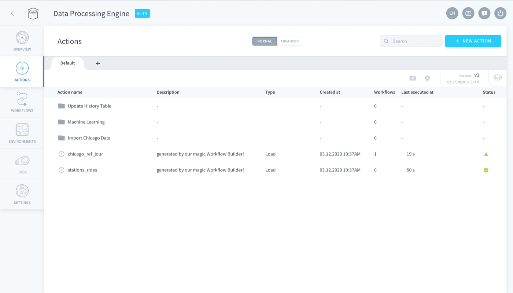{.thumbnail}

* [Create an action](/pages/public_cloud/data_platform/product/dpe/actions/00-actions-index#create-an-action)
    * [Available action types](/pages/public_cloud/data_platform/product/dpe/actions/00-actions-index#available-action-types)
    * [Advanced mode](/pages/public_cloud/data_platform/product/dpe/actions/00-actions-index#advanced-mode)
* [Manage actions](/pages/public_cloud/data_platform/product/dpe/actions/00-actions-index#manage-actions)
    * [Versioning repositories of actions](/pages/public_cloud/data_platform/product/dpe/actions/00-actions-index#versioning-repositories-of-actions)
* [Use the the platform version control system](#use-the-the-platform-version-control-system)
* [Using a repository linked to Git](/pages/public_cloud/data_platform/product/dpe/actions/00-actions-index#using-a-repository-linked-to-git)
    * [Linking a repository to Git](/pages/public_cloud/data_platform/product/dpe/actions/00-actions-index#linking-a-repository-to-git)
    * [Commiting and pushing](/pages/public_cloud/data_platform/product/dpe/actions/00-actions-index#committing-and-pushing)
    * [Pulling and merging](/pages/public_cloud/data_platform/product/dpe/actions/00-actions-index#pulling-and-merging)

## Create an action

When a repository is empty, the first thing you'd like to do is **create an action**. From the main page, click the *New action* button on the top right of the screen. You will then be prompted to choose the type of action you wish to perform from the the platform Store: 

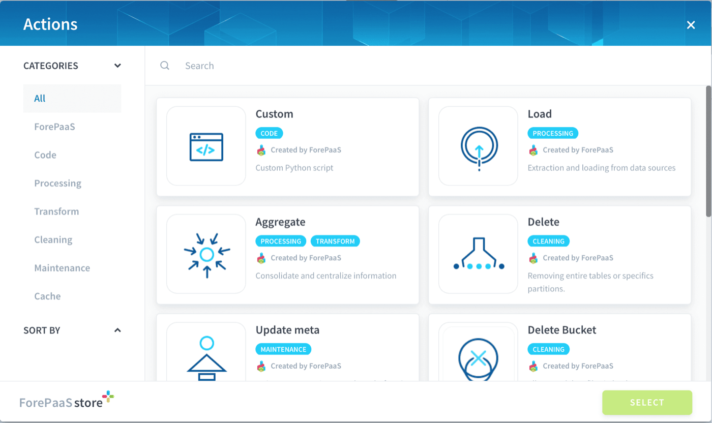{.thumbnail}

> [!primary]
> Note that editing actions is always on autosave mode. Use [versions](/pages/public_cloud/data_platform/product/dpe/actions/00-actions-index#versioning-repositories-of-actions) if you don't want to tamper with your deployed production actions.

### Available action types

-	[Load](/pages/public_cloud/data_platform/product/dpe/actions/load/00-load-index): extract, map and load data from a data source to a [Lakehouse Manager table](/pages/public_cloud/data_platform/product/lakehouse-manager/tables/00-tables-index). 
-	[Aggregate](/pages/public_cloud/data_platform/product/dpe/actions/aggregate/00-aggregate-index): extract, transform and load data from a Lakehouse Manager table to another.
-	[Custom](/pages/public_cloud/data_platform/product/dpe/actions/custom/00-custom-index): write your own Python code to extract, load, and transform data.
-	[Custom PySpark](/pages/public_cloud/data_platform/product/dpe/actions/custom-pyspark): write your own PySpark code to be executed on an Apache Spark cluster
-	[Predict](/pages/public_cloud/data_platform/product/dpe/actions/predict): use a model from the [Machine Learning Manager](/pages/public_cloud/data_platform/product/ml/00-ml-index) to write predictions in a Lakehouse Manager table.
-	[Diff](/pages/public_cloud/data_platform/product/dpe/actions/diff): build a differential per date, meaning, divide data according to dates, if it is initially a sum on a given period of time.
-    [Delete](/pages/public_cloud/data_platform/product/dpe/actions/delete): delete an object entirely.
-	[Delete diff](/pages/public_cloud/data_platform/product/dpe/actions/delete_diff): delete entries that used to exist but don't anymore.
-	[Flush Project caches, and update metas](/pages/public_cloud/data_platform/product/dpe/actions/flush-update-metas/00-flush-update-metas-index): empty the intermediary caches of the platform, after adding/editing data.

### Advanced mode

Actions in the Data Processing Engine are all configured using a set of inputs specified via a JSON configuration file. There are 2 ways for users to update an action's inputs:

- either using the graphical user interface 
- or using an **advanced mode** which lets you directly edit the JSON configuration file

Using the "advanced mode" offers a bit more flexibility and options which might in handy for advanced users.

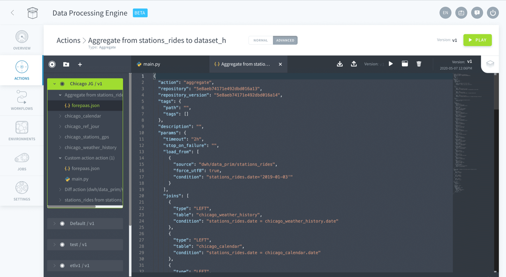{.thumbnail}

> [!primary]
> Note that the advanced mode is also very practical for [Custom actions](/pages/public_cloud/data_platform/product/dpe/actions/custom/00-custom-index) as it offers an IDE-like experience in the web. This will allow you to code custom Python script directly inside of the platform without managing files locally on your computer.

## Manage actions

As your Project matures, structure and organization becomes increasingly important. To facilitate this, the Platform provides several methods to better organize and manage your actions:

-	[Repositories](/pages/public_cloud/data_platform/product/dpe/actions/00-actions-index#versioning-repositories-of-actions): Allow compartmentalizing your actions into different sections that can be versioned

-	[Versions](/pages/public_cloud/data_platform/product/dpe/actions/00-actions-index#versioning-repositories-of-actions): the platform offers an online versioning experience for each repository of actions individually. The platform has its own version control system, but you can also synchronize each repository with Git

-	**Descriptions & Tags**: Every action can be assigned a *description* and/or *tags*. This allows you to document your Project, particularly useful when collaborating in large teams.

-	**Lineage**: Every action contains a lineage sub-tab, accessible when editing an action. It displays every [workflow](/pages/public_cloud/data_platform/product/dpe/workflows/00-workflows-index) that contains the action. Workflows allow you to orchestrate the execution of multiple actions and launch them in a specific order using stages. 

### Versioning repositories of actions

Editing actions is always on autosave mode. When you are trying to iterate on existing actions, it is recommended to create several versions of the actions' code. This lets you incrementally introduce variations to experiment and test your work, while keeping the version in production always intact.

**On the platform, this versioning happens at the level of the repositories**. The repositories are the tabs you see at the top of the Actions' tree view.

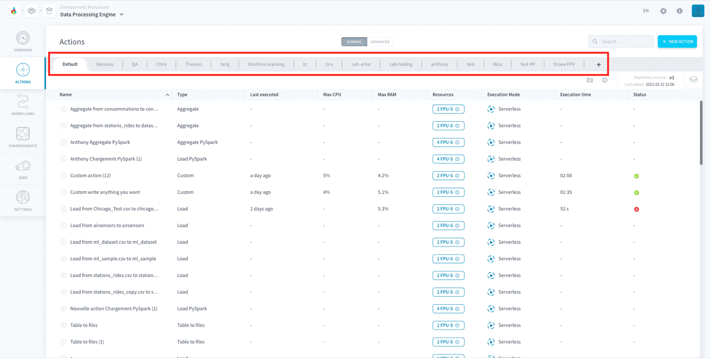{.thumbnail}

You cannot version an individual action, but rather a whole repository of actions. The versioning panel can be accessed at the top right of the repository header:

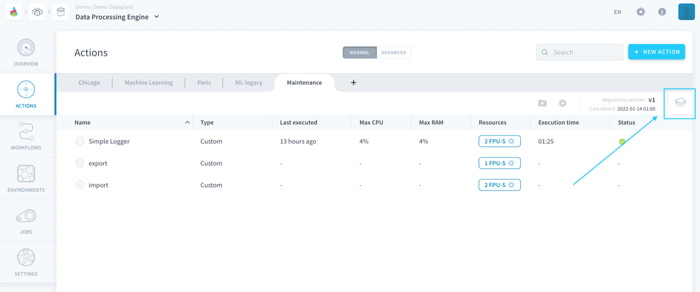{.thumbnail}

> [!primary]
> This functionality is also available on other components that implement repositories, such as [Machine Learning Manager Pipelines](/pages/public_cloud/data_platform/product/ml/pipelines/00-pipelines-index). It works in the same way, just look for the equivalent UI elements in the Pipelines screen.

There are 2 versioning systems on the Platform:

- [the platform version control system](/pages/public_cloud/data_platform/product/dpe/actions/00-actions-index#use-the-the-platform-version-control-system): the default versioning system on all repositories
- [Git versioning](/pages/public_cloud/data_platform/product/dpe/actions/00-actions-index#use-a-repository-linked-to-git): if you decide to synchronize your repository with Git

Now let's see how all of this works in practice!

### Use the platform version control system

By default, each repository of actions on the platform has an integrated version control system which allows you to manually manage the different versions of the code (i.e. actions) they contain. 

Repositories all have:

- a *deployed version*, which is the version served when [executing the job](/pages/public_cloud/data_platform/product/dpe/jobs/00-jobs-index). 
- an *editing version*, which is the version currently being edited through the editor panel.

> [!primary]
> If your repository only has *one version*, the active version is the same as the deployed version, which means that you are editing your actions in production.  
If your repository has *two versions or more*, the deployed version cannot be edited. It can be viewed in read-only mode.

Versions need to be created manually. To create a new version for the repository, open the versioning panel at the top right and click on the **+** icon.

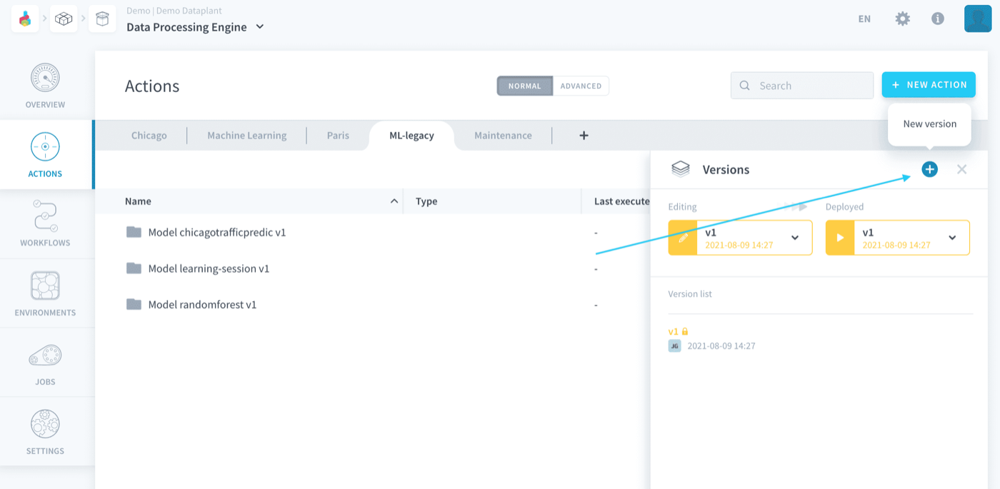{.thumbnail}

Choose which version to duplicate to create the new version.

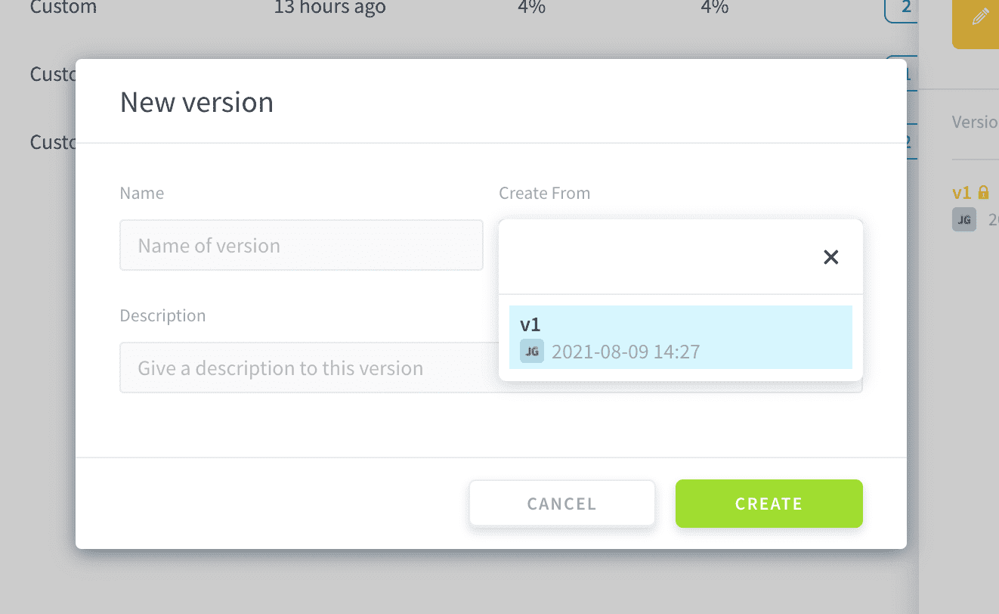{.thumbnail}

After creating the new version, the *deployed version* will not change. You are able to edit the new version directly.

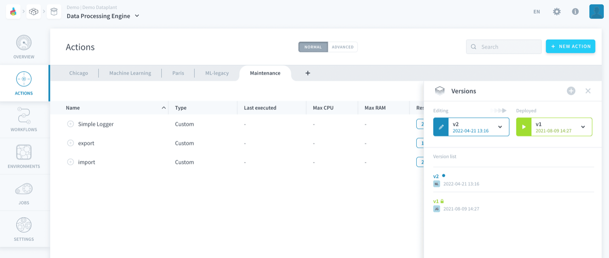{.thumbnail}

Click on the **Play** button to set a new version as the deployed version: the version of the code used when actions of the repo are executed.

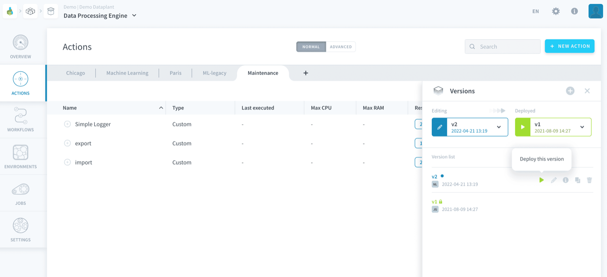{.thumbnail}

### Use a repository linked to Git

Each repository can be linked to an external Git repository in which case versions are synced with Git commits. This allows you to update & test actions continuously without affecting the version deployed in production.

#### Linking a repository to Git

To link your repository on the platform to Git, you must click on the gear icon to edit an existing repository or create a new a one. Either of this actions will open the repository configuration window.

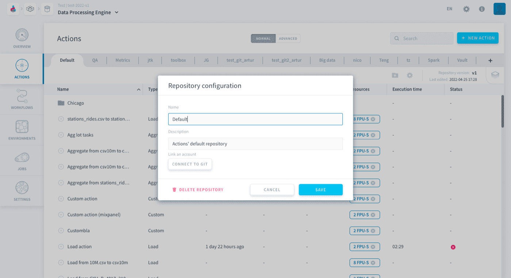{.thumbnail}

Click on *Connect to Git* to expand the window.

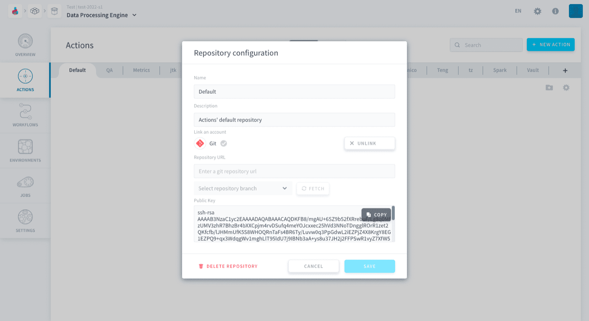{.thumbnail}

Here the first thing you need to enter is the Repository SSH URL. 

It is generally found on repository cloning options of common Git solutions. On GitHUB, for instance, it can be found on Code > Clone > SSH.

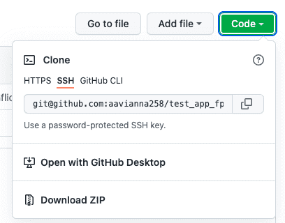{.thumbnail}

Next click on *FETCH* to get the distant branches and select the branch you desire to use.

Finally, copy the Public SSH key given at the bottom and paste it in the list of SSH keys associated to your account on your Git solution. For GitHUB, you can follow [this tutorial](https://docs.github.com/en/authentication/connecting-to-github-with-ssh/adding-a-new-ssh-key-to-your-github-account).

#### Committing and pushing

After changing an object in a repo, your repo will display the uncommitted changes as shown in the image below. You can commit and push them by clicking on the arrow pointing upwards indicated in the image.

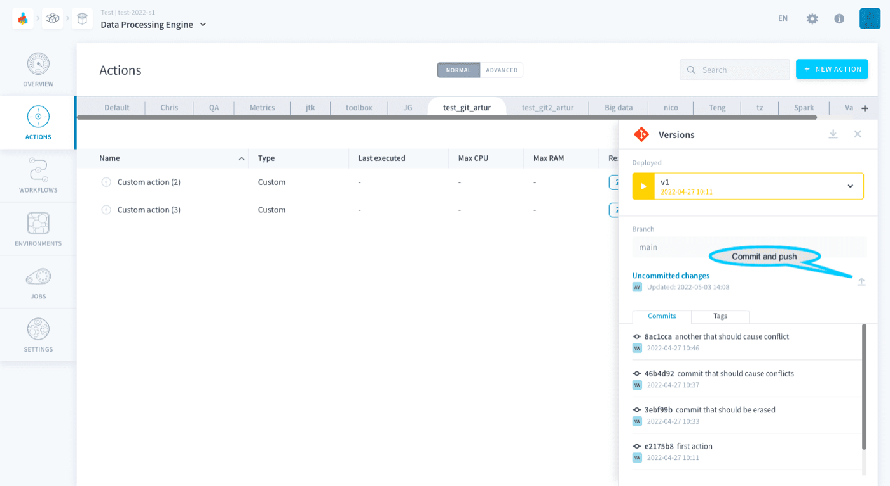{.thumbnail}

> [!primary]
> If there is a conflict when you push, your changes will not be pushed to the branch you configured, instead they will be pushed to a new branch with same name of the current branch and a suffix of *_conflictN*, where N is the number of the conflict. For example, if your branch is named *current-branch* and your push causes a conflict, the new branch will be named *current-branch_conflict1*. If there is a conflict again when you push, the new branch will be named *current-branch_conflict2*.

#### Pulling and merging

Pull distant changes by clicking on the arrow pointing downwards indicated in the image, a popup window will prompt you to confirm your decision. All uncommitted changes will be lost and both branches will be merged together.

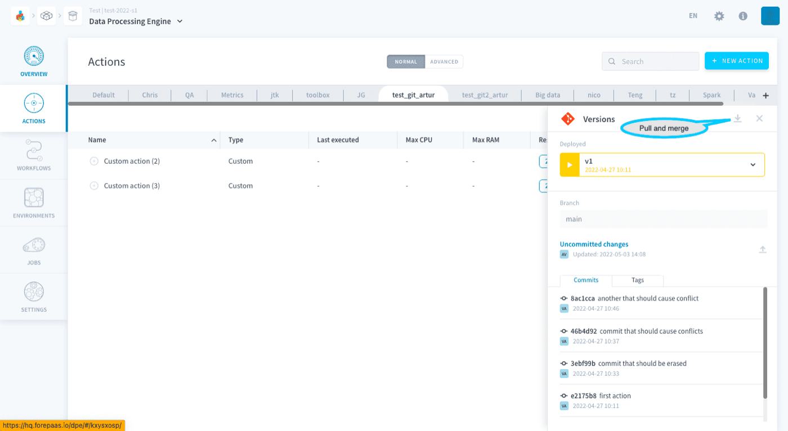{.thumbnail}

## Go further

Join our [community of users](/links/community).