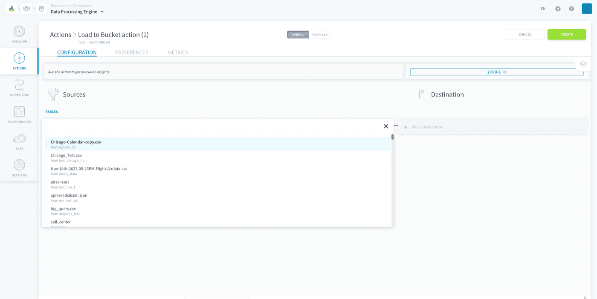
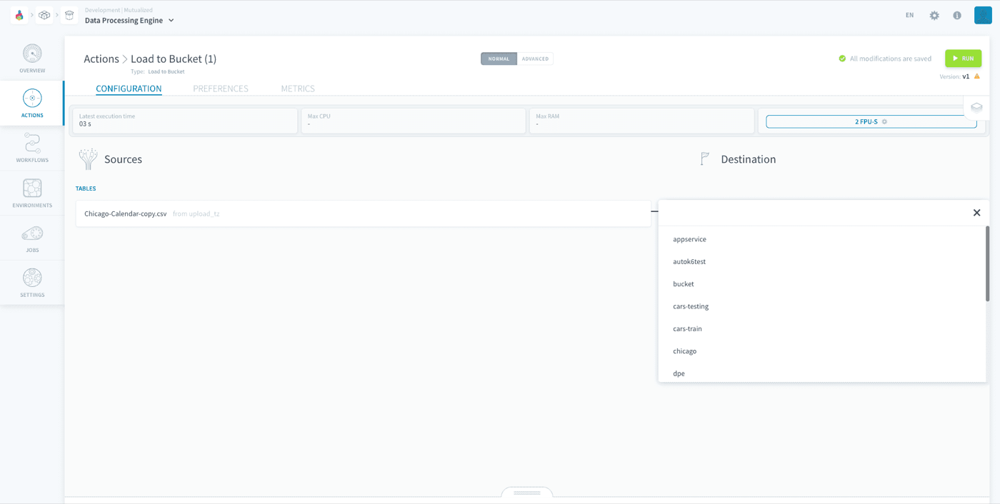
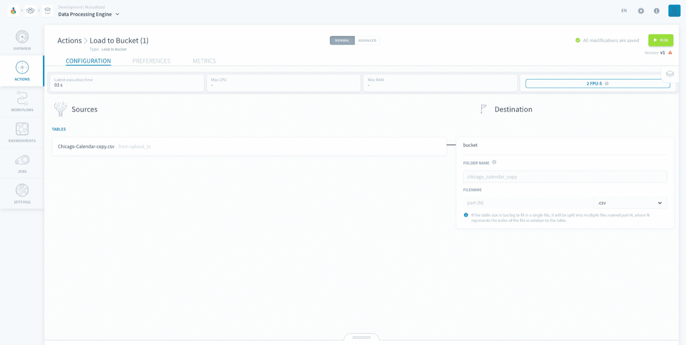

## Objective

The *Load to Bucket* action **extracts raw data from sources and puts it into a file** in your Project bucket. You can choose the file format.

* [Configure a Load to Bucket action](#configure-a-load-to-bucket-action)
    * [Choose a source and a destination](#choose-a-source-and-a-destination)
* [Destination file](#destination-file)

> [!primary]
> **Note:** This action supports the functionality to have customised date in the folder name. You can find the tutorial [here](/pages/public_cloud/data_platform/getting-further/date-in-folder-name).

## Configure a Load to Bucket action

To create a new action, navigate to the **Action tab** of the Data Processing Engine (DPE), click on **New Action** and select the *Load to Bucket* action.

### Choose a source and a destination

To set-up the action, start by selecting a source from the list that you have already set-up in the [Sources](/pages/public_cloud/data_platform/product/data-catalog/sources/00-sources-index) tab of the Data Catalog.

{.thumbnail}

Then, choose the *destination bucket* from the list of [Project buckets](/pages/public_cloud/data_platform/product/lakehouse-manager/buckets). 

{.thumbnail}

You will then be prompted to choose the file format and the destination folder. If you leave the folder name empty, it will automatically be named as the source name.

{.thumbnail}

> [!warning]
> Note that **the following sources are NOT supported** in this action: Azure Blob Storage, Data Store, Dropbox, FTP, Google Drive, HTTP Files, HTTP REST, One Drive, S3-compatible-storage, Amazon S3 and SFTP.

> [!primary]
> If you choose a **PostgreSQL source** your action will be have optimised performance similarly to the [PostgreSQL to Parquet action](/pages/public_cloud/data_platform/product/dpe/actions/postgresql-to-parquet).

### Destination file

Your data will be put into the destination folder in a file named *part-1* with the format you specified. If your file is too big, it will be split into multiple files named *part-1*, *part-2*, *part-3* and so on. 

The order of your rows will be preserved in this process. Hence, the first rows will be in the *part-1* file and the following rows will be in the *part-2* file.

## Go further

Join our [community of users](/links/community).