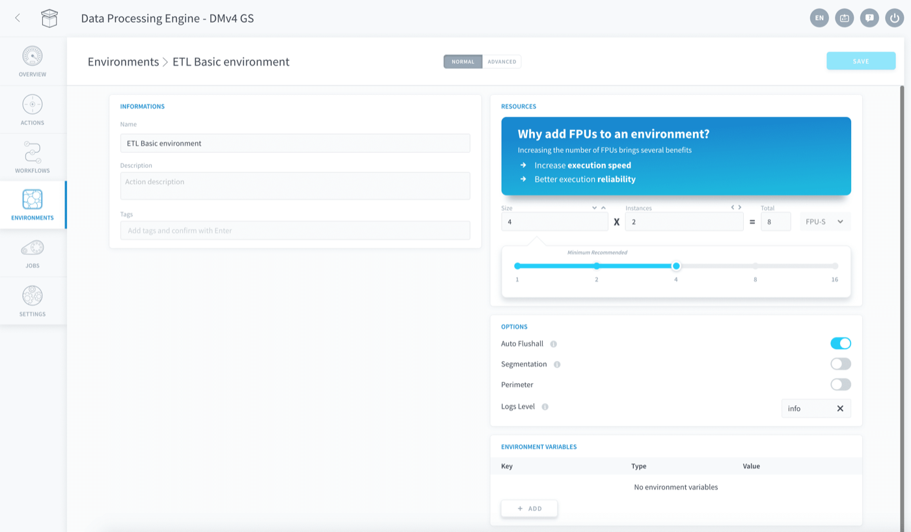
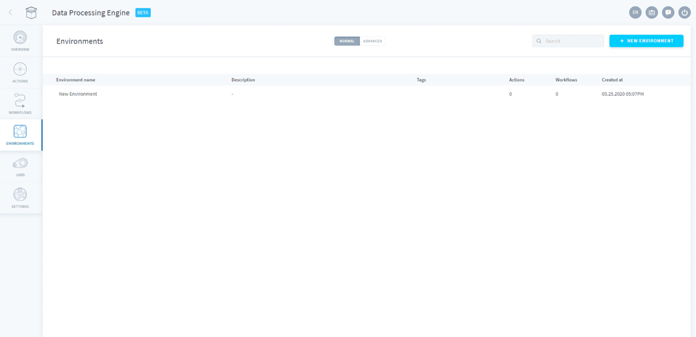
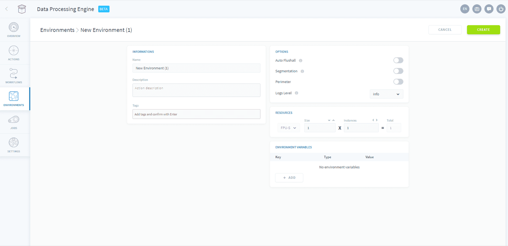

## Objective

Environments allow you to save and re-use quickly a set of [configurations and execution preferences](/pages/public_cloud/data_platform/product/dpe/jobs/execution-preferences/00-execution-preferences-index) in actions and workflows.

{.thumbnail}
*Figure 1: The environment panel*

Environments are not permanent. At any time you can [change a jobs environment](/pages/public_cloud/data_platform/product/dpe/jobs/execution-preferences/00-execution-preferences-index) even if one had already been applied.

> [!primary]
> If you make changes to any of the environments parameters, the changes will be reflected in all the actions and workflows to which the environment is assigned.

* [Create an environment](/pages/public_cloud/data_platform/product/dpe/environments#create-an-environment)

## Create an environment

When you first access the **Environment** tab, you will be greeted with a blank canvas for you to fill your custom environments.

{.thumbnail}

Click on **New environment** and a reduced version of the [preferences](/pages/public_cloud/data_platform/product/dpe/jobs/execution-preferences/00-execution-preferences-index) section will appear. 

{.thumbnail}

From here, select your preferred *resources*, *options* and *environment variables*. Don't forget to give your environment a name and a description.

[How to configure the execution preferences](/pages/public_cloud/data_platform/product/dpe/jobs/execution-preferences/00-execution-preferences-index)

## Go further

Join our [community of users](/links/community).