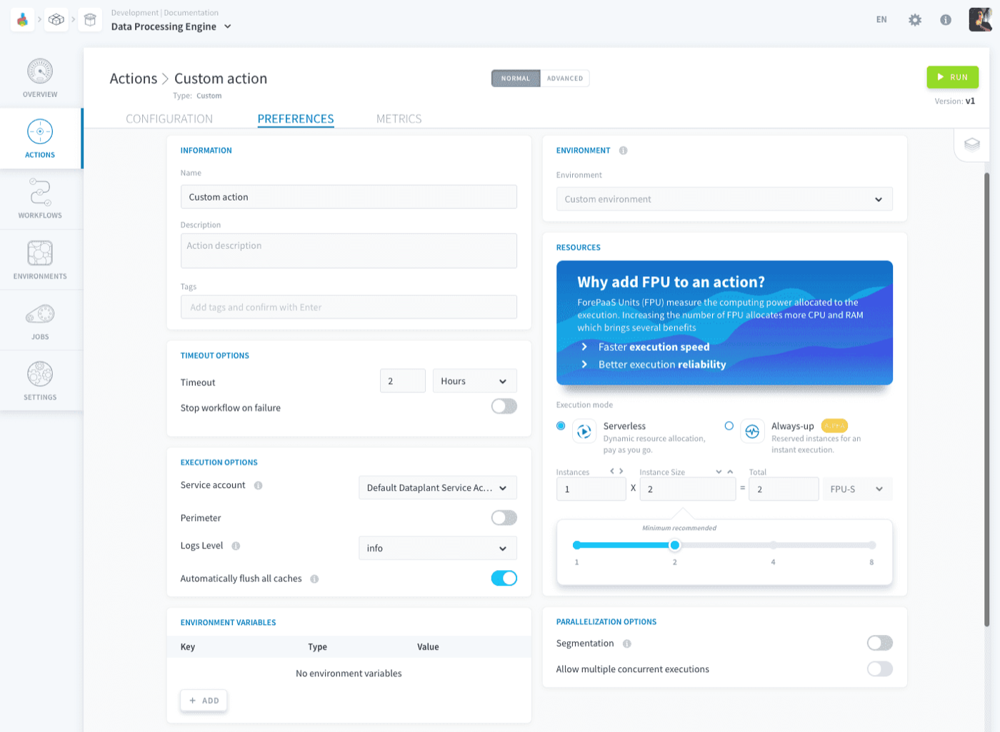
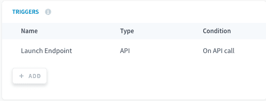
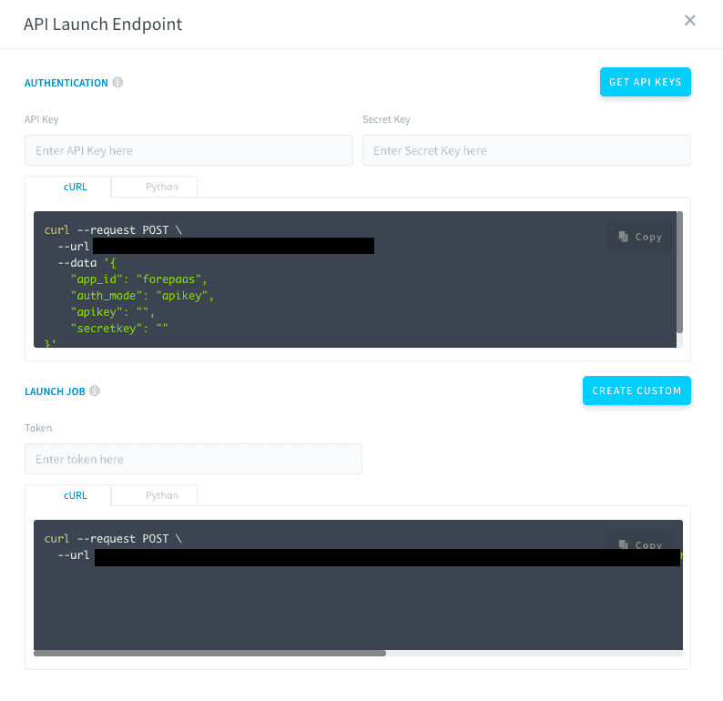
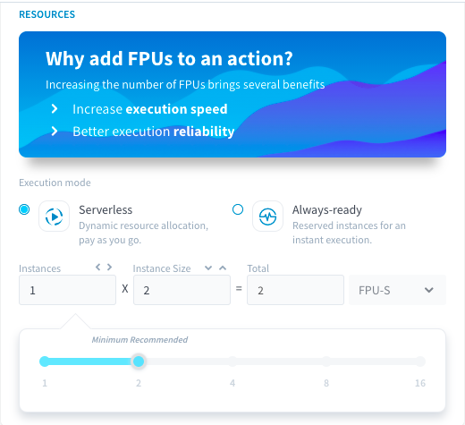
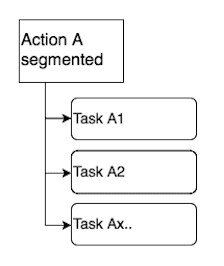

## Objective

Each [action](/pages/public_cloud/data_platform/product/dpe/actions/00-actions-index) or [workflow](/pages/public_cloud/data_platform/product/dpe/workflows/00-workflows-index) in the Data Processing Engine has several configuration settings which can be managed via the **Preferences** tab.

{.thumbnail}

When an *action* is executed, it will use those preferences to run.   

When a *workflow* is executed, its preferences will **override** the preferences of all the actions it contains. If a certain preference option is deactivated at workflow level (such as segmentation or perimeter) it will fall back to each action's preferences during the workflow's execution.

Those preferences can be templated to be re-used in one click every time by saving them in an [environment](/pages/public_cloud/data_platform/product/dpe/environments).

* [Environments](/pages/public_cloud/data_platform/product/dpe/jobs/execution-preferences/00-execution-preferences-index#environments)
* [Timeout options](/pages/public_cloud/data_platform/product/dpe/jobs/execution-preferences/00-execution-preferences-index#timeout-options)
* [Execution options](/pages/public_cloud/data_platform/product/dpe/jobs/execution-preferences/00-execution-preferences-index#execution-options)
    * [Service account](/pages/public_cloud/data_platform/product/dpe/jobs/execution-preferences/00-execution-preferences-index#service-account)
    * [Perimeter](/pages/public_cloud/data_platform/product/dpe/jobs/execution-preferences/00-execution-preferences-index#perimeter)
    * [Logs level](/pages/public_cloud/data_platform/product/dpe/jobs/execution-preferences/00-execution-preferences-index#logs-level)
    * [Automatically flush all caches](/pages/public_cloud/data_platform/product/dpe/jobs/execution-preferences/00-execution-preferences-index#automatically-flush-all-caches)
* [Environment variables](/pages/public_cloud/data_platform/product/dpe/jobs/execution-preferences/00-execution-preferences-index#environment-variables)
* [Triggers](/pages/public_cloud/data_platform/product/dpe/jobs/execution-preferences/00-execution-preferences-index#triggers)
    * [API Endpoint trigger](/pages/public_cloud/data_platform/product/dpe/jobs/execution-preferences/00-execution-preferences-index#api-endpoint-trigger)
    * [Time-based trigger](/pages/public_cloud/data_platform/product/dpe/jobs/execution-preferences/00-execution-preferences-index#time-based-trigger)
* [Resources](/pages/public_cloud/data_platform/product/dpe/jobs/execution-preferences/00-execution-preferences-index#resources)
    * [Execution modes](/pages/public_cloud/data_platform/product/dpe/jobs/execution-preferences/00-execution-preferences-index#execution-modes)
    * [Resource scaling](/pages/public_cloud/data_platform/product/dpe/jobs/execution-preferences/00-execution-preferences-index#resource-scaling)
* [Parallelization options](/pages/public_cloud/data_platform/product/dpe/jobs/execution-preferences/00-execution-preferences-index#parallelization-options)
    * [Segmentation](/pages/public_cloud/data_platform/product/dpe/jobs/execution-preferences/00-execution-preferences-index#segmentation)
    * [Concurrent executions](/pages/public_cloud/data_platform/product/dpe/jobs/execution-preferences/00-execution-preferences-index#concurrent-executions)
* [Development language](/pages/public_cloud/data_platform/product/dpe/jobs/execution-preferences/00-execution-preferences-index#development-language)

## Environments 

Environments on the Platform are a set of pre-defined preferences that you can quickly assign to your actions or workflows, so you don't need to configure it every time.

[Learn more about environments](/pages/public_cloud/data_platform/product/dpe/environments)

## Timeout options 

> [!primary]
> Timeout options are not templated in an [environment](/pages/public_cloud/data_platform/product/dpe/environments), and are to be configured in the preferences in each action/workflow

### Timeout

Timeout is an execution runtime duration after which your job will be treated as failure. Timeout duration includes the resource provisioning time, the build time, and the actual code execution duration.

The maximum timeout duration that you can set is 24 hours, except for the following types of jobs where you can set it at *null*, meaning infinite (no timeout will be enforced):

- A [Load](/pages/public_cloud/data_platform/product/dpe/actions/load/00-load-index) action having a streaming-type [connector](/pages/public_cloud/data_platform/product/data-catalog/sources/00-sources-index) as a source
- A [Custom](/pages/public_cloud/data_platform/product/dpe/actions/custom/00-custom-index) action

If a job execution times out, it will be flagged in the [jobs](/pages/public_cloud/data_platform/product/dpe/jobs/00-jobs-index) list as failed due to timeout in order to differentiate from other sources of failures.

### Stop workflow on failure

If the action is executed as part of a [workflow](/pages/public_cloud/data_platform/product/dpe/workflows/00-workflows-index), and fails throwing a *CRITICAL* error (which will be displayed in the logs), activating this option will interrupt the workflow's execution and the next stages or actions will not be run.

## Execution options 

### Service account

Each action, workflow or environment has a [service account](/pages/public_cloud/data_platform/product/iam/users/service-accounts) associated to it, which **the action/workflow impersonates as it is executed**. This service account acts as the identity of the running job, and controls the access level of the job through the [service account's roles](/pages/public_cloud/data_platform/product/iam/users/roles).

> [!primary]
> Even if you launch a job manually, its execution will be authenticated by the associated service account. 

### Perimeter

> [!primary]
> This parameter is not available for [Custom PySpark actions](/pages/public_cloud/data_platform/product/dpe/actions/custom-pyspark).

When executing a data processing job, when you reach large volumes of data to process, you may need to filter the execution of an action. The *perimeter* parameter allows you to **define a field on which to filter the data processing scope**.

There are several perimeter modes available depending on the data source and the type of action you are performing.

The scope serves in particular to:

* Apply a processing filter on a column;
* Make the execution of actions faster;
* Relieve the requested workload of certain data sources;
* In a workflow that is scheduled daily, do not process the data from the entire history, but only from the last X days.

[How to configure the perimeter](/pages/public_cloud/data_platform/product/dpe/jobs/execution-preferences/perimeter)

### Logs level

The logs level defines the list of logs that will be stored during the action's or workflow's execution. The different levels range from *debug* to *critical*. All the logs above the one selected (included) will be stored.

### Automatically flush all caches

When this parameter is activated, the components' caches will automatically be flushed after each execution of the action/workflow. 

Learn more about caches in [this article](/pages/public_cloud/data_platform/product/dpe/actions/flush-update-metas/00-flush-update-metas-index#auto-flush-all-options).

## Environment variables

> [!primary]
> This is only available for [Custom](/pages/public_cloud/data_platform/product/dpe/actions/custom/00-custom-index) actions, workflows, and environments.

Environment variables are key-value pairs that you can template and inject into your custom actions, to avoid hardcoding the values in your custom script. They are saved in the ```PARAMS``` dictionary object of the ```forepaas.core.settings``` package (available in the SDK).

A code-snippet for a typical use case is available at [this page](/pages/public_cloud/data_platform/technical/sdk/dpe/advanced-use-cases/3A-parameter).

> [!warning]
> Environment variables do not go through a KMS lifecycle and as such should not be used to store and inject secrets and credentials.

## Triggers

> [!primary]
> Triggers are not templated in an [environment](/pages/public_cloud/data_platform/product/dpe/environments), and are to be configured in the preferences in each action/workflow.

With triggers, you can set your jobs to run automatically. Typical usages include launching the job by accessing an API endpoint, or by scheduling time-based triggers (e.g. to run your jobs every day at midnight). 

{.thumbnail}

### API endpoint trigger

This endpoint lets you trigger the job via API.

It is always available to you through the trigger named *Launch API Endpoint*. Click on it to see the endpoint details.

{.thumbnail}

In order to trigger your job, you will have to authenticate first with the *Authentication* endpoint and then trigger the job with the *Launch Job* endpoint.

1. You have to input your [API and Secret keys](/pages/public_cloud/data_platform/getting-further/generate-api-key) in trigger details and then copy the *Authentication* endpoint text. Once you login, you will get a token.
2. Input this token in the *Launch job* endpoint and then access it to launch your job.

### Time-based trigger

Use the *CRON* triggers to schedule executions of your action or workflow every pre-defined time period.

You can either use the *Complete mode* to set the configuration visually or use the *Advanced mode* for custom CRON expressions. The Advanced mode configuration follows the CRON syntax (described in detail [here](https://www.netiq.com/documentation/cloud-manager-2-5/ncm-reference/data/bexyssf.html)).

## Resources 

### Execution modes

There are two execution modes available in the Preferences page:

- **Serverless**: computing resources deployed on the fly.
- **Always-up**: dedicated instances always running to swiftly execute your jobs whenever you want.

{.thumbnail}

#### **Serverless**

By default, every job you run on the Platform is executed with the Serverless mode. An execution environment is deployed when you start the job execution and it is undeployed when this execution is done. 

You will be billed for:

- The computing resources used to perform the task.

> [!primary]
> In the Serverless mode, your execution environment is up only during the task execution because, once the task is done, it is automatically killed. 

#### **Always-up**

> [!primary]
> This feature is currently in Alpha release, instabilities may occur.

When you activate the Always-up mode, a dedicated computing environment is deployed for the respective action/workflow/environment. It will stay deployed until you set the Execution mode back to Serverless so you won't need to wait for its deployment every time you run the respective job.

You will be billed for:

- The computing resources used in the time during which the execution environment was up (this includes the time taken to perform the jobs).

> [!warning]
> With the Always-up mode, your execution environment will NOT be automatically undeployed once job execution is done. You have to set the Execution Mode back to Serverless to kill it.

If you edit the configuration of an action/workflow set in Always-up mode, it will be **updated in a full blue-green way**: the deployment will wait until all current pending tasks are complete before gracefully shutting down for the update. 

> [!primary]
> It is recommended to use the Always-up execution mode on [environments](/pages/public_cloud/data_platform/product/dpe/environments) rather than individual actions/workflows, in order to re-use the resources for multiple workloads.

### Resource scaling

You can find out all about how to scale your computing power in the dedicated article below.

[Learn how to scale your jobs resources](/pages/public_cloud/data_platform/product/dpe/jobs/execution-preferences/resources)

## Parallelization options

### Segmentation

> [!primary]
> This parameter is not available for [Custom PySpark actions](/pages/public_cloud/data_platform/product/dpe/actions/custom-pyspark).
 
The **segmentation options allow you to define how a job will be broken down in multiple tasks** based on specific criteria. Once split, the workload of the job can then be [distributed across multiple workers](/pages/public_cloud/data_platform/product/dpe/jobs/execution-preferences/resources#scale-your-jobs-horizontally) in parallel (parallel computing).

 {.thumbnail}

Among most common usage, segmentation allows you to:

* **Apply a specific treatment filter** to a column;
* **Accelerate action run time** by parallelizing the processing on multiple workers in parallel and relieving the workload on data source connectors;
* In a workflow planned daily for instance, **not to ingest all of the historical data** each time you run the load action but filter on only the last day(s).

[How to configure segmentation](/pages/public_cloud/data_platform/product/dpe/jobs/execution-preferences/segmentation)

### Concurrent executions

This option allows the action/workflow to be executed multiple times at the same time (instead of returning an error if an execution is triggered while one is already happening). 

In [Serverless mode](/pages/public_cloud/data_platform/product/dpe/jobs/execution-preferences/00-execution-preferences-index#serverless), **each** concurrent execution will use the allocated computing power for the job.  
In [Always-up mode](/pages/public_cloud/data_platform/product/dpe/jobs/execution-preferences/00-execution-preferences-index#always-up), multiple concurrent executions are [distributed across the available workers](/pages/public_cloud/data_platform/product/dpe/jobs/execution-preferences/resources#scale-your-jobs-horizontally) in parallel (parallel computing).

Multiple concurrent executions can only be triggered [via API](/pages/public_cloud/data_platform/product/dpe/jobs/execution-preferences/00-execution-preferences-index#api-endpoint-trigger), not by GUI.

## Development language

> [!primary]
> This is only available in workflows (and [Custom actions](/pages/public_cloud/data_platform/product/dpe/actions/custom/00-custom-index)' configuration page).

This option lets you specify which language version to use for the overall workflow. By default, a workflow will use the latest of all the versions it contains. 

## Go further

Join our [community of users](/links/community).

Additionally, you can ask for support by reaching out to us on the Data Platform Channel within the [Discord Server](https://discord.com/channels/850031577277792286/1163465539981672559). There is a step-by-step guide in the [support](/pages/public_cloud/data_platform/support) section.