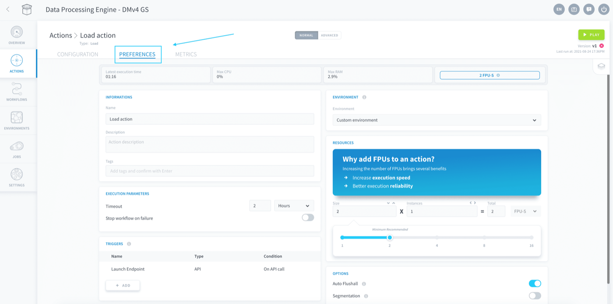
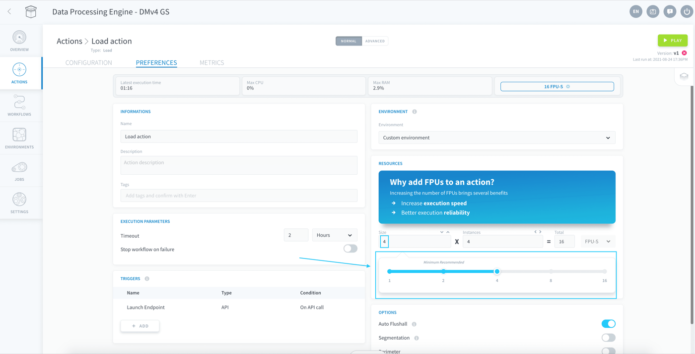

## Objective

The Platform is designed to scale easily as the requirements of your data Project evolve. 

In the Data Processing Engine, each individual action or workflow can be **scaled both horizontally and vertically**, meaning you can parallelize processing tasks and add more computing power to each indefinitely.

* [Scale your jobs horizontally](/pages/public_cloud/data_platform/product/dpe/jobs/execution-preferences/resources#scale-your-jobs-horizontally)
* [Scale your jobs vertically](/pages/public_cloud/data_platform/product/dpe/jobs/execution-preferences/resources#scale-your-jobs-vertically)

## Scale your jobs horizontally

You can **parallelize the workload** of your action or workflow by selecting the number of parallel instances in which your job will be ran. Typically, multiple instances will be used for the following processes:

- Using [segmentation](/pages/public_cloud/data_platform/product/dpe/jobs/execution-preferences/segmentation) for a job
- Running workflows with multiple actions in the same [stage](/pages/public_cloud/data_platform/product/dpe/workflows/configuration#stages)
- Running multiple [concurrent](/pages/public_cloud/data_platform/product/dpe/jobs/execution-preferences/00-execution-preferences-index#concurrent-executions)
 occurrences of the same [Always-up action/workflow](/pages/public_cloud/data_platform/product/dpe/jobs/execution-preferences/00-execution-preferences-index#always-up) 

> [!primary]
> Failure to allocate multiple instances for the above processes will simply have the broken-down tasks executed back-to-back on the single instance.

To change the amount of parallel instances allocated to an action or a workflow, go to its **Preferences** tab. 

{.thumbnail}

Change the number of instances in the Resources panel.

{.thumbnail}

## Scale your jobs vertically

You can allocate **more computing power** to an action or a workflow by increasing the number of Data Platform Units (DPU) of each computing instance. The DPU is a unit of processing capability, representing access to a certain amount of CPU and memory, as such:

* **DPU**: - corresponds to approximately *1 CPU* and *2 GB of RAM*, based on hardware availability. 

> [!primary]
> By default, newly created actions or workflows are allocated 2 DPU.

To change the amount of DPU allocated to an action or a workflow, go to its **Preferences** tab. 

{.thumbnail}

Use the slider to set the desired DPU size of [each parallel instance](/pages/public_cloud/data_platform/product/dpe/jobs/execution-preferences/resources#scale-your-jobs-horizontally) for the execution. 

{.thumbnail}

The final total amount of DPU allocated to a DPE job is the number of parallel instances times the DPU size of each.

> [!primary]
> If you are using the [Always-up execution mode](/pages/public_cloud/data_platform/product/dpe/jobs/execution-preferences/00-execution-preferences-index), you still are allowed to update your resources. The update will come into effect shortly after you change your settings and your workflows/actions will not be interrupted in the process.

## Go further

Join our [community of users](/links/community).