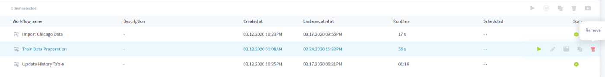
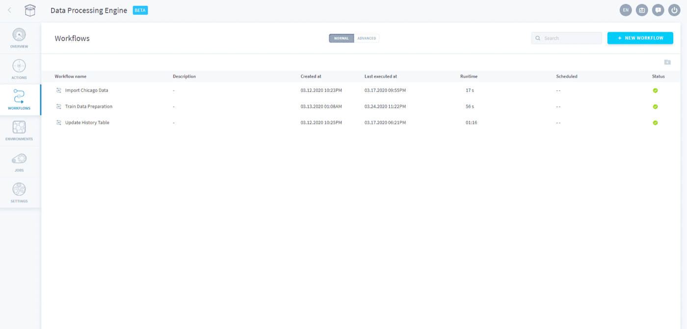

## Objective

Workflows are basically your orchestrated ETL and data processing pipelines on the Platform. A workflow is an organizational structure in the Data Processing Engine which represents **a sequence of [actions](/pages/public_cloud/data_platform/product/dpe/actions/00-actions-index)** which can be:

* Run manually or through an API call
* Scheduled to run at a given time (CRON)

## Create a workflow

The Platform offers a simple point-and-click interface to orchestrate your actions into scheduled workflows.

[Learn how to configure a workflow](/pages/public_cloud/data_platform/product/dpe/workflows/configuration)

You can also go under the hood by using our integrated IDE in the Advanced mode.

[Learn how to configure a workflow using the Advanced mode](/pages/public_cloud/data_platform/product/dpe/workflows/advanced-mode)

## Manage workflows

In the workflows screen, you can quickly see which workflows are being run, have successfully ran or have encountered errors during their execution. 

By hovering on the *More* icon (i.e. "...") on each line of a workflow, you can also easily:

* **Delete** a workflow
* **Edit** an existing workflow
* **Run** a workflow
* **Inspect the logs** of a workflow

{.thumbnail}

When the number of workflows increases, you can organise the view using *Folders* or look for a specific workflow using the search bar on the top right of the screen. To add workflows into folders, simply drag & drop a workflow inside a given folder.

{.thumbnail}

## Go further

Join our [community of users](/links/community).