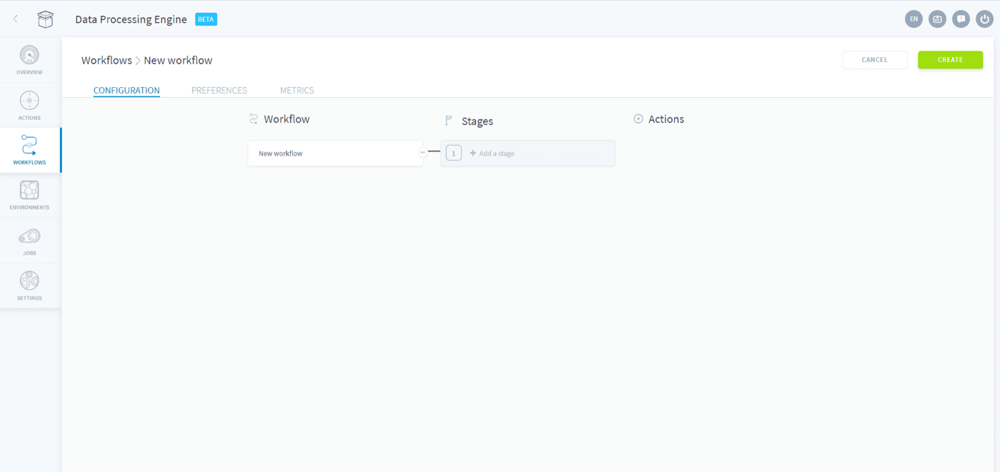
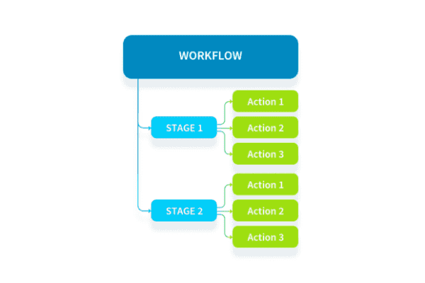
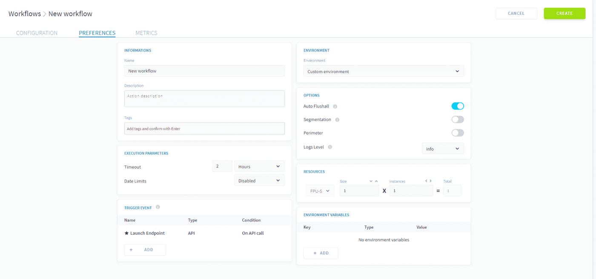
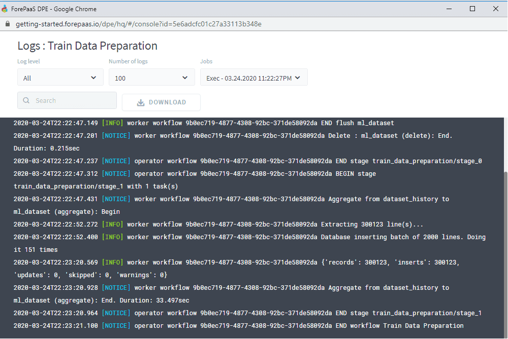
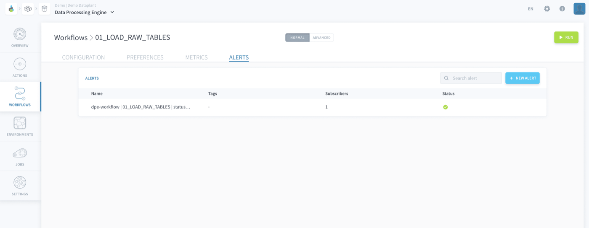

## Objective

When **creating workflows**, you can organize [actions](/pages/public_cloud/data_platform/product/dpe/actions/00-actions-index) into stages to customize the processing of your data, as stages are run sequentially and actions in parallel. 

Each time a workflow is launched, you can **monitor the execution of a workflow** by reviewing the logs.

- [Create a workflow](/pages/public_cloud/data_platform/product/dpe/workflows/configuration#create-a-workflow)
    - [Stages](/pages/public_cloud/data_platform/product/dpe/workflows/configuration#stages)
    - [Preferences](/pages/public_cloud/data_platform/product/dpe/workflows/configuration#preferences)
- [Monitor a workflow](/pages/public_cloud/data_platform/product/dpe/workflows/configuration#monitor-a-workflow)
    - [Logs](#logs)
    - [Alerts](#alerts)

## Create a workflow 

The creation of the workflow has 2 main steps:

- **Stages**: Configure the workflow's successive stages, actions in the respective stages can be either added upon the creation of the workflow or later on.
- **Preferences**: Users can define various parameters and information about the workflow

{.thumbnail}

### Stages

Within a workflow, actions are organized in **sequential** stages. Within stages, actions are run in **parallel** (meaning they can run [in parallel on multiple instances](/pages/public_cloud/data_platform/product/dpe/jobs/execution-preferences/resources#scale-your-jobs-horizontally))

{.thumbnail}

If a workflow contains actions with multiple language versions, it will be executed with the **latest language version** it contains. You can override this behavior from the [workflow's preferences](/pages/public_cloud/data_platform/product/dpe/workflows/configuration#preferences)

> [!warning]
> At the moment, a single workflow **cannot** contain both [PySpark actions](/pages/public_cloud/data_platform/product/dpe/actions/custom-pyspark) and normal actions.

### Preferences

The preferences tab allows the user to give the workflow a name, a description and tags; and to define several [execution parameters](/pages/public_cloud/data_platform/product/dpe/jobs/execution-preferences/00-execution-preferences-index).

{.thumbnail}

> [!primary]
> **What does the "Auto Flushall" do?** The platform stores the output of the queries in cash (in other words they are "pre-computed") for better performance when using an application. By running the "Flush all" the queries are re-run and the data in the app refreshed. It is therefore activated by default & usually adds an additional 5-10s of processing time to your workflow. For complex successive data processing workflows, you might want to deactivate it and run it only once at the end as a separate workflow.

Finally, note that the **advanced** tab is available to further customize your workflow using the JSON config files. 

[Learn how to tweak a workflow in the Advanced mode](/pages/public_cloud/data_platform/product/dpe/workflows/advanced-mode)

## Monitor a workflow

### Logs

To monitor a workflow's progress, it is possible to open its logs by clicking on the **Console icon**. This will open the [Control Center Logs Explorer](/pages/public_cloud/data_platform/product/cc/logs) in a new window, where you will be able to 

Note that in the [preferences](#preferences) of a workflow, you can define a level of information available in the logs (debug, info, notice, warning, error, critical).

{.thumbnail}

### Alerts

Just like for actions, you can monitor the execution of a workflow by setting alerts on some key execution metrics (like job success, runtime, memory used, etc.). This will create an [alert](/pages/public_cloud/data_platform/product/cc/alerting/00-alerting-index) in the [Control Center](/pages/public_cloud/data_platform/product/cc/00-cc-index).

{.thumbnail}

## Go further

Join our [community of users](/links/community).