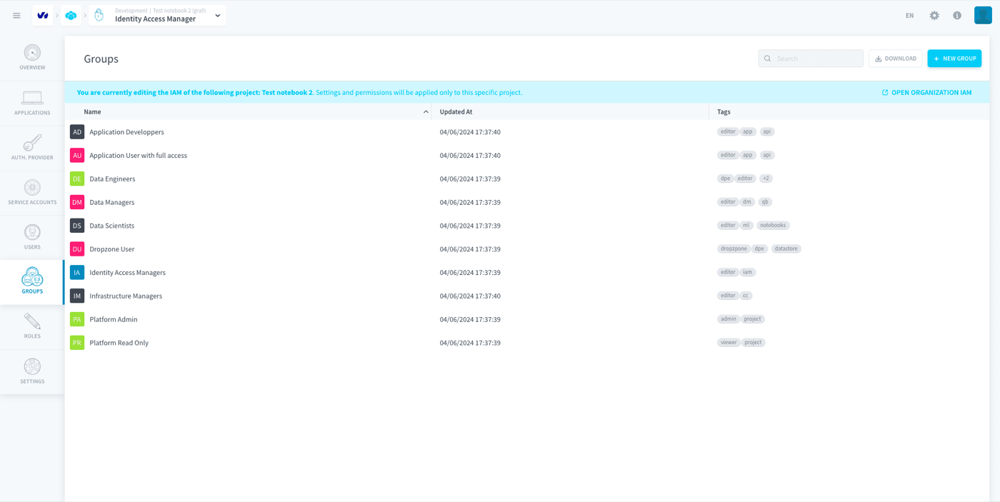
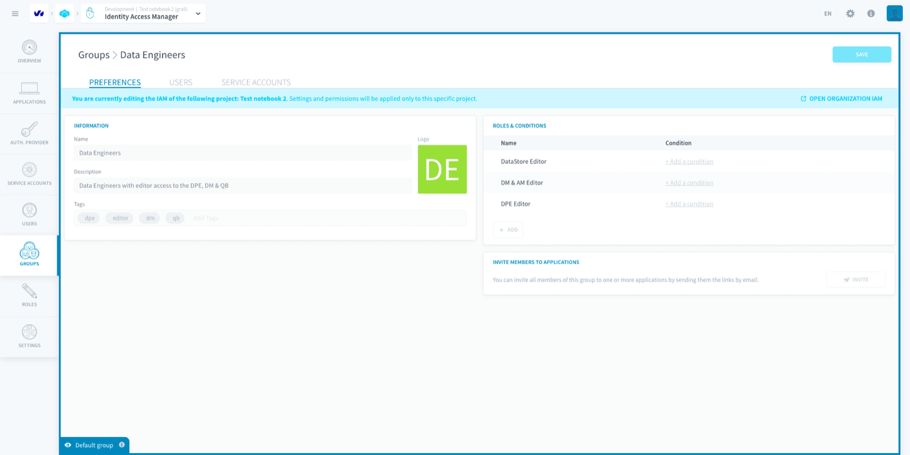
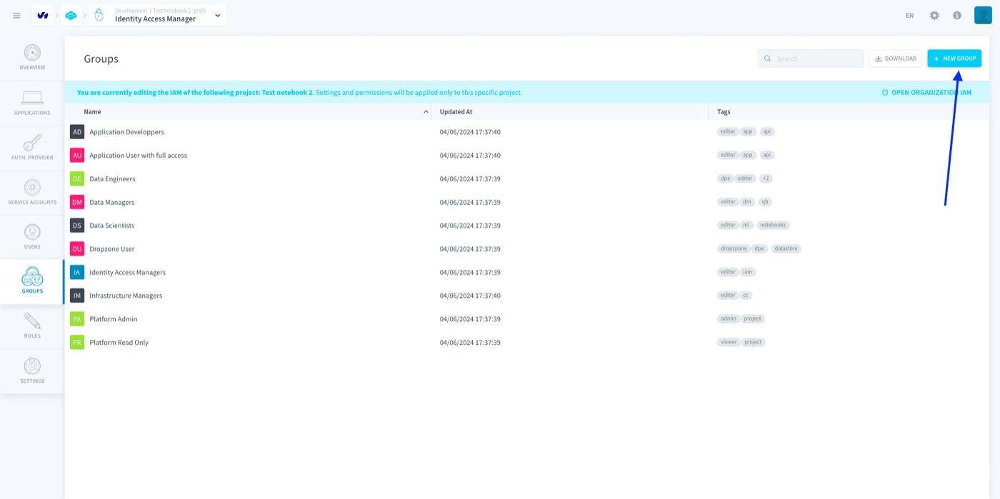
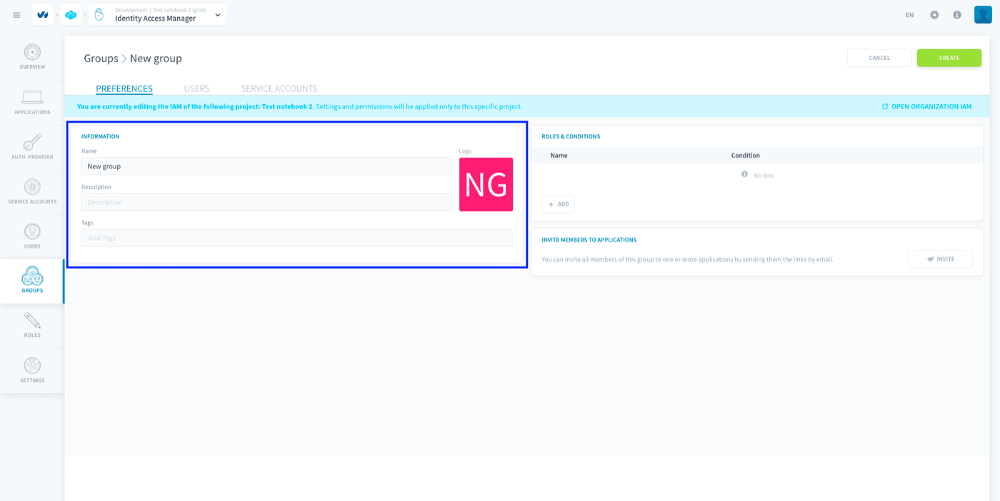
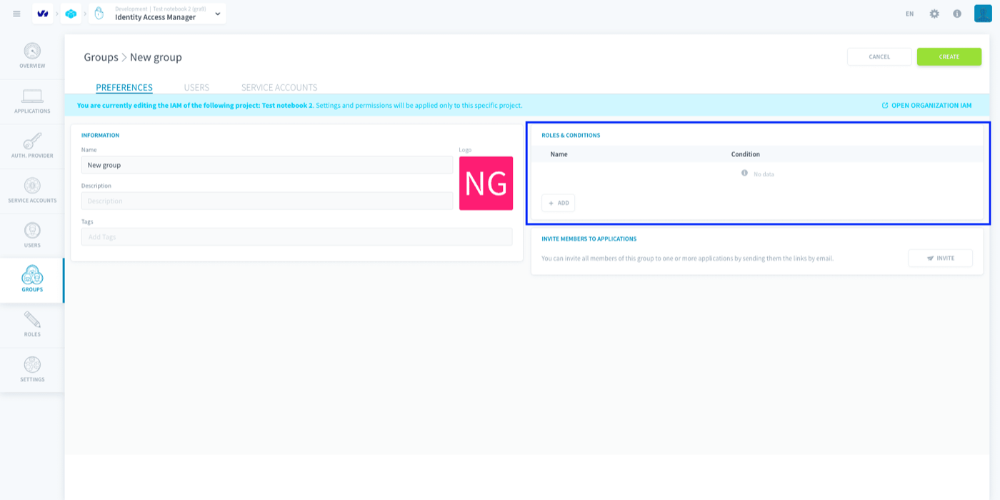
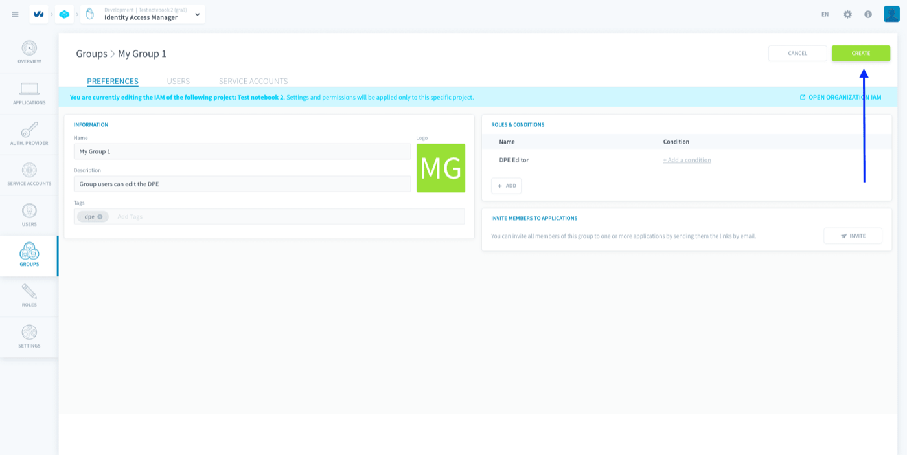
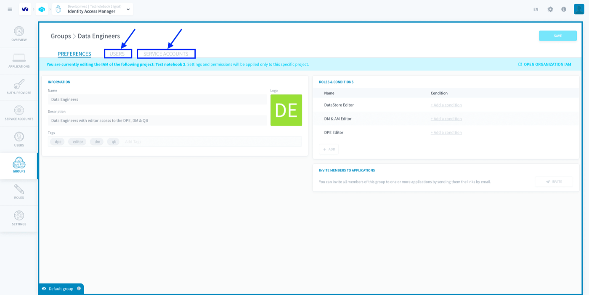
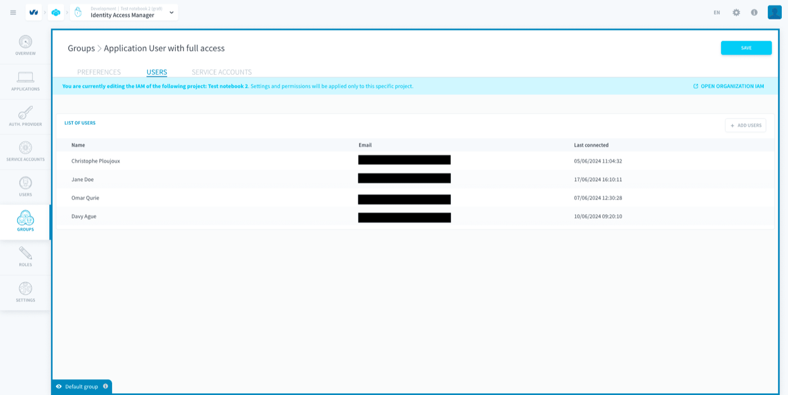
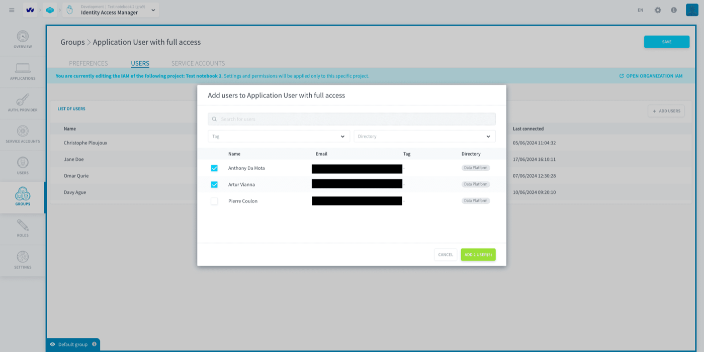
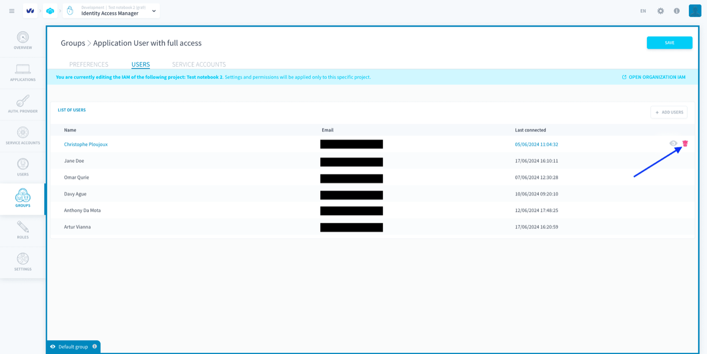

## Objective

Groups enable you to assign the same [roles](/pages/public_cloud/data_platform/product/iam/users/roles) to multiple [users](/pages/public_cloud/data_platform/product/iam/users/users) or [service accounts](/pages/public_cloud/data_platform/product/iam/users/users#manage-your-dataplant-service-accounts) at once.

{.thumbnail}

By default, some groups are pre-generated by Data Platform for you to use directly. These are called **default groups** and they **cannot be deleted**. 

For example, the default group *Data Engineers* in the [Project IAM](/pages/public_cloud/data_platform/product/iam/project-iam/00-project-iam-index) gives its members editor roles for the [Data Processing Engine](/pages/public_cloud/data_platform/product/dpe/00-dpe-index), the [Lakehouse Manager](/pages/public_cloud/data_platform/product/lakehouse-manager/00-lakehouse-manager-index) and the [Analytics Manager](/pages/public_cloud/data_platform/product/am/00-analytics-manager-index).

{.thumbnail}

* [Create a group](/pages/public_cloud/data_platform/product/iam/users/groups#create-a-group)
* [Assign users or service accounts to a group](/pages/public_cloud/data_platform/product/iam/users/groups#assign-users-or-service-accounts-to-a-group)

> [!primary]
> Note that Groups **exist both in the Project and Organization IAMs**. The screenshots in this article have been taken in the Project IAM, but the steps are the same in the Organization IAM.

## Create a group

To create a group, head to the *Groups* tab of the Identity Access Manager. Click on **New group**.

{.thumbnail}

Give your group a name. You can also add a description and tags to help you manage your groups more easily.

{.thumbnail}

### Assign roles to a group

You can either give additional roles to the group right now, or at any time after it's been created.

{.thumbnail}

[Learn how to assign a role to a group](/pages/public_cloud/data_platform/product/iam/users/roles#bind-a-role-to-a-user-service-account-or-group)

### Finish creating your group

You can either [assign users](/pages/public_cloud/data_platform/product/iam/users/groups#assign-users-or-service-accounts-to-a-group) to the group right now, or at any time after it's been created.

To finish creating your group, press **Create**.

{.thumbnail}

## Assign users or service accounts to a group

To add users or service accounts into a group, open the group and head to the corresponding tab.

{.thumbnail}

You can see the list of users / service accounts who are currently part of the group. **Users, like service accounts, can be in multiple groups**: they wind up having all the roles associated to any group they are part of.

{.thumbnail}

To add users / service accounts into the group, click on **Add** then select all the Project users / service accounts that you want to add to the group.

{.thumbnail}
{.thumbnail}

> [!primary]
> You can also check which groups a specific user is part of by heading to the [user page](/pages/public_cloud/data_platform/product/iam/users/users) in the Identity Access Manager.

You can remove users / service accounts from a group by clicking on the **trash** icon.

{.thumbnail}

## Go further

Join our [community of users](/links/community).