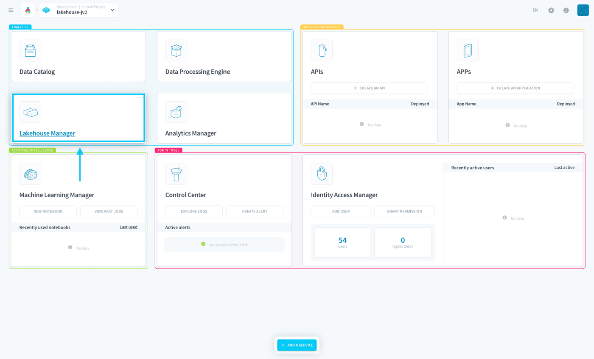

## Objective

Lakehouse Manager is a **serverless data warehouse used to store and organize any dataset**. Easily create [Datasets](/pages/public_cloud/data_platform/product/lakehouse-manager/datasets) to organize your [tables](/pages/public_cloud/data_platform/product/lakehouse-manager/tables/00-tables-index), upload and store non-structured data with [buckets](/pages/public_cloud/data_platform/product/lakehouse-manager/buckets), get a hands-on view of your data through the [explorer](/pages/public_cloud/data_platform/product/lakehouse-manager/explorer) and get fine-grained access control over your data using [policy tags](/pages/public_cloud/data_platform/product/lakehouse-manager/policy-tags).

The lakehouse manager is also the *storage engine* for this service. Completely serverless, unifying data lake & date warehouse into one service. It's based on [Apache Iceberg](https://iceberg.apache.org/) which brings the open table format for huge analytic datasets.

{.thumbnail}

As the Lakehouse Manager is one of the main components and has vast features, it can be a little difficult for first-timers to understand its full usage well. 

Fortunately, we have prepared a detailed tutorial explaining each sub-component!

[Check-out the Lakehouse Manager's key concepts](/pages/public_cloud/data_platform/product/lakehouse-manager/understanding-lakehouse-manager-further)

## Go further

Join our [community of users](/links/community).