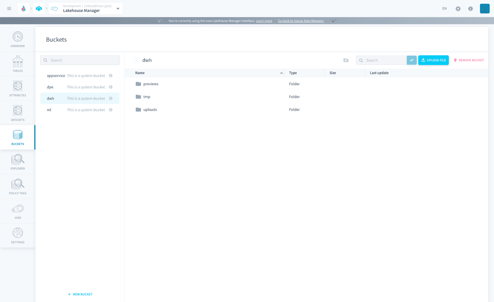
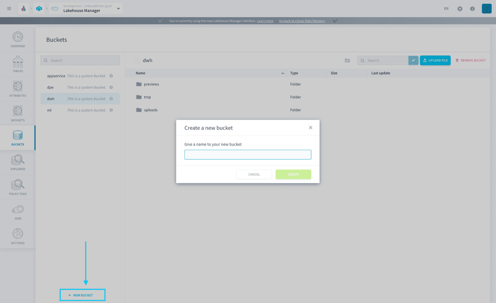
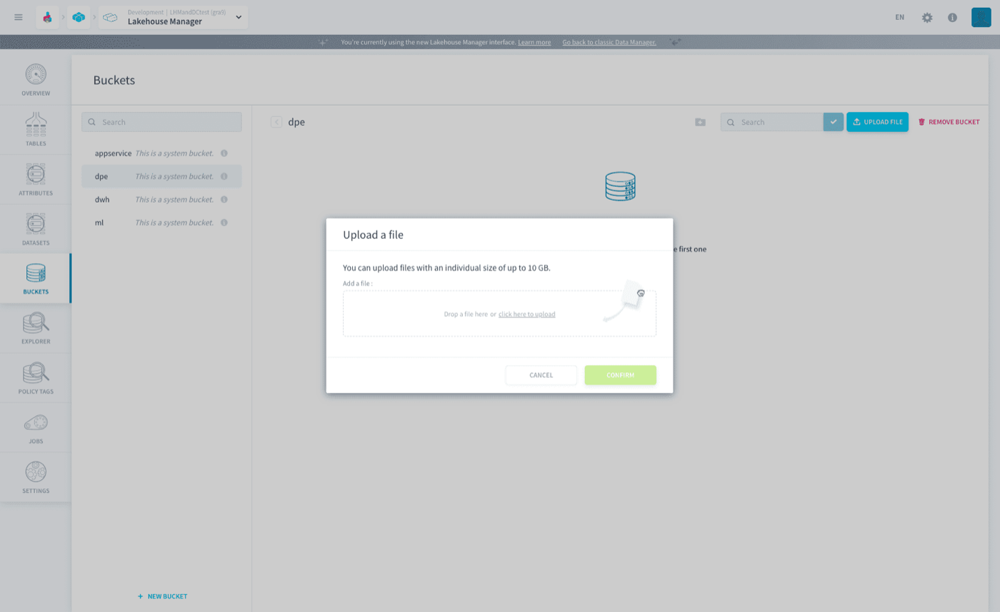
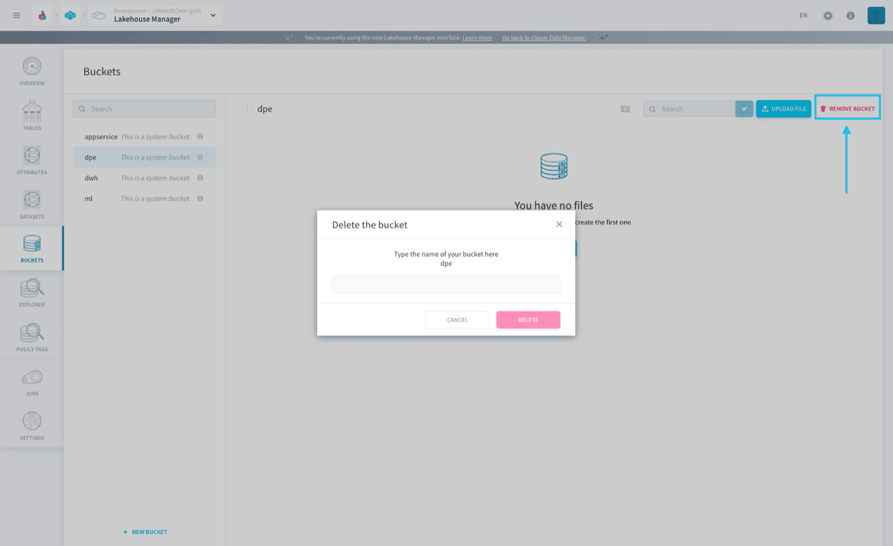

## Objective

the platform Buckets are **S3 compatible object stores** which allow you to store any unstructured data. Think of buckets as different workspaces, for instance, a specific machine learning Project or a repository of photos or videos.

{.thumbnail}

* [Create a bucket](#create-a-bucket)
* [Upload files](#upload-files)
* [Delete a bucket](#delete-a-bucket)
* [Manage permissions on buckets](#manage-permissions-on-buckets)

## Create a bucket

To create a new bucket, click on the _+ New Bucket_ button on the bottom left side of the screen.

Then, name your bucket and click on _Confirm_.

{.thumbnail}

## Upload files

Once you have created your bucket, you will see a _+ Upload file_ button. Just click on it and drag-and-drop your file to upload it.

{.thumbnail}

> [!warning]
> There is a **10 GB size limit** on files handled bythe PlatformBuckets.

## Delete a bucket

To delete a bucket, click on _Remove Bucket_ on the top righ-hand corner of the screen. Then you will have to write the input the name of the bucket and click on _Confirm_ to delete the bucket.

{.thumbnail}

## Manage permissions on buckets 

You can also manage how each user is allowed to interact with the buckets. These permissions are managed on the [Identity Access Manager](/pages/public_cloud/data_platform/product/iam/00-iam-index). 

For details refer to the following article:

- [Roles and conditions: Add a role condition to a specific bucket](/pages/public_cloud/data_platform/product/iam/users/roles#add-a-role-condition-on-a-specific-bucket)

## Go further

Join our [community of users](/links/community).