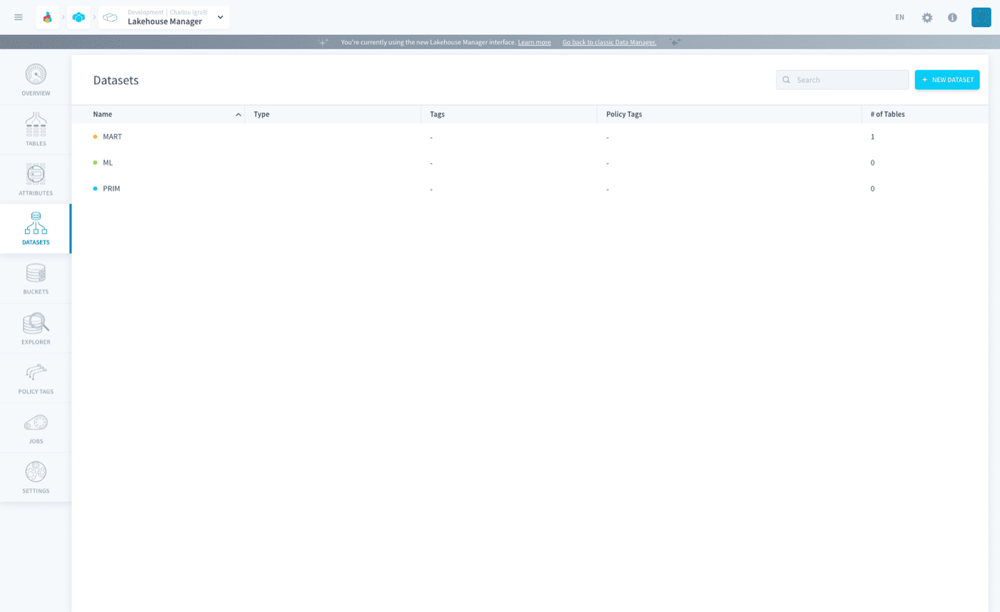
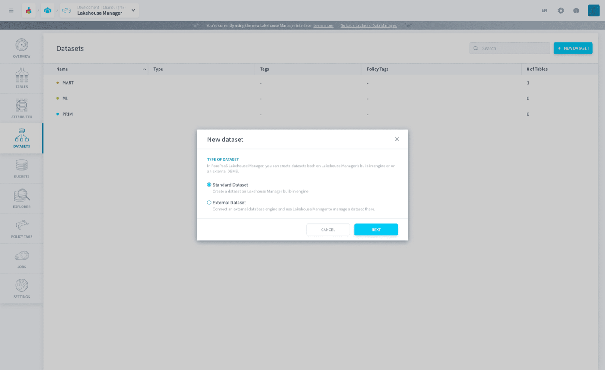
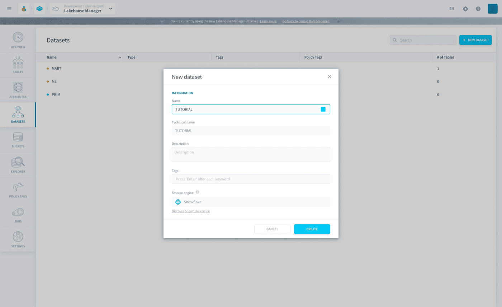
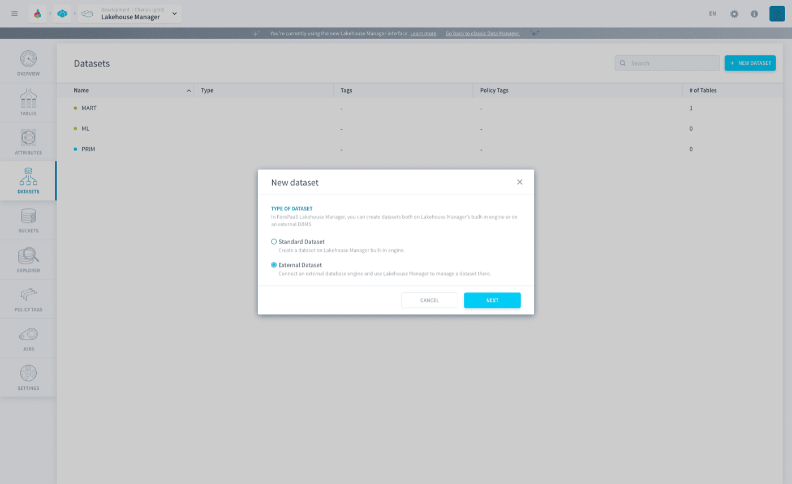
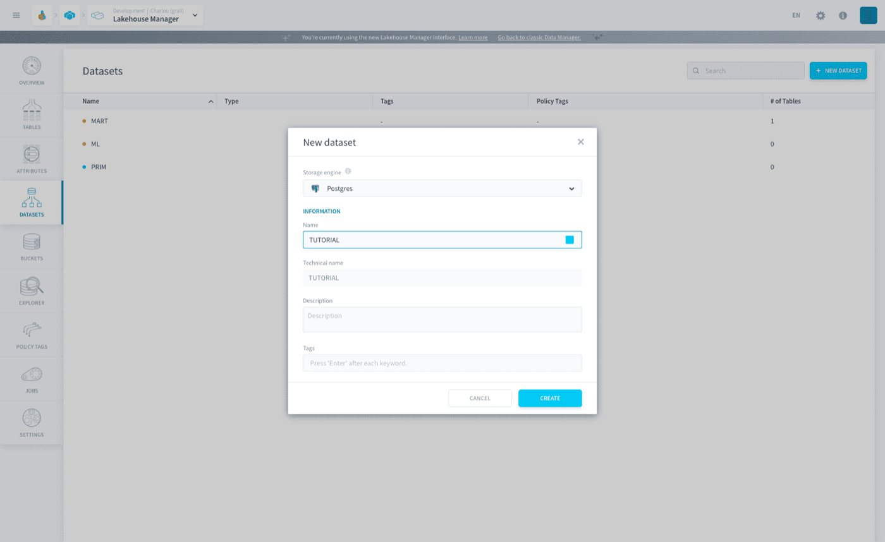
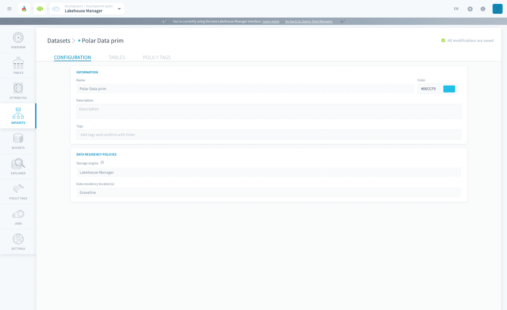
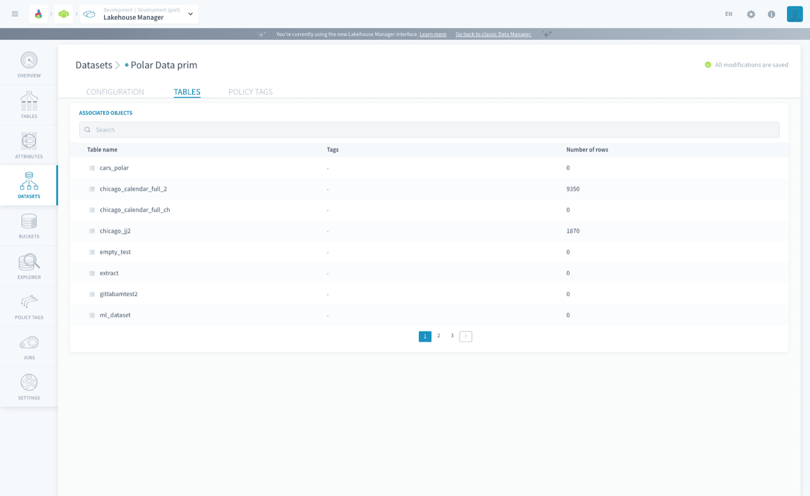
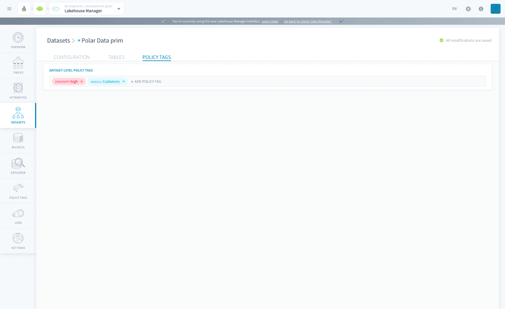

## Objective

Datasets are logical groupings of tables, which allow them to share some default parameters.the Platform supports **Standard** as well as **External** Datasets to manage your tables.

By default you will be given 3 standard datasets - **MART, ML and PRIM**. These 3 standard datasets will be using the *Lakehouse Manager Engine* which is based on [Apache Iceberg](https://iceberg.apache.org/).

{.thumbnail}

* [Datasets](#datasets)
    * [Standard Dataset](#standard-dataset)
    * [External Dataset](#external-dataset)
* [Dataset Management](#dataset-management)

> [!warning]
> Once you create a dataset, there is a waiting period of 60 seconds before it can be used for queries.

## Datasets

Datasets were designed with the mindset of encouraging users to manage the parameters of a table at a group/dataset level. You can Edit, Duplicate and Delete datasets from the list view.

### Standard Dataset

The [Lakehouse Manager](/pages/public_cloud/data_platform/product/lakehouse-manager/00-lakehouse-manager-index) does the dual role of being the data management service but also the storage engine for the standard dataset. You can learn more about this engine by clicking on the *discover* link during the creation of a dataset.

Click on the **New Dataset** button to start creating a new dataset, then select *standard dataset*. Fill in all the required dataset fields and click **Create**.

{.thumbnail}

{.thumbnail}

### External Dataset

The Lakehouse Manager can connect to an external database engine and manage a dataset.the Platform currently supports two external database engine - *PostgreSQL* and *Snowflake*. You can learn more about these engines by clicking on the *discover* link during the creation of a dataset.

To create an *External Dataset* first you will need to [create a storage engine](/pages/public_cloud/data_platform/product/storage-engine) and link it to your project.

Click on the **New Dataset** button to start creating a new dataset, then select *external dataset*. 

Choose the database engine from the dropdown and fill in all the required dataset fields and click **Create**.

{.thumbnail}

{.thumbnail}

## Dataset Management

The configuration page shows all the information you need to know about your dataset. You can edit the description and the tags for your datasets, you can also view the data residency policies - storage engine used and data residency location.

{.thumbnail}

In the tables tab, you can view all the associated tables that are a part of the dataset. It is important to remember that this is only a view, and you cannot edit any of the tables from this menu.

{.thumbnail}

The [policy tags](/pages/public_cloud/data_platform/product/lakehouse-manager/policy-tags) menu allows you assign dataset wide policy tags, which will be further applied to all the tables part of the dataset. 
You can choose from the available policy tags, or even create policy tags on spot. [Here](/pages/public_cloud/data_platform/product/lakehouse-manager/policy-tags#binding-policy-tags-to-data) is the step-by-step guide to binding policy tags.

{.thumbnail}

## Go further

Join our [community of users](/links/community).