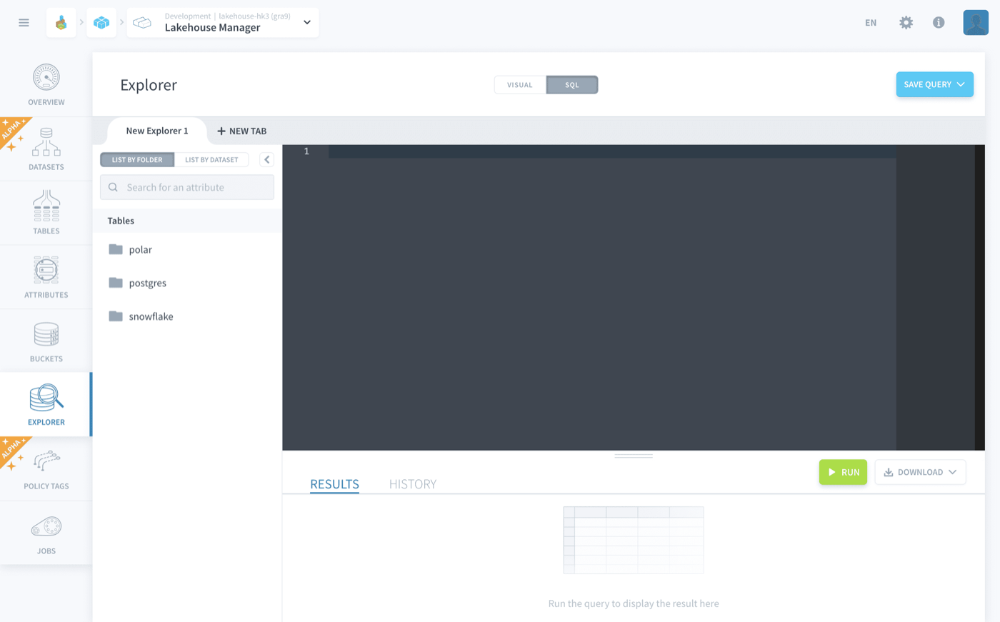

## Objective

The Explorer is a powerful and flexible tool designed to **perform exploratory data analysis** in an easy-to-use interface, using either a no-code visual query tool, or SQL. 

It provides an easy way to check the content of the tables you have created in the Lakehouse Manager after having [loaded them through the Data Processing Engine](/pages/public_cloud/data_platform/product/dpe/actions/load/00-load-index), and get the insights needed to help you make decisions as to what to build next.

{.thumbnail}

The Explorer is a collaborative tool. You and your team can work on multiple tabs at the same time, and you can see the queries of your teammates by switching to their tabs. You can only edit the tabs that you created: your teammates' tabs are in read-only mode.

> [!primary]
> The Explorer only displays results in the form of a table. If you want to create charts and visualizations, use the [Analytics Manager](/pages/public_cloud/data_platform/product/am/00-analytics-manager-index)

> [!warning]
> It is necessary to activate a [query engine](/pages/public_cloud/data_platform/product/am/resources) in order to use the Explorer. This can be done in the Resources tab of the Analytics Manager.

* [How to explore your data using the visual builder](#how-to-explore-your-data-using-the-visual-builder)
* [How to explore your data using the SQL editor](#how-to-explore-your-data-using-the-sql-editor)

## How to explore your data using the visual builder

The visual builder interface offered in the Explorer is the same as the one used to build queries in the [Analytics Manager](/pages/public_cloud/data_platform/product/am/00-analytics-manager-index). Discover how to use it on the link below.

> [!primary]
> [**Use the visual builder**](/pages/public_cloud/data_platform/product/am/queries/visual)

## How to explore your data using the SQL editor

The SQL editor interface offered in the Explorer is the same as the one used to build queries in the [Analytics Manager](/pages/public_cloud/data_platform/product/am/00-analytics-manager-index). Discover how to use it on the link below.

> [!primary]
> [**Use the SQL editor**](/pages/public_cloud/data_platform/product/am/queries/sql) 

## Go further

Join our [community of users](/links/community).