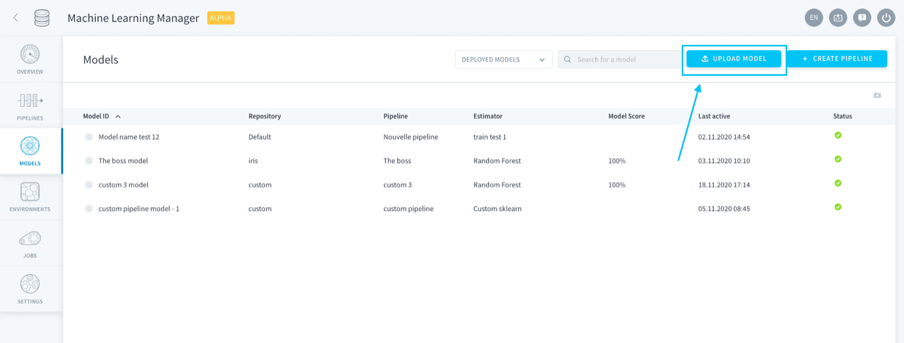
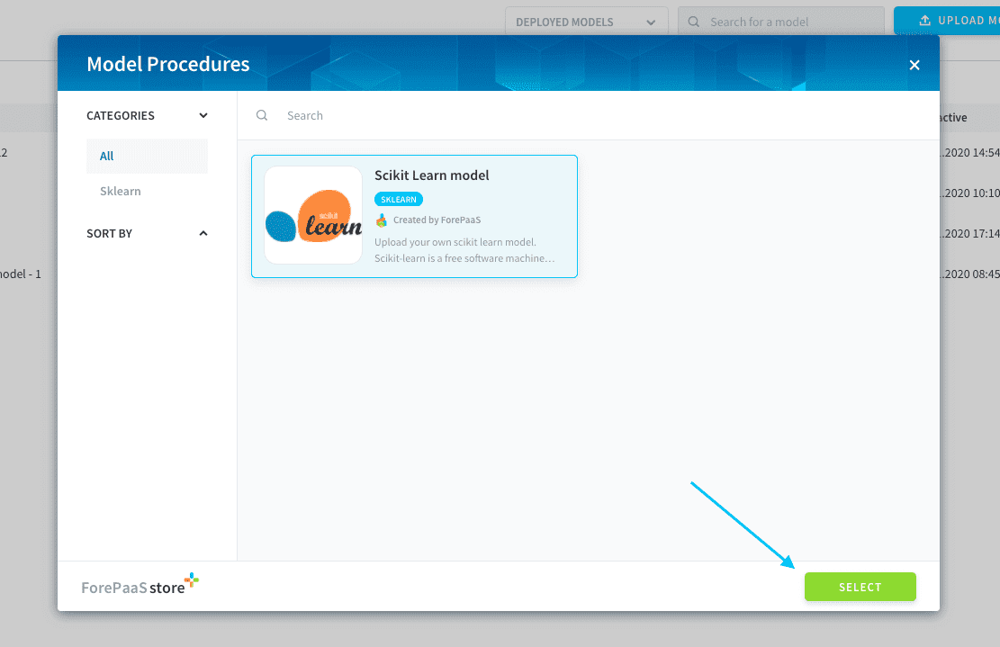
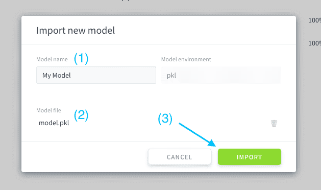
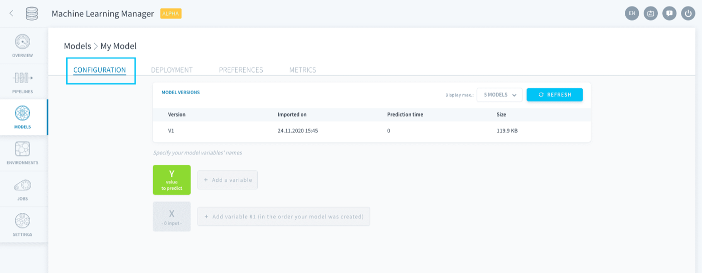
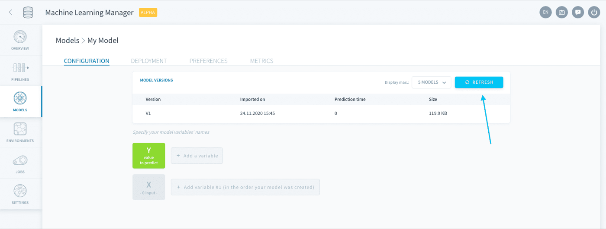
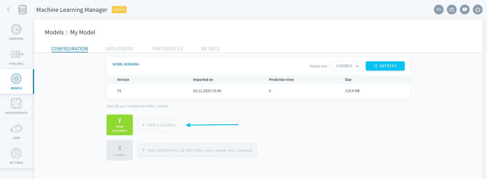
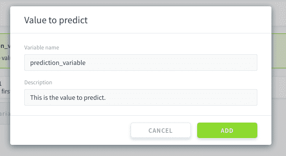
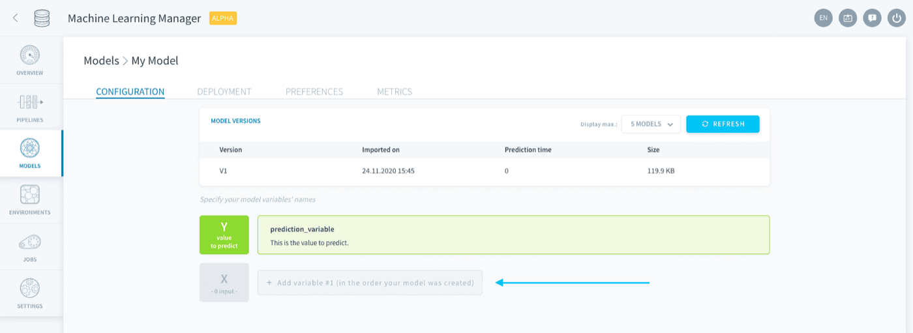
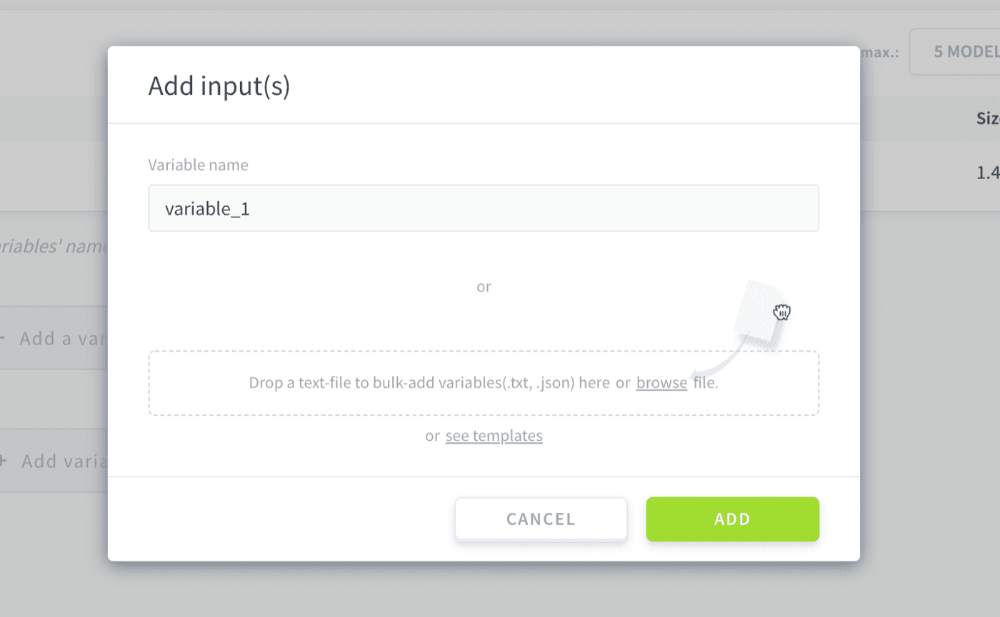
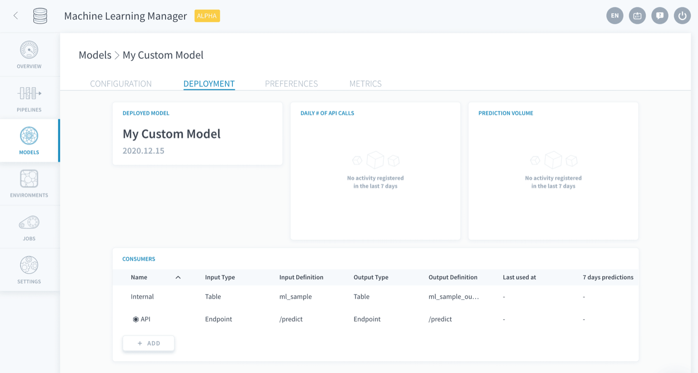

## Objective

> [!primary]
> **Please note:** This service is only available on the *Legacy ForePaaS Platform*.

You can very easily import a trained model to ForePaaS by clicking on **Upload Model** on the Models page.

{.thumbnail}

You can either **upload a private model** from your computer or a git repository, or **import a shared community model** that has been posted to the Store by another user.

To use a shared community model, simply search for the desired model within the Store and import it.

If you want to use your own private model instead, simply select one of the *Custom* options in the store.

> [!primary]
> If you can't find your model language among the Custom options in the Store, it is not supported on ForePaaS yet.  
We are working hard to regularly add more integrations to the platform! Drop us a message on [the Roadmap page](https://hq.forepaas.io/#/features) so we know how to prioritize your needs for future releases.

{.thumbnail}

Specify the name and file for your model, and click on **Import**.

{.thumbnail}

Now you need to configure your model deployment. This is done through several steps:

* [Configuration](/pages/public_cloud/data_platform/product/ml/models/import#configuration)
    * [Manage versions](/pages/public_cloud/data_platform/product/ml/models/import#manage-versions)
    * [Specify variables](/pages/public_cloud/data_platform/product/ml/models/import#specify-variables)
* [Deployment settings](/pages/public_cloud/data_platform/product/ml/models/import#deployment-settings)

> [!primary]
> Shared models are already configured by the author: you can deploy them in one click of a button!

## Configuration

Setting up your model is done in the **Configuration tab**.

{.thumbnail}

### Manage versions

All model versions are listed in the table so you can track changes and compare them instantly. 

> [!primary]
> For the moment, it is not possible to get scoring on imported models - please [drop us a note on the roadmap portal](https://hq.forepaas.io/#/features) if you would like to see this in the future.

To update the model version, simply press the **Refresh** button at the top of the table.

{.thumbnail}

You will then be prompted to select the newest version of your model from your files.

### Specify variables

Depending on the language/software you have used to build your model, you might need to specify its features. This step is required for the **inference API to correctly map input data** when you will be making predictions.

First, specify the name of your value-to-predict by clicking on **Add a variable** next to Y.

{.thumbnail}

{.thumbnail}

Then, specify the variables in your X dataset by clicking on the same button next to X. 

{.thumbnail}

You have two options to specify your X variables:

* enter them manually one-by-one
* add them all in one go by uploading a text file. [Click here](/pages/public_cloud/data_platform/product/ml/models/import) to see code boilerplates.

{.thumbnail}

> [!warning]
> The variables' names must be the same as the names you will use when requesting a prediction.

## Deployment settings

{.thumbnail}

This is where you decide how to use your deployed models to make predictions. All the configuration is done through what is called **consumers**. They are entities plugged into your deployed model which are fed data in order to make predictions. 

Deployment settings are identical for standalone models and for pipelines: check out the article below for a detailed documentation.

[Manage deployment settings](/pages/public_cloud/data_platform/product/ml/pipelines/configure/deployment)

## Go further

Join our [community of users](/links/community).