## Objective

> [!primary]
> **Please note:** This service is only available on the *Legacy ForePaaS Platform*.

Notebooks are a built-in integration of [Jupyter Notebooks](https://jupyter.org/) on ForePaaS. Coming with pre-loaded packages for data science, they allow you to perform non-real-time interactive statistical analysis and data visualization. Notebooks are highly connected to the rest of your Project, making it possible to read/write data in the Data Manager thanks to [our SDK](/pages/public_cloud/data_platform/technical/sdk/dpe/00-dpe-index) or convert your notebook code into a [Data Processing Engine action](/pages/public_cloud/data_platform/product/dpe/actions/00-actions-index) or a [Machine Learning Manager pipeline](/pages/public_cloud/data_platform/product/ml/pipelines/00-pipelines-index).

{.thumbnail}

* [Create and delete notebooks](/pages/public_cloud/data_platform/product/ml/notebooks/00-notebooks-index#create-and-delete-notebooks)
* [Open a notebook](/pages/public_cloud/data_platform/product/ml/notebooks/00-notebooks-index#open-a-notebook)
* [Edit the settings of a notebook](/pages/public_cloud/data_platform/product/ml/notebooks/00-notebooks-index#edit-the-settings-of-a-notebook)
* [Export a notebook into ForePaaS](/pages/public_cloud/data_platform/product/ml/notebooks/00-notebooks-index#export-a-notebook-into-forepaas)

## Create and delete notebooks

You can manage your **notebook instances** in the corresponding tab in the Machine Learning Manager. A notebook instance is a Jupyter environment with specific resources and dependencies.  

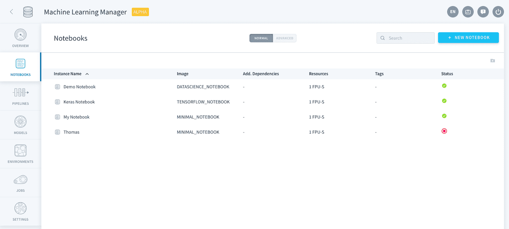{.thumbnail}

A notebook instance can contain several notebook documents, i.e. *.ipynb* files, which you can manage directly from the JupyterLab interface.

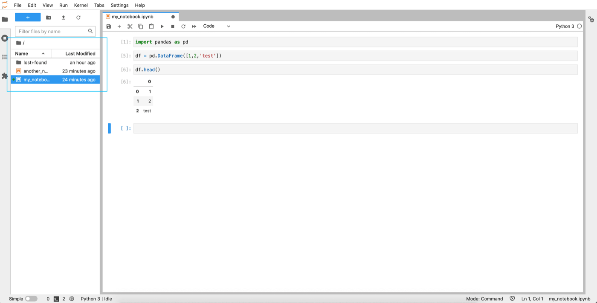{.thumbnail}

From the Notebooks home page, you can **create, work on, delete and edit the settings** of all your notebooks.

> [!primary]
> On the ForePaaS Platform, the word *notebook* is used to talk about notebook instances.

[Learn how to create a notebook](/pages/public_cloud/data_platform/product/ml/notebooks/create)

You can delete a notebook by clicking on the 🗑️ icon. Deleted notebooks cannot be recovered.

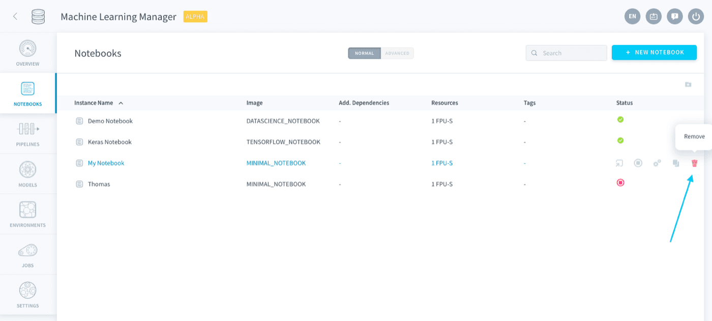{.thumbnail}

## Open a notebook

Notebook instances are **automatically turned on** when you open them. 

The notebook instance will consume all assigned FPU for the duration it is turned on. 

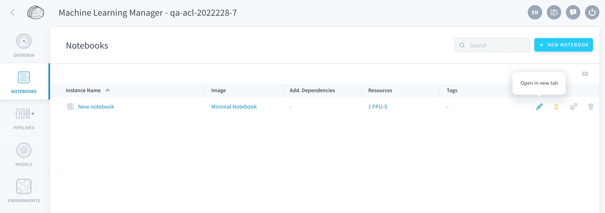{.thumbnail}

You can manually turn off a notebook by clicking on the *Stop* button when it is active.

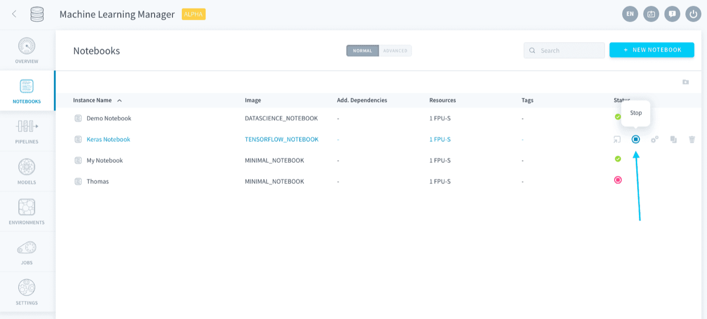{.thumbnail}

To open a notebook, **double click** on it, or press the button shown below. This will open the notebook in a new JupyterLab window.

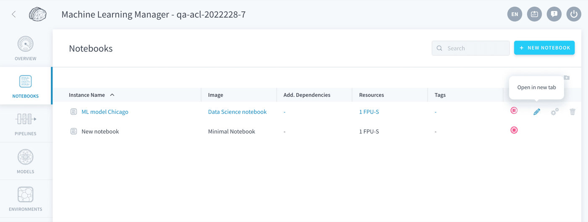{.thumbnail}

The [JupyterLab](https://jupyterlab.readthedocs.io/en/stable/) interface allows you to work on your notebooks with all the features provided by Jupyter, such as having multiple *.ipynb* files open at the same time, keyboard shortcuts, download and export options, and much more.

> [!primary]
> Use the [ForePaaS SDK](/pages/public_cloud/data_platform/technical/sdk/dpe/00-dpe-index) to easily interact with the rest of your Project, typically to **import/process/export data** from and to your Data Manager tables.

{.thumbnail}

## Edit the settings of a notebook

To edit the settings of a notebook, click on the **gears** icon.

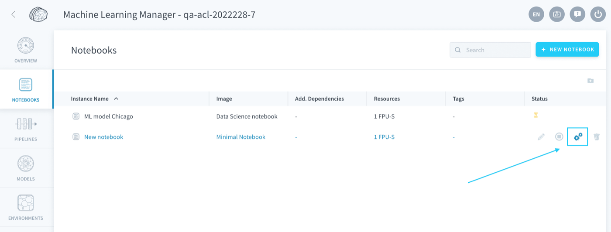{.thumbnail}

You can edit the following options:

* [Edit dependencies](/pages/public_cloud/data_platform/product/ml/notebooks/00-notebooks-index#edit-dependencies)
* [Edit resources](/pages/public_cloud/data_platform/product/ml/notebooks/00-notebooks-index#edit-resources)

### Edit dependencies

You can edit the packages and dependencies of your notebook environment, including the Python version. The notebook will have to be restarted for any modification to be applied.

All notebooks have an [instance image](/pages/public_cloud/data_platform/product/ml/notebooks/create), which comes with some default packages and **Python 3.9**. You can specify additional dependencies by clicking on the **Add** button in the *Dependencies* panel.

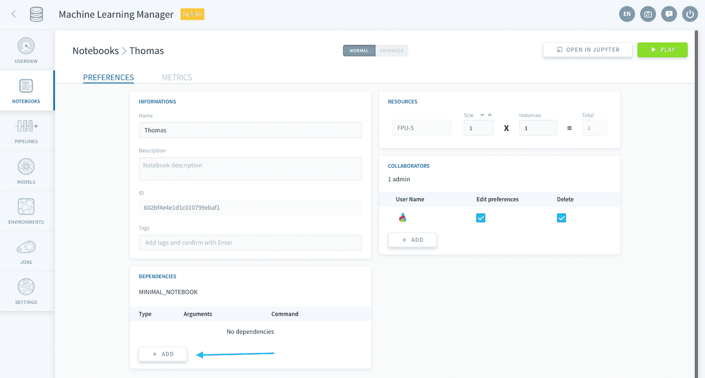{.thumbnail}

Simply choose the type of dependency and enter the name of the package to install in the server, then press Enter.

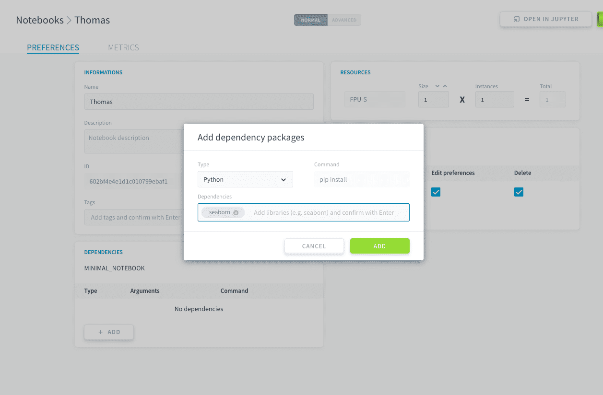{.thumbnail}

You can add several packages at once by pressing *Enter* every time, like tags.

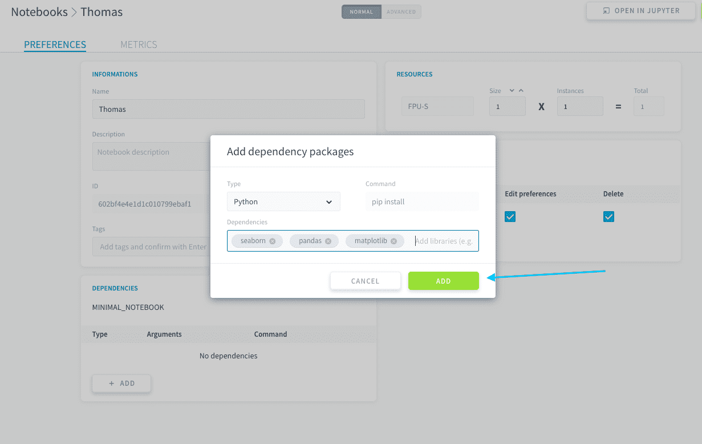{.thumbnail}

### Edit resources

This is where you can edit the resources you want your notebook to use. The notebook will have to be restarted for any modification to be applied.

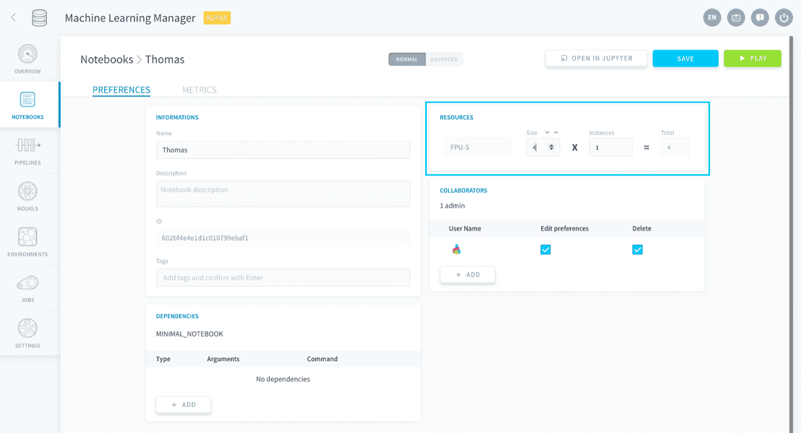{.thumbnail}

## Export a notebook into ForePaaS

You can also export the entirety of the notebook's content to an object in ForePaaS. This will export all the code in your cells as it is and will turn any markdown cells into comments. 

> [!primary]
> Notebook exporting is only available with Python version 3.9.7. Please select that version on the notebook's settings, otherwise you won't be able to export your notebook.

There are three options regarding where to export your notebook to:

- [Custom Action](/pages/public_cloud/data_platform/product/dpe/actions/custom/00-custom-index), in the Data Processing Engine.
- [Custom Estimator](/pages/public_cloud/data_platform/product/ml/pipelines/configure/training/custom-estimator/00-custom-estimator-index), in the Machine Learning Manager.
- [Custom Scoring Function](/pages/public_cloud/data_platform/product/ml/pipelines/configure/training/validation#custom-scoring-function), in the Machine Learning Manager.

To export your notebook, open it and click on *File* and then on *ForePaaS export*. 

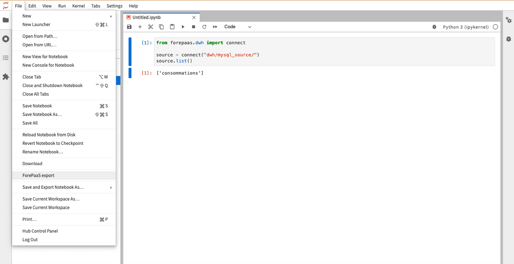{.thumbnail}

This will open an export widget allowing you to choose between the three export options. Choose your preferred option and click on Next.
 
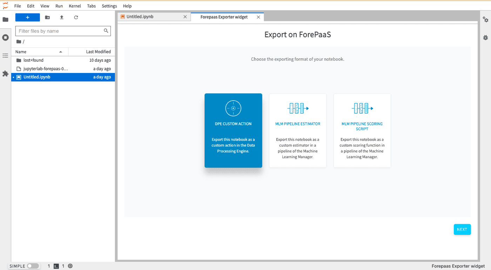{.thumbnail}

Choose the repository and the repository version where to export the notebook. If are not familiar with repositories, simply leave it at the *Default* repository with version *v1*.

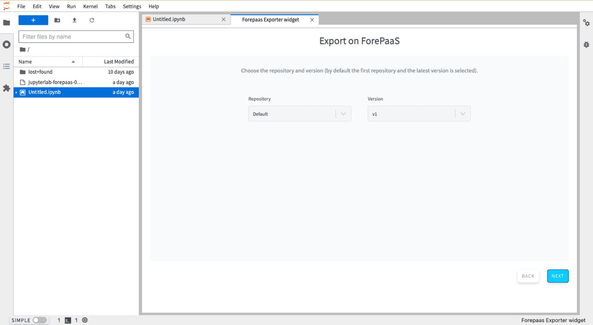{.thumbnail}

Then, you will be required to decide if you want to export to an existing object or create a new one. If you create a new one, you also have to choose the name and the framework to be used.

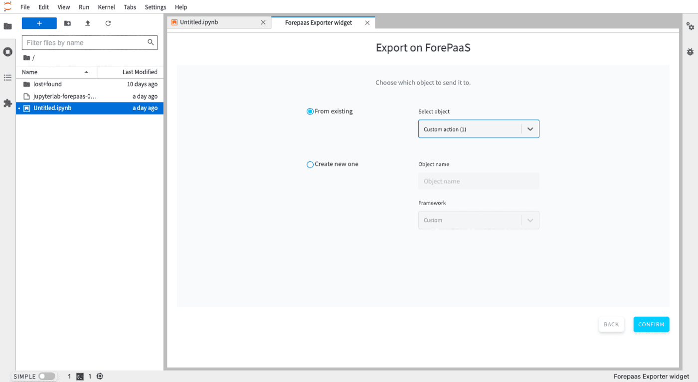{.thumbnail}

Finally, click on confirm to export the notebook.

## Go further

Join our [community of users](/links/community).