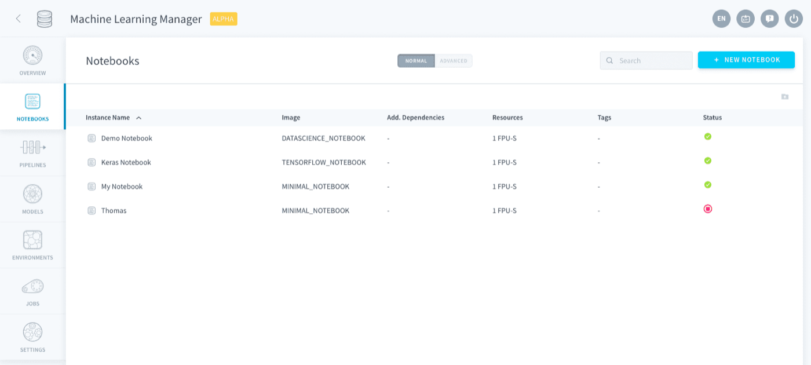
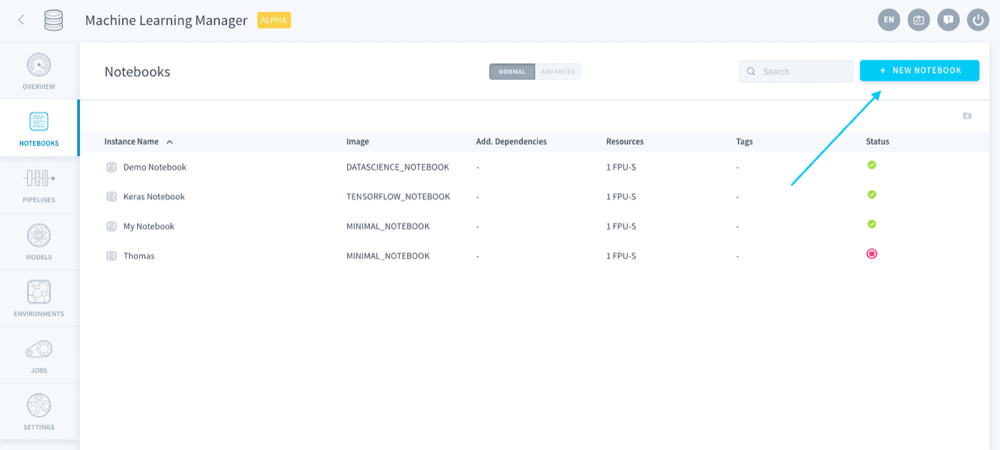
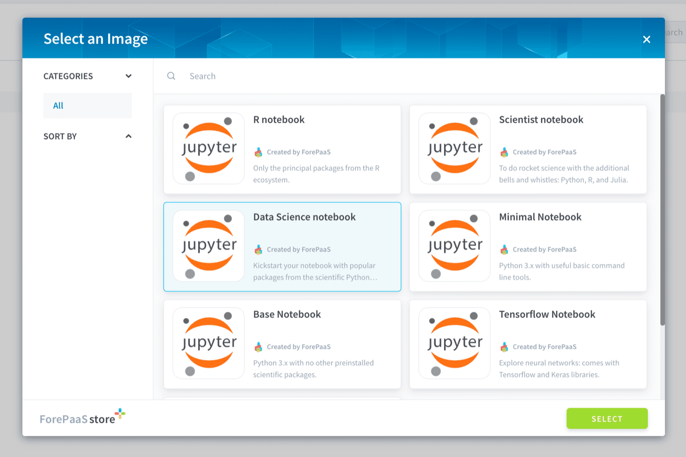
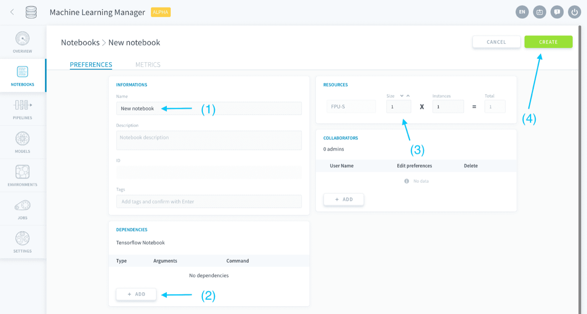
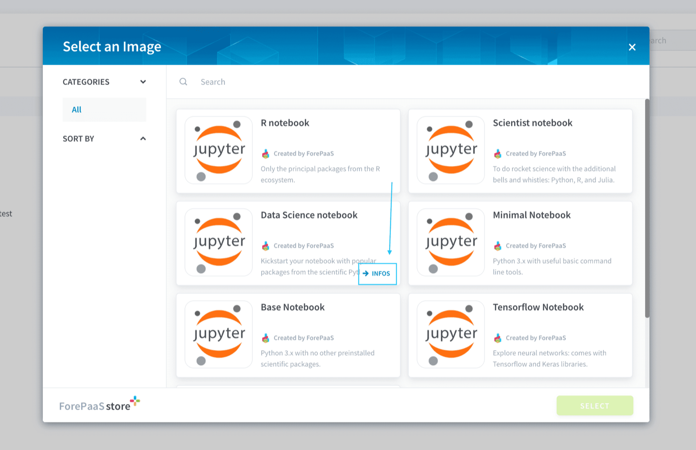
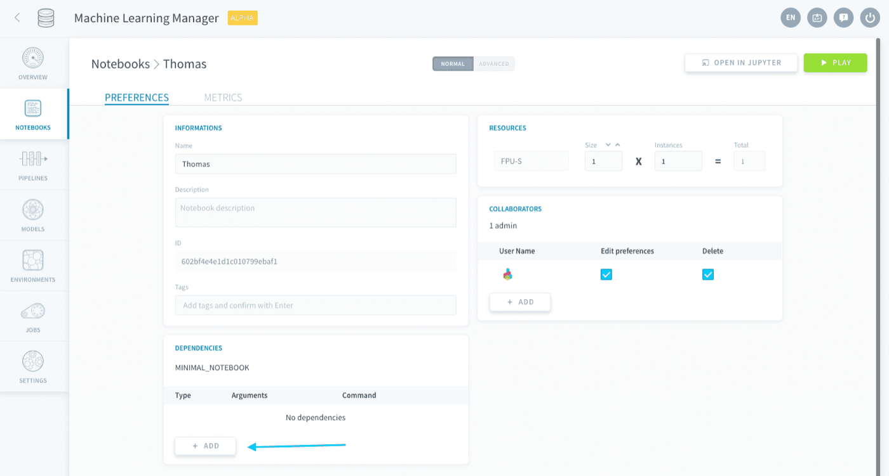
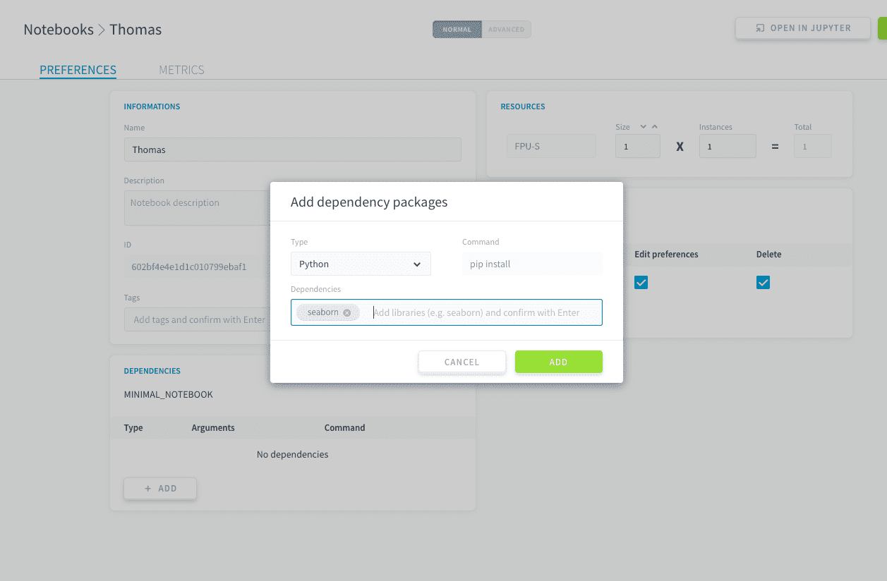
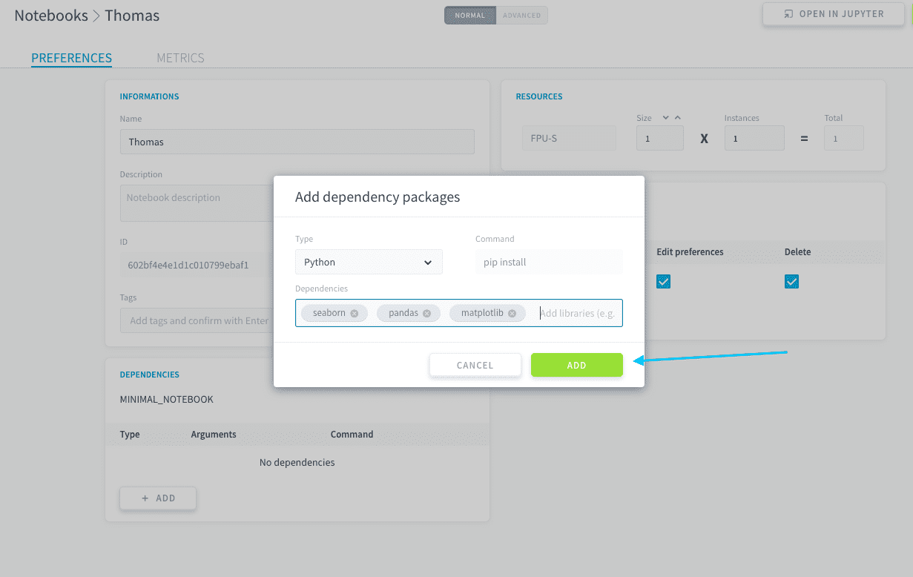

## Objective

> [!primary]
> **Please note:** This service is only available on the *Legacy ForePaaS Platform*.

To create a notebook instance, head to the **Notebook** section of the Machine Learning Manager.

{.thumbnail}

Click on **New notebook** in the top-right.

{.thumbnail}

You have to choose a [container image](https://jupyter-docker-stacks.readthedocs.io/en/latest/using/selecting.html) for your Jupyter environment, i.e. the set of packages and dependencies you want to have for your new notebook. ForePaaS features several ready-to-run images which contain the most popular libraries for data analysis and data science. 

> [!primary]
> If you are new at creating notebooks, we recommend starting off with a *Data Science notebook*. It contains all the basic Python libraries for data exploration such as pandas, scipy, scikit-learn, matplotlib and much more!

{.thumbnail}

You can then configure your notebook further before it is created (and it is still possible to change those settings later on). Once you press **Create**, the server for the notebook will be initialized - with its specific environment and dedicated computing resources.

{.thumbnail}

The two main aspects to configure are:

* [Additional dependencies](/pages/public_cloud/data_platform/product/ml/notebooks/create#notebook-dependencies)
* [Resources](/pages/public_cloud/data_platform/product/ml/notebooks/create#notebook-resources)

## Notebook dependencies

Your notebook's image already comes with some default packages, which you can individually check in the image description in the marketplace. 

{.thumbnail}

You can specify additional dependencies by clicking on the **Add** button in the *Dependencies* panel.

{.thumbnail}

Simply choose the type of dependency and enter the name of the package to install in the server.

{.thumbnail}

You can add several packages at once by pressing *Enter* every time, like tags.

{.thumbnail}

## Notebook resources

Check out the dedicated sections to learn how to configure your new notebook's resources. It is suggested to configure them before confirming the creation of the notebook.

[Configure a notebook's resources](/pages/public_cloud/data_platform/product/ml/notebooks/00-notebooks-index#edit-resources)

## Go further

Join our [community of users](/links/community).