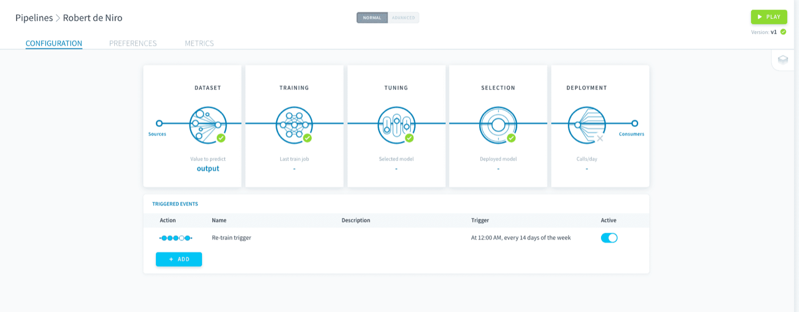
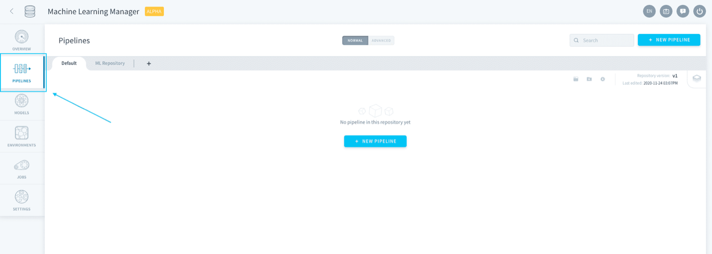
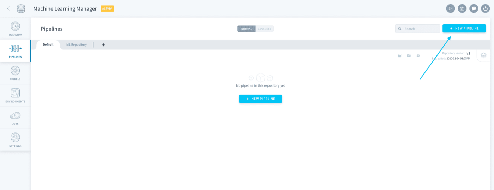
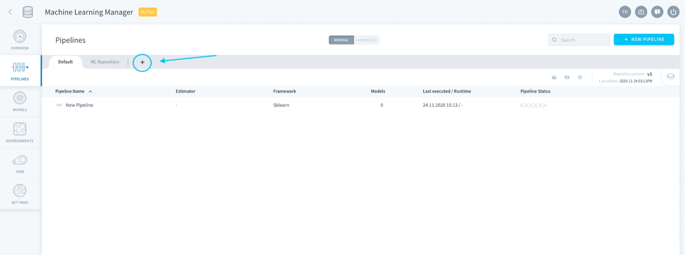
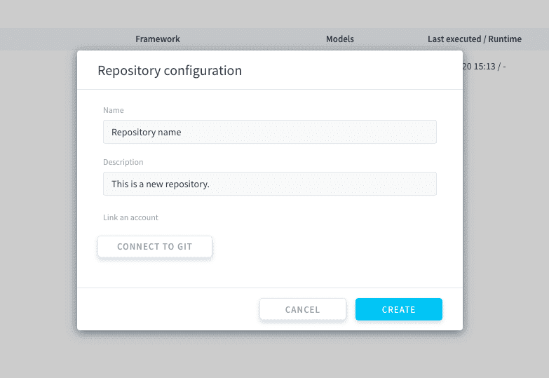
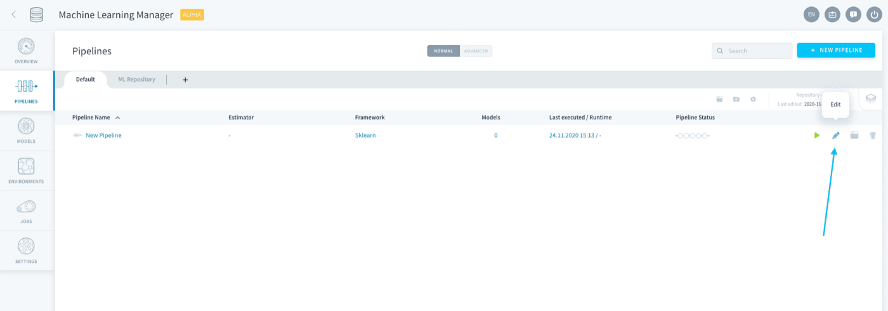
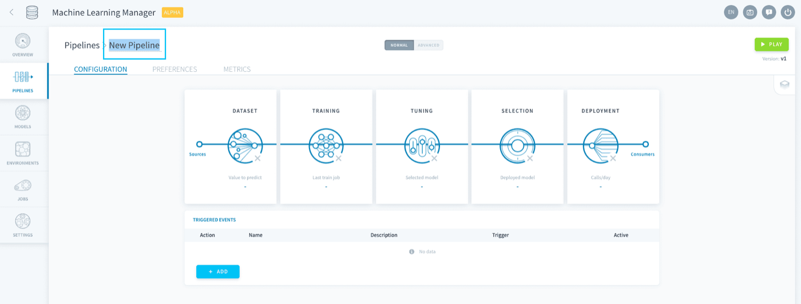
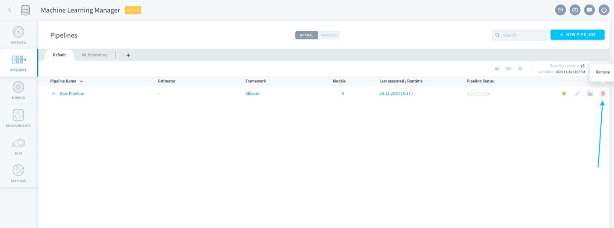

## Objective

> [!primary]
> **Please note:** This service is only available on the *Legacy ForePaaS Platform*.

Pipelines are the feature that enables you to **create a machine learning model from scratch and deploy it to make predictions**. It is a production-grade end-to-end environment in which a model evolves through its [life-cycle](/pages/public_cloud/data_platform/product/ml/pipelines/configure/00-configure-index#manage-execution-options) in a traceable way.

{.thumbnail}

> [!primary]
> Pipelines can store several trained models and their versions, but only one can be deployed to make predictions.

- [Create a pipeline](#create-a-pipeline)
- [Manage pipelines](#manage-pipelines)
- [Configure a pipeline](/pages/public_cloud/data_platform/product/ml/pipelines/configure/00-configure-index)
- [Execute a pipeline](/pages/public_cloud/data_platform/product/ml/pipelines/execute/00-execute-index)

## Create a pipeline

To create a pipeline, head to **Pipelines** in the ML component. 

{.thumbnail}

If you haven't already started a *machine learning Project*, start by [initializing a repository](/pages/public_cloud/data_platform/product/ml/pipelines/00-pipelines-index#pipeline-repositories). Else simply click on **New Pipeline** at the top-right. 

{.thumbnail}

Wait a few seconds for your pipeline to be built. After being built for the first time, pipelines are in auto-save mode. You can exit and come back to the configuration at any time.

[Configure a pipeline](/pages/public_cloud/data_platform/product/ml/pipelines/configure/00-configure-index)

## Manage pipelines

### Pipeline repositories

Pipelines are stored in ForePaaS repositories. You can initialize a new repository by pressing the ➕ sign in the Pipelines tab.

{.thumbnail}

You can edit the name and description of the pipeline, as well as connect it to an existing Git repository.

{.thumbnail}

### Edit pipelines

Pipelines can be configured from the repository list by clicking on the **pen 🖊️ icon**, or by double-clicking the pipeline.

{.thumbnail}

Pipelines can be renamed when configuring them, by double-clicking on their name at the top-right.

{.thumbnail}

Pipelines can be deleted from the repository list by clicking on the **trash 🗑️ icon**.

> [!warning]
> Deleting a pipeline does not delete its saved models. Models that were generated by a deleted pipeline are still accessible on [the Models tab](/pages/public_cloud/data_platform/product/ml/models/00-models-index).

{.thumbnail}

## Go further

Join our [community of users](/links/community).