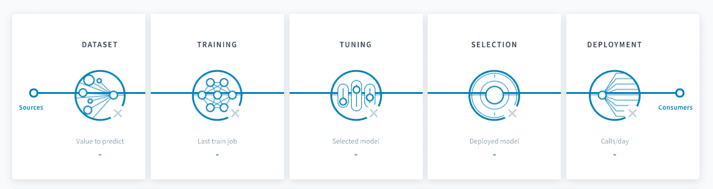

## Objective

Each pipeline can be configured from the data input to the deployment options in order to create accurate production-grade prediction models. 

{.thumbnail}

## The five configuration steps

There are five core steps to setting up a pipeline on ForePaaS.

   
1

   <a class="landing-link" href="pages/public_cloud/data_platform/product/ml/pipelines/configure/dataset/00-dataset-index">
      
      

         <h2>Dataset preparation</h2>
         
Specify everything related to the train and test datasets of your model.

      

   </a>

   
2

   <a class="landing-link" href="pages/public_cloud/data_platform/product/ml/pipelines/configure/training/00-training-index">
      
      

         <h2>Training procedure</h2>
         
Set up the estimator at the basis of your model as well as the scoring and validation options needed to fine-tune it.

      

   </a>

   
3

   <a class="landing-link" href="pages/public_cloud/data_platform/product/ml/pipelines/configure/tuning">
      
      

         <h2>Hyper-parameter tuning</h2>
         
Fine-tune the hyper-parameters of your estimator using our intuitive and insightful studio.

      

   </a>

   
4

   <a class="landing-link" href="pages/public_cloud/data_platform/product/ml/pipelines/configure/validation/00-validation-index">
      
      

         <h2>Model selection</h2>
         
Compare models that have been trained since the creation of your pipeline and decide which to deploy.

      

   </a>

   
5

   <a class="landing-link" href="pages/public_cloud/data_platform/product/ml/pipelines/configure/deployment">
      
      

         <h2>Deployment settings</h2>
         
Specify the various settings for your production-grade inference service

      

   </a>

## Manage execution options

Once a pipeline is set up, you can manage various execution options to ensure a reliable life-cycle of your models in a production environment. Learn more about the execution of a pipeline and the life-cycle of a model below:

[Manage a pipeline's execution](/pages/public_cloud/data_platform/product/ml/pipelines/execute/00-execute-index)

## Go further

Join our [community of users](/links/community).