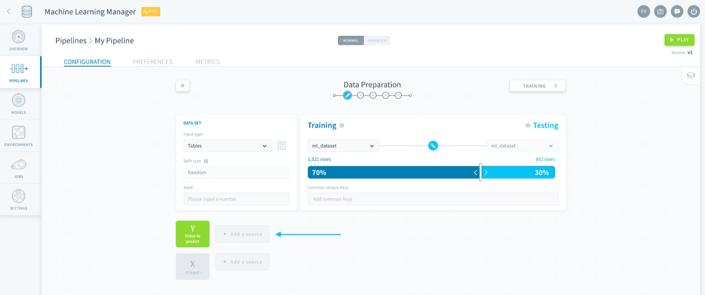
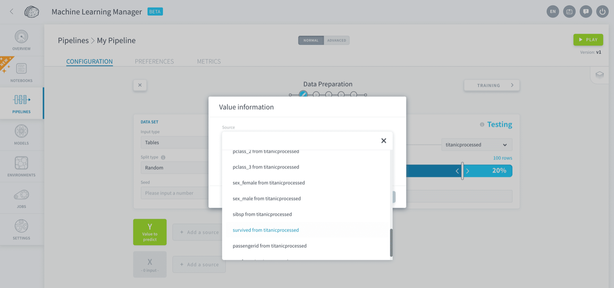
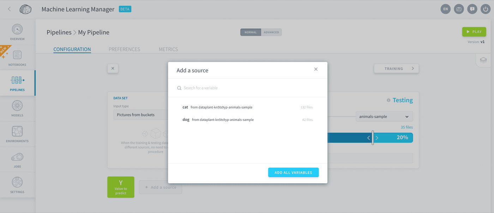
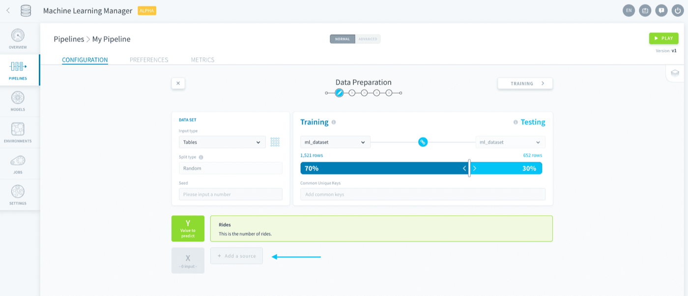

## Objective

ForePaaS enables you to fully specify which variables to select for your model.

## Add a value-to-predict

The value you want to predict (i.e. the label) is saved in the *Y dataset*. To add a value-to-predict, click on **Add a source** next to Y.

{.thumbnail}

Choose the source based on the **input type** you specified when [generating your dataset](/pages/public_cloud/data_platform/product/ml/pipelines/configure/dataset/input#choose-a-data-input) and save.

#### When the input type is *Tables*

You will be able to select one attribute from the training table.

{.thumbnail}

#### When the input type is *Pictures from buckets*

You will be able to select [one or several folders](/pages/public_cloud/data_platform/product/ml/pipelines/configure/dataset/input#pictures-from-buckets) from the training bucket.

{.thumbnail}

## Add features

The features, or variables, that are used to make a prediction are saved in the *X dataset*. To add features to your structured data model, click on **Add a source** next to X.

{.thumbnail}

Choose as many variables as you want from the source based on the input type you specified when [generating your dataset](/pages/public_cloud/data_platform/product/ml/pipelines/configure/dataset/input#choose-a-data-input) and save.

> [!primary]
> Shortcut tip: you have the option to *add all variables* in one go: this will add all the variables from the source **except** the one you chose as the value-to-predict.

## Pre-processing

Advanced feature engineering should be carried out in the [Data Processing Engine (DPE)](/pages/public_cloud/data_platform/product/dpe/00-dpe-index) on your source itself.

## Go further

Join our [community of users](/links/community).