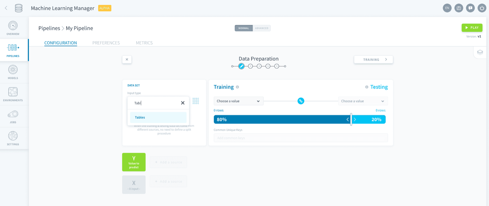
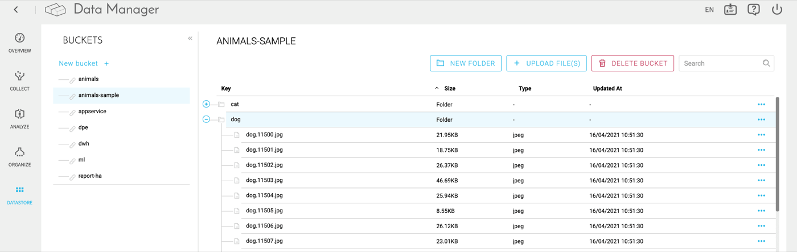
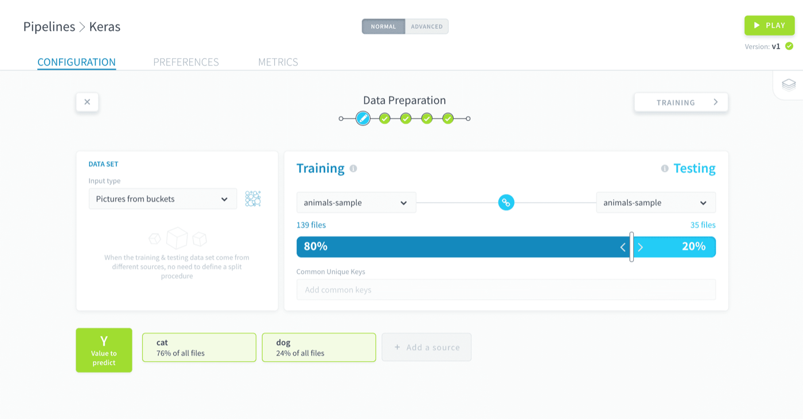
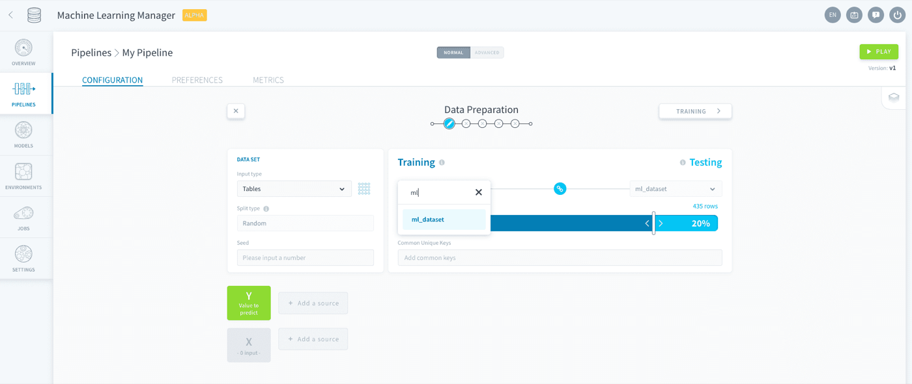
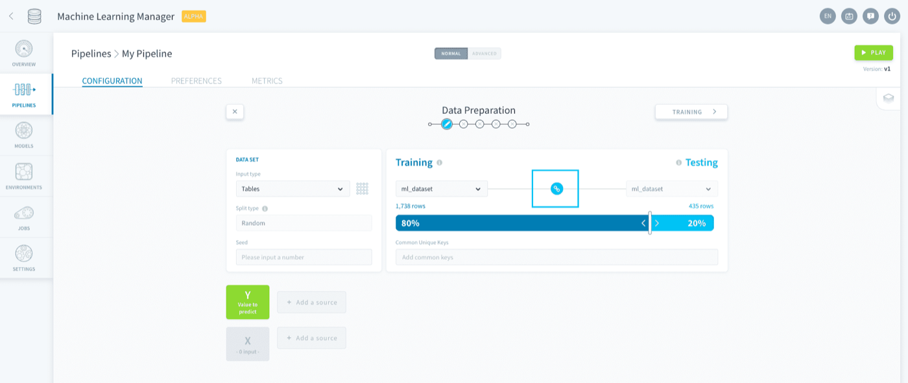
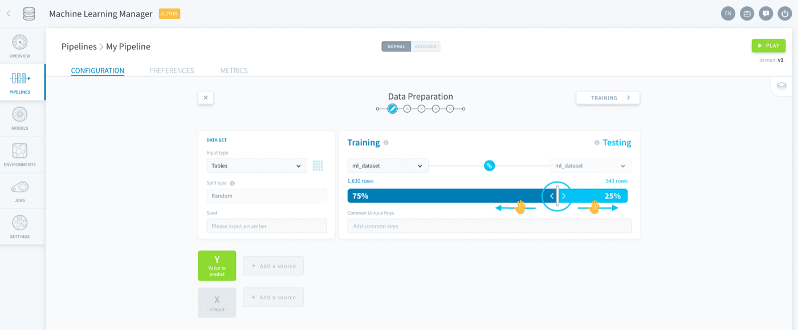
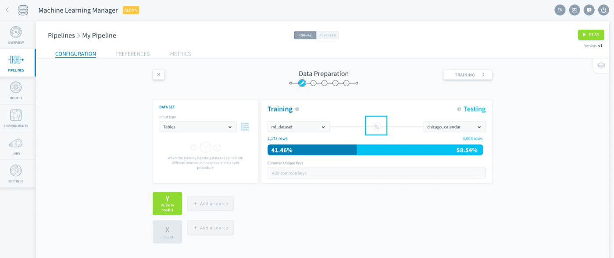
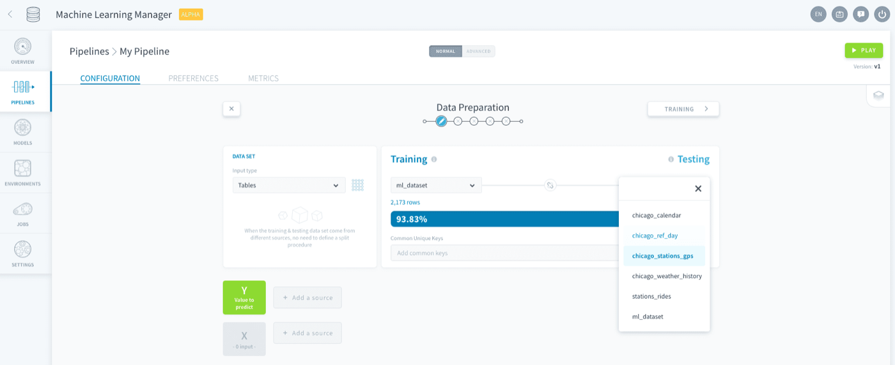

## Objective

The dataset generation consists in **choosing an data input** and then **splitting that data into a train and a test dataset**. When doing production-level AI, this split occurs continually over time as new [Dataset Generation jobs](/pages/public_cloud/data_platform/product/ml/pipelines/execute/00-execute-index#dataset-generation-jobs) are launched (manually or through triggers). 

## Choose a data input

ForePaaS supports several input types:

* [Data Manager Tables](/pages/public_cloud/data_platform/product/ml/pipelines/configure/dataset/input#tables)
* [Buckets](/pages/public_cloud/data_platform/product/ml/pipelines/configure/dataset/input#pictures-from-buckets)

> [!primary]
> We are working hard to add more integrations to ML pipelines. If we are missing something critical for your Project, please reach out and drop us a line on [our Roadmap Portal](https://hq.forepaas.io/#/features)! 

### Tables

The *Tables* input type lets you choose from the **tables in your Data Manager**. You can choose from raw, prim and mart tables.

{.thumbnail}

### Pictures from buckets

The *Pictures from buckets* input type lets you choose from the buckets in your Data Manager. This makes it the perfect choice to work with unstructured data, especially pictures.

> [!primary]
> This input type currently only accepts files with EXIF data and files that are considered as an image by [the pillow library](https://pillow.readthedocs.io/en/5.1.x/handbook/image-file-formats.html).

To enable unstructured data training, the images must first be uploaded to the Data Manager's buckets in **a folder named after each class**. Using the [Cats and Dogs](https://www.tensorflow.org/datasets/catalog/cats_vs_dogs) image classification dataset as an example, the images will be uploaded into two folders in a bucket. One named `cats` (so that the path is *cats/my_images.jpg*) the other `dogs` (so that the path is *dogs/my_images.jpg*). 

{.thumbnail}

{.thumbnail}

## Train-test split

After choosing an origin for your data, you need to make it usable by machine learning algorithms by splitting it into a training and a testing set. The nature of the sets depends on whether you are working with structured *(in which case it will be tables of data)* or unstructured data *(in which case it will be filepaths)*.

> [!primary]
> **Training set**: Sample of data used to fit (i.e. train) the model.  
> **Testing set**: Independent sample of data used to provide an unbiased assessment of a fully trained model. Training and testing sets must remain disjoint over time.
>
> On ForePaaS, training and testing sets are modeled and stored as ML tables in the Data Manager.

In a pipeline, you can choose to use either [the same source](/pages/public_cloud/data_platform/product/ml/pipelines/configure/dataset/input#use-the-same-source) or [two separate sources](/pages/public_cloud/data_platform/product/ml/pipelines/configure/dataset/input#use-different-sources) for your training and testing datasets. 

### Use the same source

Under Training, select the desired data source.

{.thumbnail}

Then activate the **link 🔗 icon** in between Training and Testing to use the same source for your training and testing sets.

{.thumbnail}

The next step is to decide how to split the data between Training and Testing. Use the slider to choose the share of data points amount (rows for Tables, files for Buckets, etc.) that each set should have **at the end** of the [Dataset Generation job](/pages/public_cloud/data_platform/product/ml/pipelines/execute/00-execute-index#dataset-generation-jobs).

{.thumbnail}

You can also control the method used to execute the split in the Data Set panel with the **Split Type** option. *Random* will assign each entering data point randomly in either the training or testing set so that the desired train-test ratio is respected. Specifying a **seed** for the pseudo-randomization will enable you to reproduce randomness. 

> [!warning]
> Remember that data points cannot be individually removed from a testing ML dataset even if they are removed from your source. You have the option to manually reset your ML datasets in your [pipeline preferences](/pages/public_cloud/data_platform/product/ml/pipelines/execute/preferences#reset-datasets).

### Use different sources

Under Training, select the desired data source.

{.thumbnail}

Make sure to turn off the **link 🔗 icon** in between Training and Testing to use the same source for your training and testing sets.

{.thumbnail}

Under Testing, select the desired data source.

{.thumbnail}

> With different sources you don't need to specify a train-test-split method since the split is already done! Each entering data point will be assigned accordingly either to the training or the testing set.

> [!warning]
> Remember that data points cannot be individually removed from a testing ML dataset even if they are removed from your input. You have the option to manually reset your ML datasets in your [pipeline preferences](/pages/public_cloud/data_platform/product/ml/pipelines/execute/preferences#reset-datasets).

After specifying the rows of your datasets, you need to specify their columns.

[Select your model's features](/pages/public_cloud/data_platform/product/ml/pipelines/configure/dataset/features)

## Go further

Join our [community of users](/links/community).