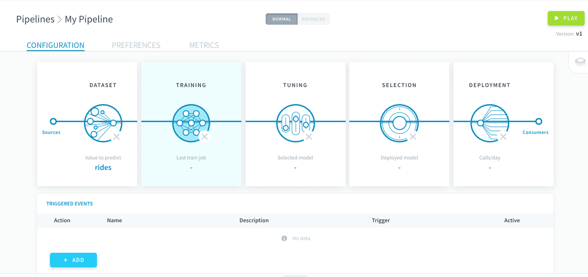

## Objective

The training procedure is at the core of every machine learning model. It defines the mathematical algorithm (i.e. estimator) at its basis as well as the set of rules used to **fit and evaluate it**.

{.thumbnail}

Training is usually the second step in configuring a pipeline. Coupled with the third step, [hyper-parameters tuning](/pages/public_cloud/data_platform/product/ml/pipelines/configure/tuning), your pipeline will be able to produce trained models for you to compare and deploy.

Training jobs [can be accelerated by a lot using GPUs](/pages/public_cloud/data_platform/product/ml/pipelines/execute/resources#use-gpu-for-your-processing).

## Train with a standard estimator

Give your pipeline configuration a quick start by using one of the standard estimators from a curated list from the most popular ML libraries!

[Use a standard estimator](/pages/public_cloud/data_platform/product/ml/pipelines/configure/training/standard-estimator)

## Train with a custom estimator

Can't find what you want on the ForePaaS Store? Carry out your training procedure exactly the way you want it by importing your own custom estimator.

[Use a custom estimator](/pages/public_cloud/data_platform/product/ml/pipelines/configure/training/custom-estimator/00-custom-estimator-index)

## Scoring and validation

Scoring and validation are necessary aspects of the training step in order to evaluate models in an unbiased way. Learn how to configure it right.

[Configure scoring and validation](/pages/public_cloud/data_platform/product/ml/pipelines/configure/training/validation)

## Go further

Join our [community of users](/links/community).