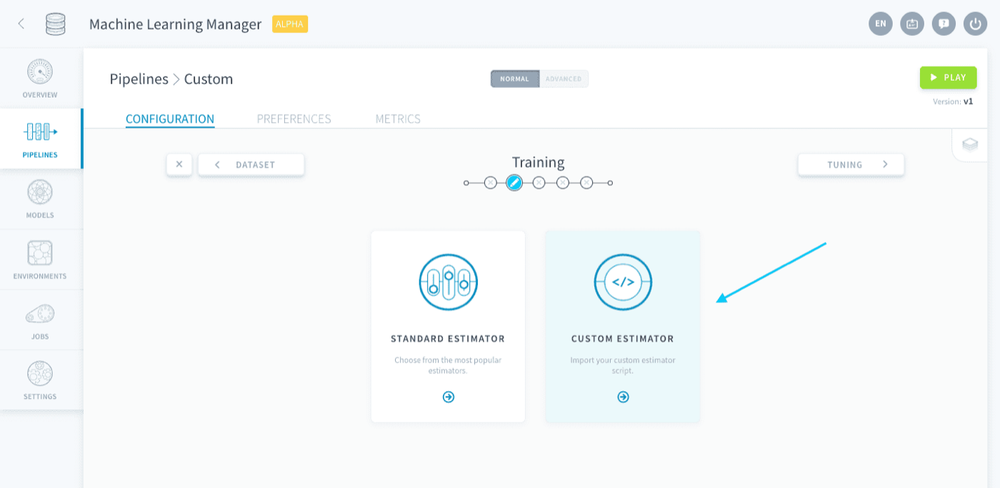
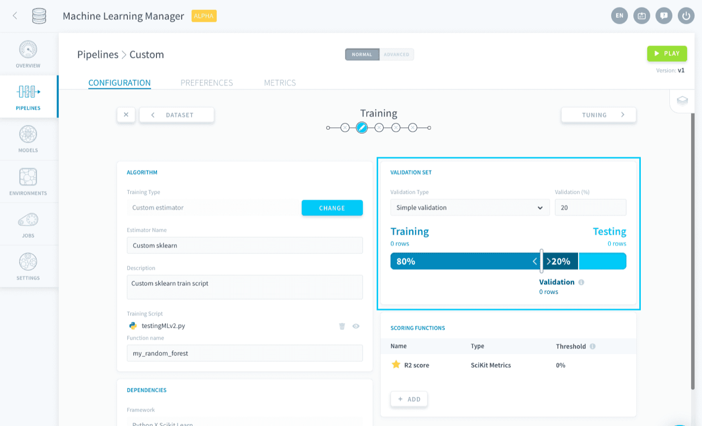
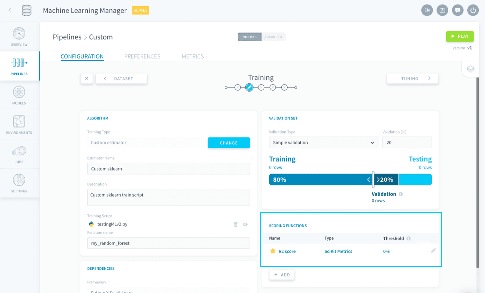
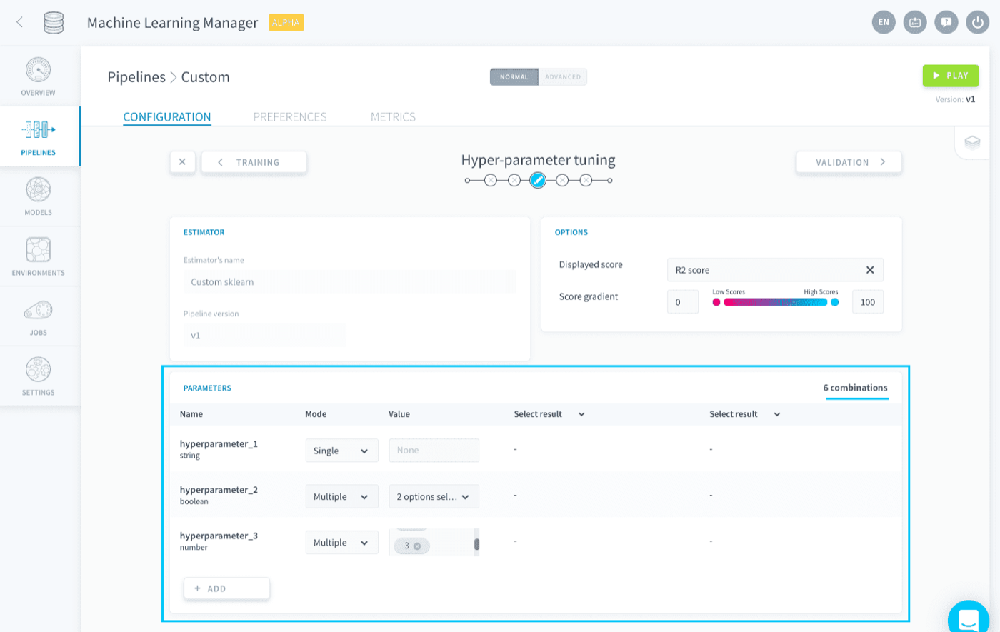

## Objective

If you cannot find what you want among the standard estimators, or if you already have a training script on hand, ForePaaS allows you to upload your own estimator to be fitted on your pipeline's data. This can be done either by opening the Training configuration page for the first time, or by [changing the algorithm](/pages/public_cloud/data_platform/product/ml/pipelines/configure/training/standard-estimator#change-your-pipeline39s-estimator) if there is already one.

{.thumbnail}

It is necessary to choose a framework for your pipeline. ForePaaS currently supports the following frameworks, details of which can be found on their respective pages:

* [Scikit Learn](/pages/public_cloud/data_platform/product/ml/pipelines/configure/training/custom-estimator/custom-scikit-learn)
* [Keras](/pages/public_cloud/data_platform/product/ml/pipelines/configure/training/custom-estimator/custom-keras)
* [PyTorch](/pages/public_cloud/data_platform/product/ml/pipelines/configure/training/custom-estimator/custom-pytorch)

## Common features from SDK

Some features provided by the Machine Learning Manager have a common behavior for any custom estimator written in Python, and require you to **input additional elements of code in your training script**. The following configurations can be integrated:

* [Use a validation configuration from the Training step](/pages/public_cloud/data_platform/product/ml/pipelines/configure/training/custom-estimator/00-custom-estimator-index#use-a-validation-configuration)
* [Use a validation score function from the Training step](/pages/public_cloud/data_platform/product/ml/pipelines/configure/training/custom-estimator/00-custom-estimator-index#use-a-validation-score-function)
* [Use hyper-parameters specified in the Tuning step](/pages/public_cloud/data_platform/product/ml/pipelines/configure/training/custom-estimator/00-custom-estimator-index#use-hyper-parameters)

### Use a validation configuration

You can connect the [validation settings](/pages/public_cloud/data_platform/product/ml/pipelines/configure/training/validation) configured during the Training step.

{.thumbnail}

If using simple validation, you can get the share allocated to the validation set by including:

```py
from forepaas.core.settings import ML_CONFIG

# Get ratio of the % size of the validation set
ratio = ML_CONFIG["train"]["ratio"]
```

If using cross-validation, you can get the number of folds chosen by including:

```py
from forepaas.core.settings import ML_CONFIG

# Get cv as either the number of folds, or False if cross-validation is turned off.
cv = ML_CONFIG["train"]["execution_options"]["cross_validation"]
```

An example for Scikit Learn can be found [here](/pages/public_cloud/data_platform/product/ml/pipelines/configure/training/custom-estimator/custom-scikit-learn#sample-code).

### Use a validation score function
You can connect the [scoring functions](/pages/public_cloud/data_platform/product/ml/pipelines/configure/training/validation) added during the Training step in order to use them for the validation score.

{.thumbnail}

You can get the default scoring function and turn it into an sklearn scorer by including:

```py
from forepaas.ml import get_train_scoring_function
from sklearn.metrics import make_scorer

scoring_function = get_train_scoring_function()
```
An example for Scikit Learn can be found [here](/pages/public_cloud/data_platform/product/ml/pipelines/configure/training/custom-estimator/custom-scikit-learn#sample-code).

### Use hyper-parameters
You can connect the [hyper-parameter list](/pages/public_cloud/data_platform/product/ml/pipelines/configure/tuning) specified in the Tuning step.

{.thumbnail}

To get the dictionary of hyper-parameters and their lists of values, include:

```py
from forepaas.ml import get_hyper_parameters

hyper_parameters = get_hyper_parameters()
```

An example for Scikit Learn can be found [here](/pages/public_cloud/data_platform/product/ml/pipelines/configure/training/custom-estimator/custom-scikit-learn#sample-code).

[Import a custom Scikit Learn script](/pages/public_cloud/data_platform/product/ml/pipelines/configure/training/custom-estimator/custom-scikit-learn)
[Import a custom Keras script](/pages/public_cloud/data_platform/product/ml/pipelines/configure/training/custom-estimator/custom-keras)

## Go further

Join our [community of users](/links/community).