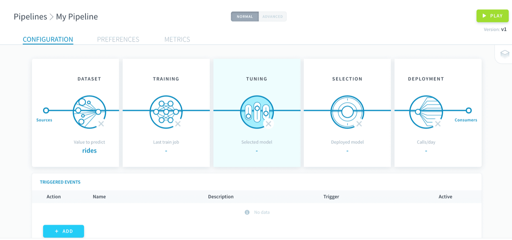
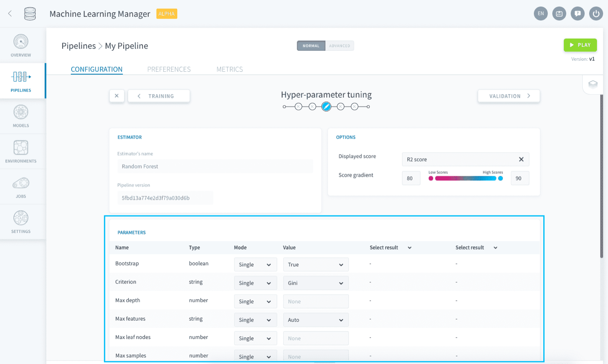
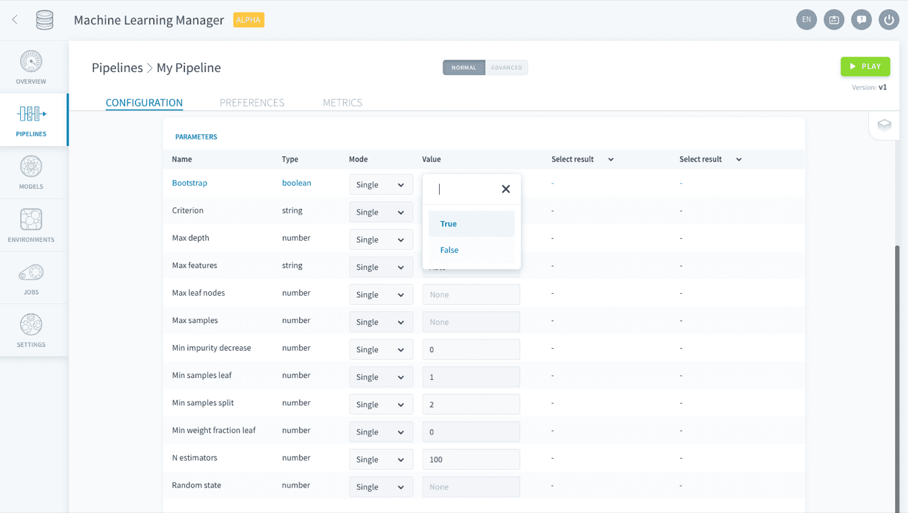
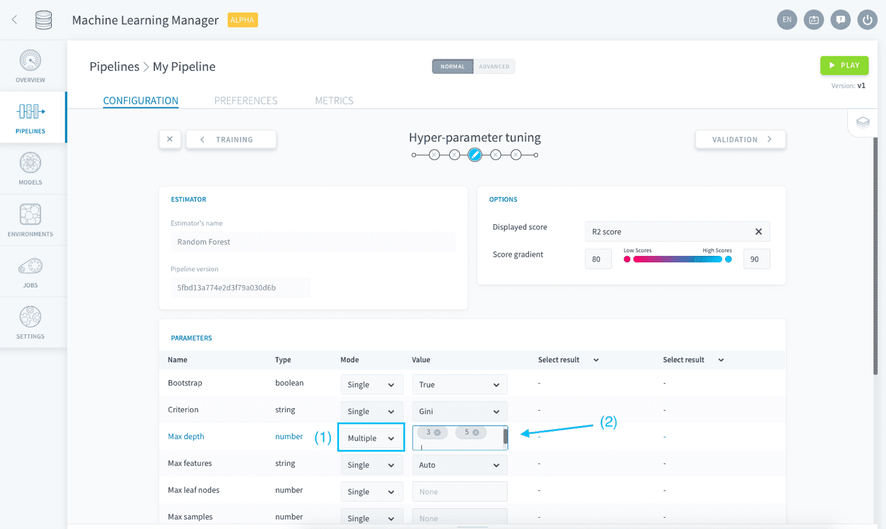

## Objective

Hyper-parameter tuning is a pipeline configuration step closely linked to the [training step](/pages/public_cloud/data_platform/product/ml/pipelines/configure/training/00-training-index) where you can fine-tune the estimator implemented in a pipeline.

{.thumbnail}

> [!primary]
> Hyper-parameters are the core variables of any machine learning estimator that are not learned using the training data. They have to be hard-coded while configuring a model and are needed for the training jobs.

## Set specific hyper-parameter values

The tuning studio lists all the hyper-parameters associated to the estimator chosen during the [training configuration](/pages/public_cloud/data_platform/product/ml/pipelines/configure/training/00-training-index). 

{.thumbnail}

Each of them has a default value already entered. To modify the value set for a specific hyper-parameter, edit it in the *Value* column. 

{.thumbnail}

When your pipeline [is executed](/pages/public_cloud/data_platform/product/ml/pipelines/execute/00-execute-index), training jobs will use the resulting hyper-parameter configuration for the ML estimator. The scoring function used for the validation method can be set in the Visual Options panel.

{.thumbnail}

## Explore different values

If you don't know how to configure it, ForePaaS also lets you explore the impact of different hyper-parameters values on the score of the resulting model in the studio.

Select the *Multiple* value for the **Mode** column and enter all the values that you want to explore for any hyper-parameter. 

{.thumbnail}

This will create a grid of combinations that will all be trained and scored (using the function specified in the Visual Options panel) on the validation set every time the pipeline [is executed](/pages/public_cloud/data_platform/product/ml/pipelines/execute/00-execute-index#Training_jobs). 

> [!warning]
> Exploring a grid of hyper-parameters can quickly be **very time and resource-consuming** since all generated model combinations need to be trained and evaluated - especially when you have [cross-validation](/pages/public_cloud/data_platform/product/ml/pipelines/configure/training/validation) activated.

{.thumbnail}

When a pipeline [is executed](/pages/public_cloud/data_platform/product/ml/pipelines/execute/00-execute-index#Training-jobs) with multiple hyper-parameter combinations, while all resulting validation scores are displayed in the studio **only the model with the highest validation score is saved for deployment**. This saved model will then be listed in the [model selection step](/pages/public_cloud/data_platform/product/ml/pipelines/configure/validation/00-validation-index).

[Select a model to deploy](/pages/public_cloud/data_platform/product/ml/pipelines/configure/validation/00-validation-index)

## Go further

Join our [community of users](/links/community).