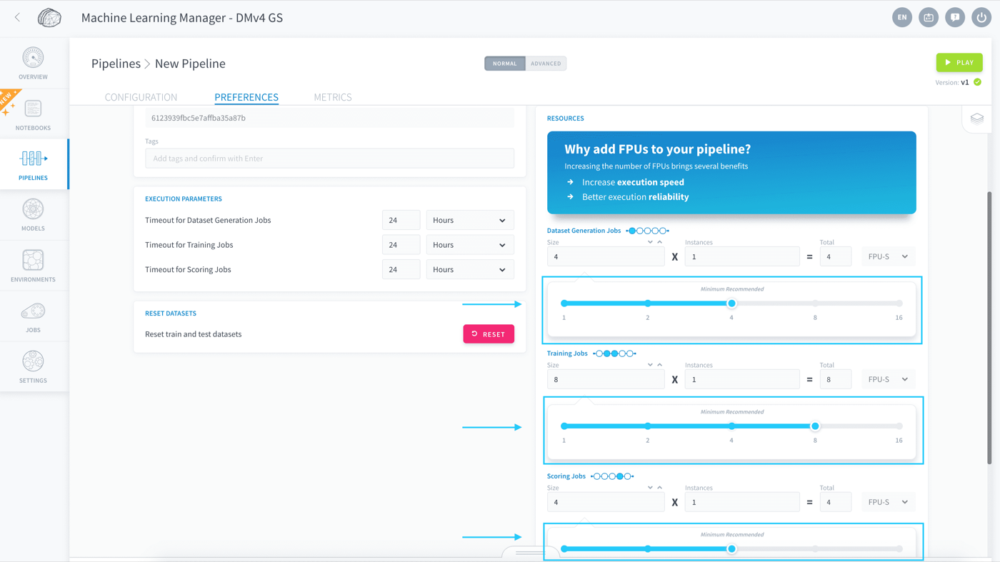
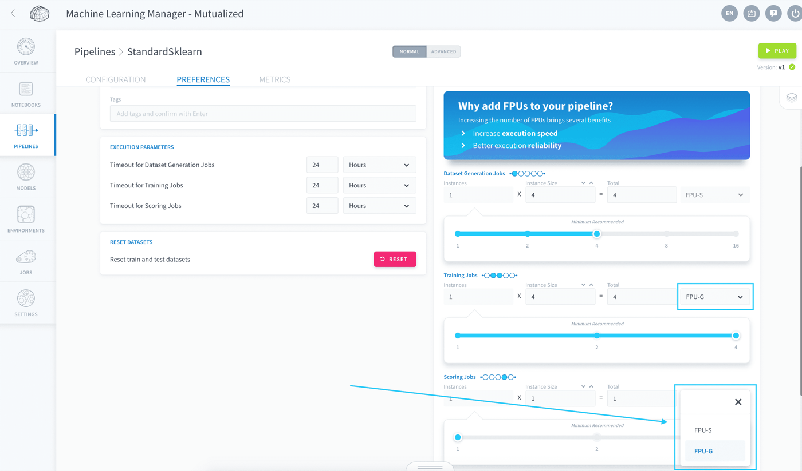

## Objective

The ForePaaS Platform is designed to scale easily as the requirements of your data Project evolve. 

In the Machine Learning Manager, each individual pipeline can be **scaled vertically**, meaning you can add more computing power to each job indefinitely. *Dataset generation* jobs can also be **scaled horizontally**, by splitting the workload on multiple parallel instances. 

> [!primary]
> For the moment, it is not possible to scale *training*/*testing* jobs horizontally, i.e. to do distributed training. Our engineering team is working hard to implement this feature soon. If you have a particular need for this, please drop us a note on our [roadmap portal](https://hq.forepaas.io/#/features)!

* [Scale your jobs vertically](/pages/public_cloud/data_platform/product/ml/pipelines/execute/resources#scale-your-jobs-vertically)
* [Use GPU for your processing](/pages/public_cloud/data_platform/product/ml/pipelines/execute/resources#use-gpu-for-your-processing)

## Scale your jobs vertically

You can allocate **more computing power** to each kind of [machine learning jobs](/pages/public_cloud/data_platform/product/ml/pipelines/execute/00-execute-index#pipeline-jobs) independently in the Resources panel of the Preferences tab, by increasing the number of ForePaaS Units (FPU) of each computing instance. The FPU is a unit of processing capability, representing access to a certain amount of CPU and memory, as such:

* **FPU-S**: general processing - corresponds to approximately *0.5 CPU* and *2 GB of RAM*, based on hardware availability. 
* **FPU-G**: GPU-accelerated - represents approximately *1 GPU* with at least *5 vCPU* and *40 GB of RAM*, based on hardware availability.

> [!primary]
> By default, newly created pipelines are allocated 4 FPU-S for each type of job.

To change the amount of FPU allocated to a pipeline job, go to its **Preferences** tab. 

{.thumbnail}

Use the corresponding slider to set the desired FPU size allocated for the execution. 

{.thumbnail}

## Use GPU for your processing

You can configure your pipeline to use graphics processing units (GPU) when they are executed in order to accelerate the machine learning and data processing scripts by a lot. To do this, change the allocated resource type to *FPU-G* in the pipeline's **preferences**.

{.thumbnail}

> [!primary]
> Note that jobs using FPU-G will usually have a longer build phase, up to a few minutes.

Currently, FPU-G are available for [training](/pages/public_cloud/data_platform/product/ml/pipelines/execute/00-execute-index#training-jobs) and [testing](/pages/public_cloud/data_platform/product/ml/pipelines/execute/00-execute-index#testing-jobs) jobs.

> [!primary]
> FPU-G are not available on all cloud providers at the moment. If you are unable to find them in your Machine Learning Manager, please reach out to the support team to get more information on the roadmap.

## Go further

Join our [community of users](/links/community).