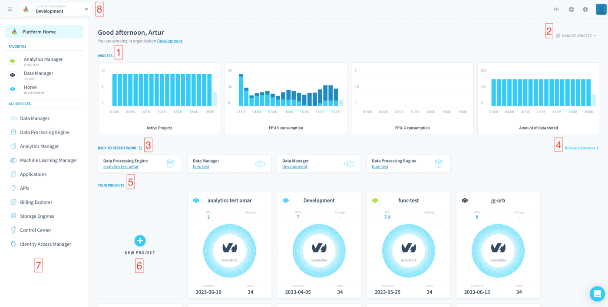
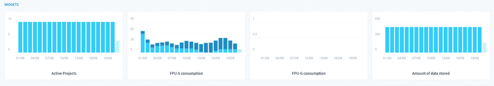
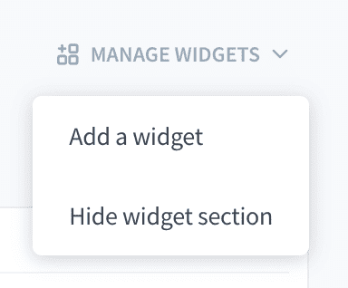
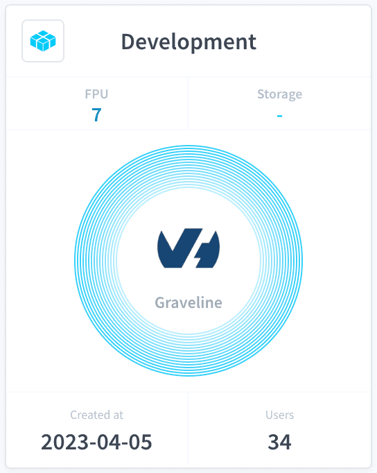
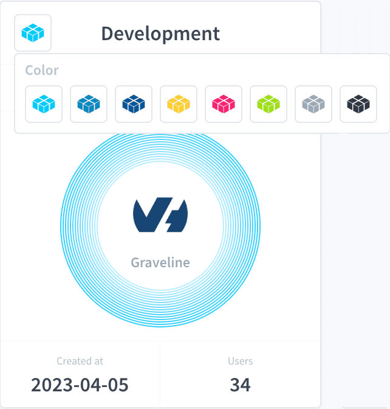
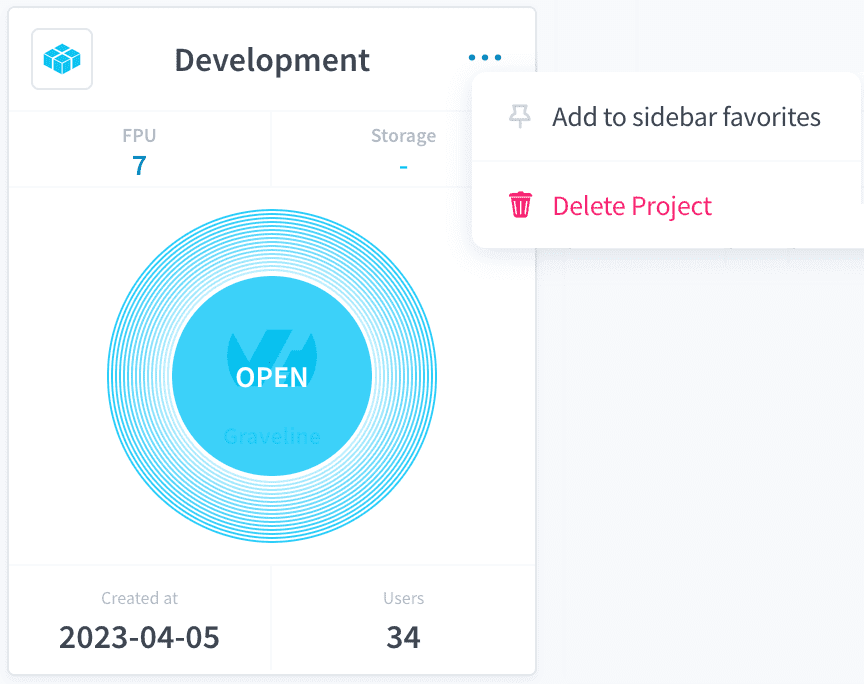

## Objective

As long as you are part of an Organisation that has Projects, everytime you log-in to the Platform you will be welcomed into the platform at the Homepage (shown below).

This page is the central hub that shows all the your Projects within an organisation and allows you to easily navigate to any service in the platform. 

{.thumbnail}

> [!primary]
> The Homepage is specific to a single organisation and if you are a part of multiple organisations, you will have one homepage per organisation. You can swap organisations in the [Header](/pages/public_cloud/data_platform/product/navigation/header) and upon logging-in you will arrive at the homepage of the last organisation you accessed.

1. [Widgets](#widgets)
2. [Manage Widgets](#manage-widgets)
3. [Back to recent work](#back-to-recent-work)
4. [Browse all services](#browse-all-services)
5. [Your Projects list](#your-Projects-list)
   - [Change a Project's icon](#change-a-Projects-icon)
   - [Add Project Homepage to the Sidebar's favorites](#add-Project-homepage-to-the-sidebars-favorites)
   - [Delete a Project](#delete-a-Project)
6. [New Project button](#new-Project-button)
7. [Sidebar](#sidebar)
8. [Header](#header)

## Widgets

{.thumbnail}

Widgets are snippets of data about your organisation and Projects shown to you here so you can be sure to catch critical information such as compute and storage consumption without having to look for it. They are **specific to your user account** and not your organisation so any change you make to your widgets will not affect your teammates' widgets.

### Manage Widgets

{.thumbnail}

Via the *Manage Widgets* menu you can add new wigets or hide the widget section entirely if you do not wish to see them.

## Back to recent work
Services that you accessed recently appear in this section along with their preoject. The list is updated everytime you access a new service.

[Learn more about Projects and Services](/pages/public_cloud/data_platform/product/project/00-project-index)

## Browse all services

Clicking in this link will redirect you to the **All Services** page which details the entirety of Platforms' service portfolio and what each service can do for you.

## Your Projects list

All Projects of the organisation that you have access to will be displayed here in the for of a Project Card :

{.thumbnail}

Each card contains:

- Project name
- Project icon
- DPU consumption
- Amount of data stored
- Cloud provider icon and deployment site name
- Creation date
- Number of users with access to the Project

### Change a Project's icon

The Project icon can be changed by clicking on it which will display the options:

{.thumbnail}

> [!primary]
> Bear in mind that changing the icon will **change it for all other user** as well, not only for you.

### Add Project Homepage to the Sidebar's favorites

By clicking on the top-right corner menu that appears upon hovering you over the card, you can add your [Project Homepage](/pages/public_cloud/data_platform/product/project/project_home) to the [Sidebar's Favorites section](/pages/public_cloud/data_platform/product/navigation/sidebar).

{.thumbnail}

### Delete a Project

By clicking on the top-right corner menu that appears upon hovering you over the card, you can also [delete your Project](/pages/public_cloud/data_platform/product/project/delete_project).

## New Project button

You can also easily create a Project from the Organisation Button by clicking on this button which will open the [Project Creation page](/pages/public_cloud/data_platform/product/project/project_creation).

## Sidebar

The [Navigation Sidebar](/pages/public_cloud/data_platform/product/navigation/sidebar) is accessible from all platform pages and opens by default whenever you open the Homepage. It is particularly useful to quickly navigate to a service you need or to access your favorites

[Learn more about the Sidebar](/pages/public_cloud/data_platform/product/navigation/sidebar)

## Header

With the [Navigation Header](/pages/public_cloud/data_platform/product/navigation/header) you can change organisations and move to another Organisation's Homepage.

[Learn more about the Header](/pages/public_cloud/data_platform/product/navigation/header)

## Go further

Join our [community of users](/links/community).