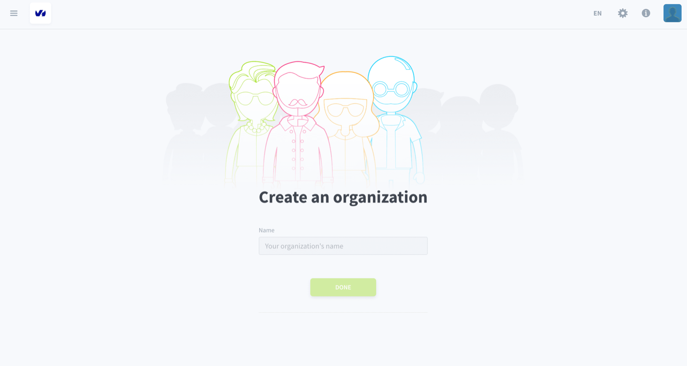
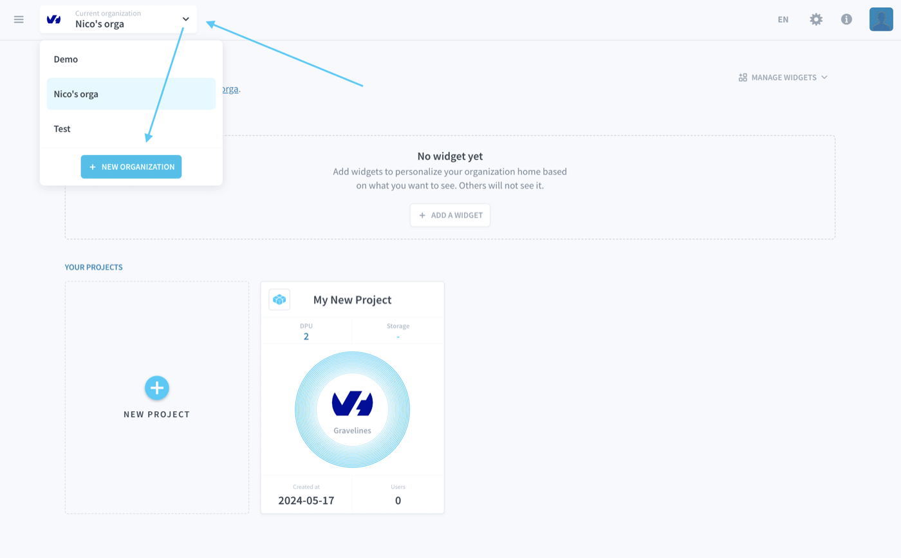

## Objective

Organizations are the compartmentalized teams that link individual users (or members) and [Projects](/pages/public_cloud/data_platform/product/project/00-project-index) as well as their services together. You can have as many teammates in your organization as you want and everyone in the organization must have [user profile](/pages/public_cloud/data_platform/product/organisations/profile) to use the platform.

Your organization can work on multiple [Projects](/pages/public_cloud/data_platform/product/project/00-project-index) at the same time and you can create as many as you want.

> [!primary]
> To create or join an organization, make sure that you already have a [User Profile](/pages/public_cloud/data_platform/product/organisations/profile).

## Create an organization

### If you are not in an organization

If you are not part of an organization already, you will be able to create a new one:

{.thumbnail}

### If you are already in an organization

If you are already in an organization, click on the drop-down menu located at the top left and then on **New organization**.

{.thumbnail}

Fill in the name and press **Done**. 

## Join an existing organization

To join an organization that already exists (if your team already has one, for example), you need to ask someone already on there to invite you.

You will receive an email with a clickable link inviting you to join their organization.

## Manage your organization settings

You can manage your organization by opening the drop-down menu at the top right and by clicking on **Manage organization settings**.

{.thumbnail}

From there, you will be able to configure:

- Your Projects
- Your storage engines
- Your billing settings
- Other parameters: Name, description, SSL certificates, domain names, etc.

[Learn how to configure an organization](/pages/public_cloud/data_platform/product/organisations/orga_settings)

## Go further

Join our [community of users](/links/community).