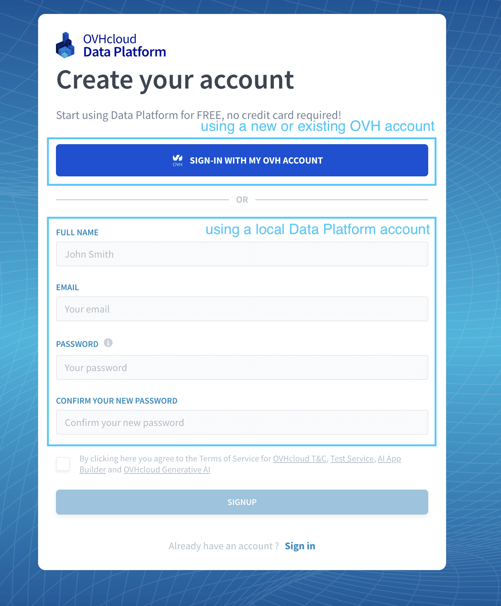
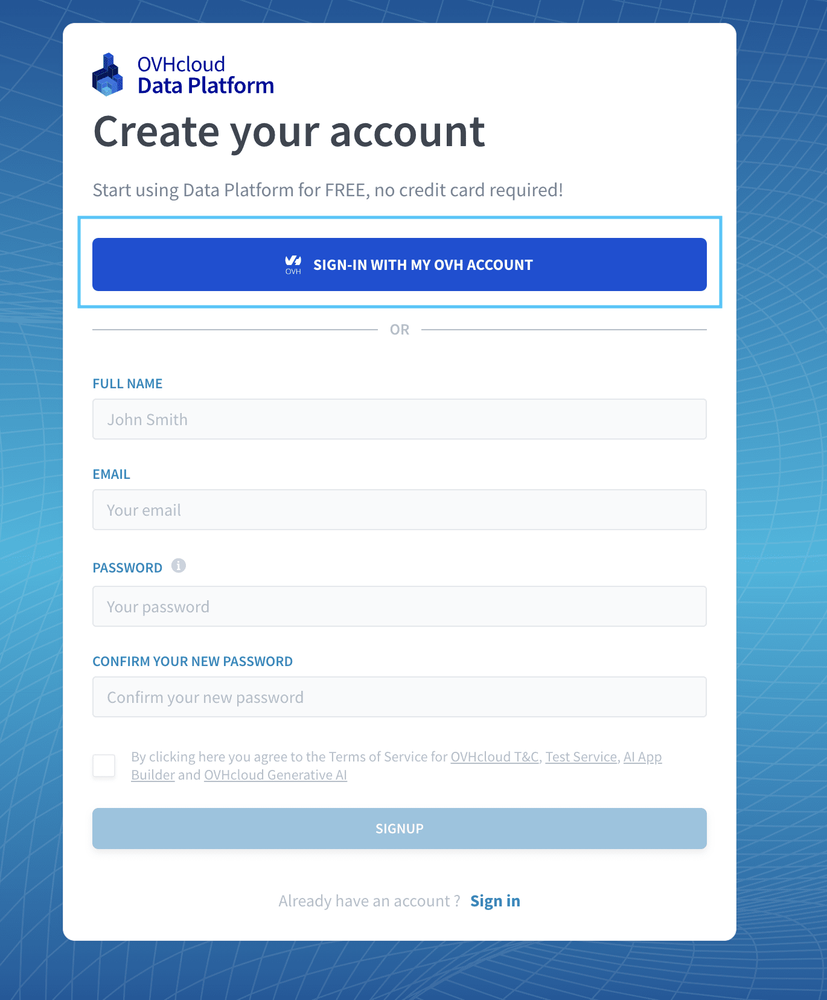
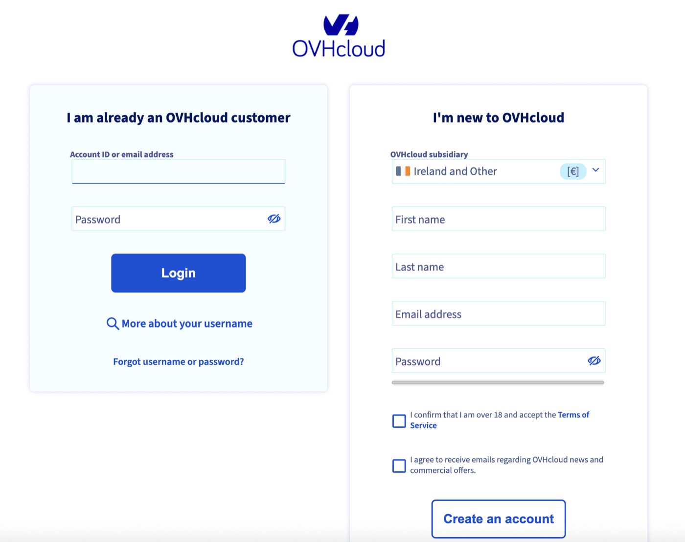
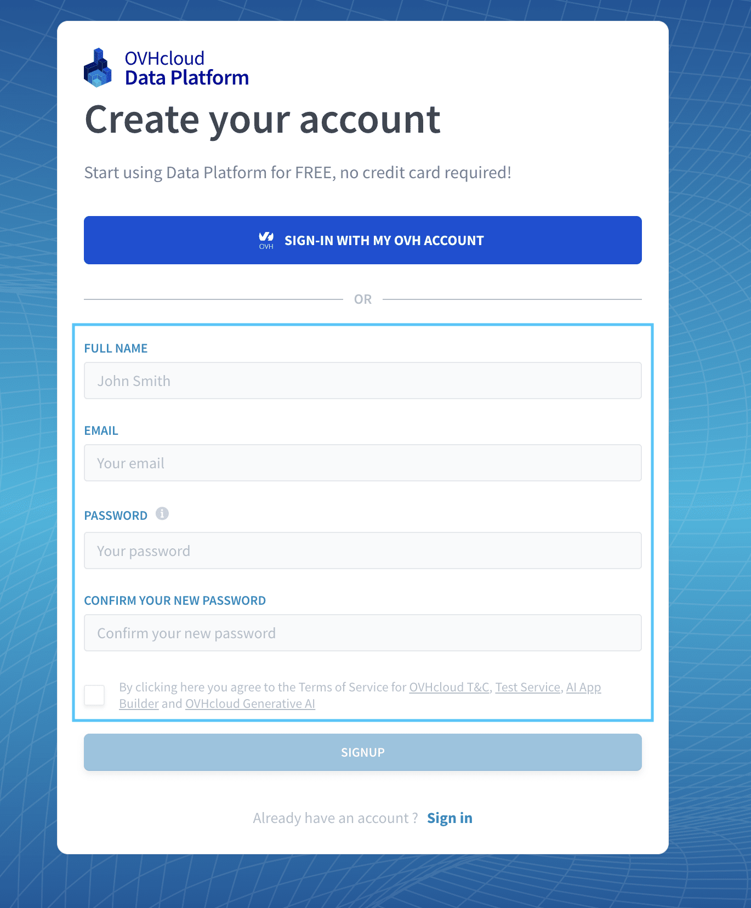

## Objective

> [!warning]
> ForePaaS Legacy Platform no longer accepts new signups. If your company would like to get started on the platform, please use [OVHcloud Data Platform](https://eu.dataplatform.ovh.net/). 

Connecting to OVHcloud Data Platform can be done in either one of two ways:

- connecting by using an OVHcloud account
- connecting by using a local Data Platform account (invitation required)

{.thumbnail}

## Signup using an OVHcloud account

> [!primary]
> This is the recommended method to connect to Data Platform.

You can connect to Data Platform using an OVHcloud account by pressing the blue button on the signup/signin page. 

{.thumbnail}

You will then have the option to either use an existing account or to create a new one there.

{.thumbnail}

## Signup using an local Data Platform account

> [!warning]
> To use this option, it is **required to [have been invited](/pages/public_cloud/data_platform/product/iam/users/users#manage-organization-iam-users) in an existing Data Platform Organization** by an admin from your company beforehand. Consequently, at least one person in your organization needs to have signed up [using an OVHcloud account](/pages/public_cloud/data_platform/product/organisations/create-account#signup-using-an-ovhcloud-account).

If you are joining people from your organization that are already signed-up on the platform, you can fill out the form to signup to the platform using a email & password combination.

{.thumbnail}

> [!warning]
> To use this option, it is **required to [have been invited](/pages/public_cloud/data_platform/product/iam/users/users#manage-organization-iam-users) in an existing Data Platform Organization** by an admin from your company beforehand. Consequently, at least one person in your organization needs to have signed up [using an OVHcloud account](/pages/public_cloud/data_platform/product/organisations/create-account#signup-using-an-ovhcloud-account).

## Go further

Join our [community of users](/links/community).