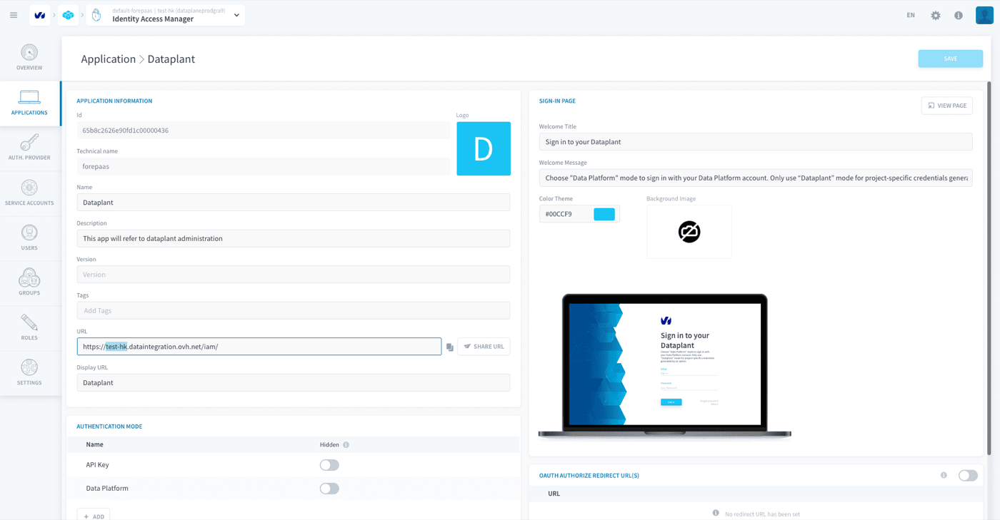

## Objective

Some configuration variables for your project are presented on this page.

## Project subdomain

Your project's subdomain is used in the base URL for the APIs of all services of the platform. It is the **stringified version of your project's name**.

You can find it in [Identity Access Manager](/pages/public_cloud/data_platform/product/iam/00-iam-index) **> Applications > Dataplant**, at the base of the field *URL*.

{.thumbnail}

## Go further

Join our [community of users](/links/community).