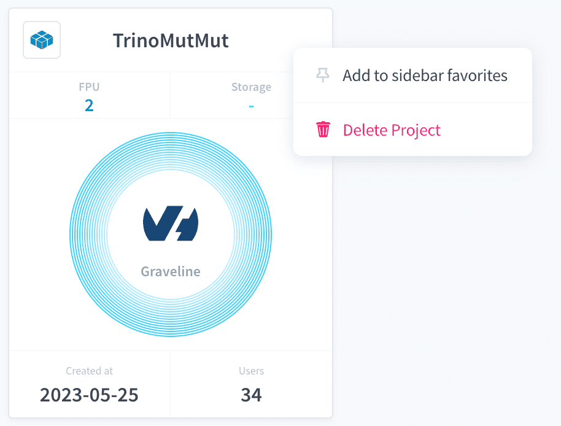
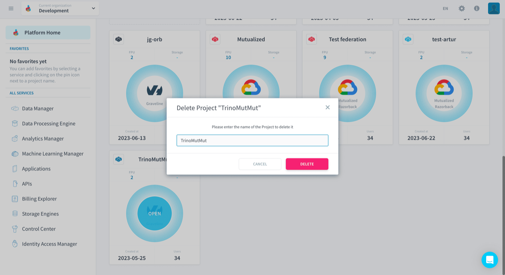
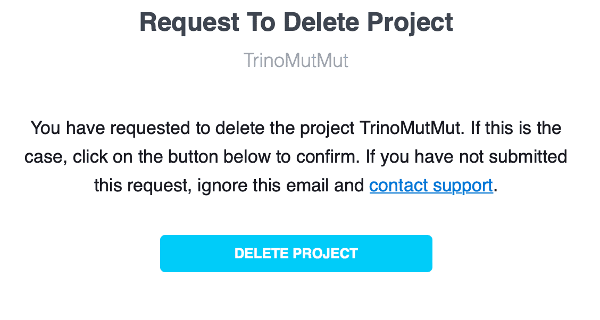

## Objective

> [!primary]
> You must have **project permission** `delete` in order to delete projects. These permissions are set at user level in your organization settings.

Deleting a Project **completely and permanently erases its data**. Use only when necessary!

If you are sure about deleting a Project, it can be done in 3 steps:

- [Choose the Project to delete](#choose-the-Project-to-delete)
- [Confirm decision by typing Project name](#confirm-decision-by-typing-Project-name)
- [Click on link on email received](#click-on-link-on-email-received)

## Choose the Project to delete

You can delete a Project via the [Project Card menu](/pages/public_cloud/data_platform/product/navigation/homepage#your-Projects-list) in the [Homepage](/pages/public_cloud/data_platform/product/navigation/homepage).

{.thumbnail}

## Confirm decision by typing Project name

After you click on *Delete Project* you will be prompted to confirm your decision by typong your Project name.

{.thumbnail}

## Click on link on email received

You will receive an email with a link to confirm the deletion of your Project. Just click on the confirmation link to delete the Project.

{.thumbnail}

## Go further

Join our [community of users](/links/community).