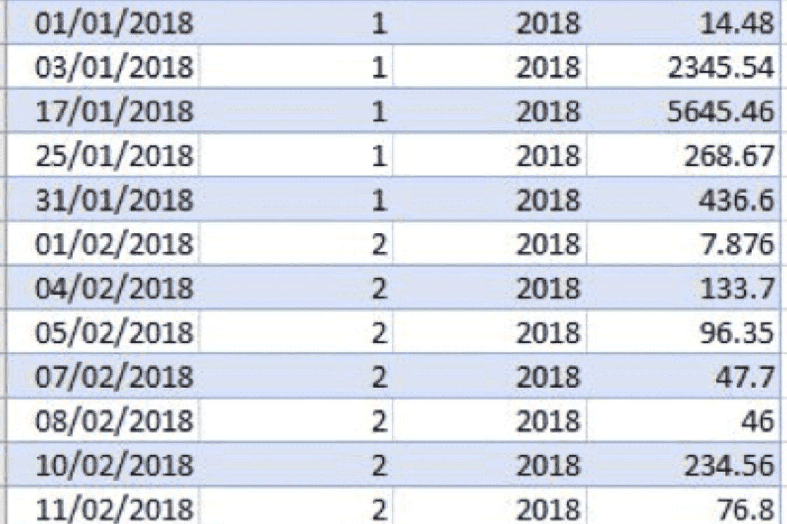

## Objective

The ForePaaS JSON query format uses multiple parameters as input and output to describe a query and its results.

The following articles document each individual query parameters, and illustrate their impact using a simple example of the revenue of a company. The available dataset is given as follows:

{.thumbnail}

[Reference: 'data' parameter](/pages/public_cloud/data_platform/technical/api-reference/qb/json-format/data-query)
[Reference: 'scale' parameter](/pages/public_cloud/data_platform/technical/api-reference/qb/json-format/scale)
[Reference: 'filter' parameter](/pages/public_cloud/data_platform/technical/api-reference/qb/json-format/filter)
[Reference: 'other' parameters](/pages/public_cloud/data_platform/technical/api-reference/qb/json-format/others)

## Complete reference of parameters

The JSON configuration for a query takes in the following parameters.
      
| Parameter name | required | example | description |
| --- | --- | --- | --- |
| data.fields | yes | { &quot;income&quot;:[&quot;sum&quot;],&quot;expense&quot;:[&quot;sum&quot;]} | Fields to return and their compute mode(s) (can be: select, select\_distinct, sum, min, max, avg, count, count\_distinct)          |
| data.skip | no | 10 | Number of rows to skip |
| data.limit | no | 100 | Number of rows returned |
| data.hints | no | true/false | Total number of lines corresponding to the query (omitting data.limit) |
| filter | no | {  &quot;date&quot;: {          &quot;between&quot;: [&quot;1420066800,1428962399&quot;]  },  &quot;client\_code&quot;: {          &quot;in&quot;: [&quot;08KD&quot;, &quot;09CC&quot;]  },  &quot;creation\_date&quot;: {          &quot;eq&quot;: [&quot;2018-01-01&quot;]  }}  | Apply filter(s) on the data to query. Filters can be: in, not\_in, between, not\_between, eq, not\_equal, like, not\_like, is\_null, is\_not\_null, gt (\&gt;), gte (\&gt;=), lt (\&lt;), lte (\&lt;=) |
| scale.fields | no | [&quot;date&quot;,[&quot;client\_code&quot;, &quot;employee\_id&quot;]] | Apply scale (group by) to the query. It can be a computed scale, or more than 1 scale. |
| evol.scale | no | &quot;year&quot; | scale to apply for evolution (weekday;week; month; quarter; semester; year) |
| evol.mode | no | &quot;date&quot;&quot;weekday&quot; | date : comparison with same dateweekday : comparison with respecting the same weekday. |
| evol.depth | no | 5 | How much evolutions you want to get back |
| total.all | no | [][&quot;client\_code&quot;] | total queries per distinct scales (optional) |
| total.x | no | [&quot;client\_code&quot;] | Total queries for a specific attribute |
| order | no | {   &quot;date&quot;:&quot;asc&quot;} | order query output (asc or desc, asc by default) |
| table\_name | no | &quot;prim\_vehicles&quot; | Force to query in a specific table |
| database\_name | no | &quot;data\_prim&quot;&quot;data\_mart&quot; | Force to query in a specific layer |

## Go further

Join our [community of users](/links/community).