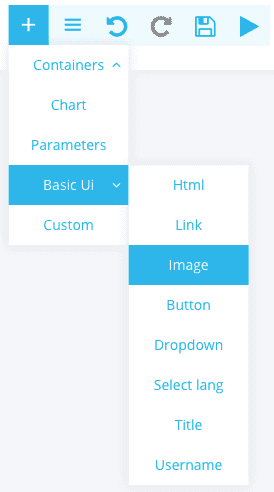
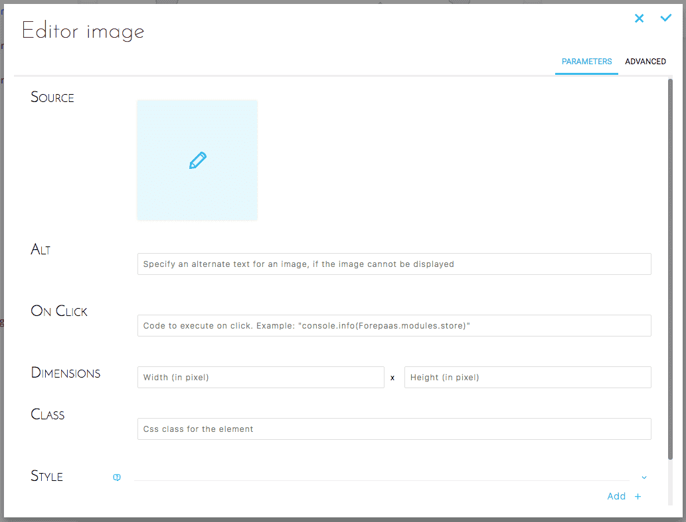
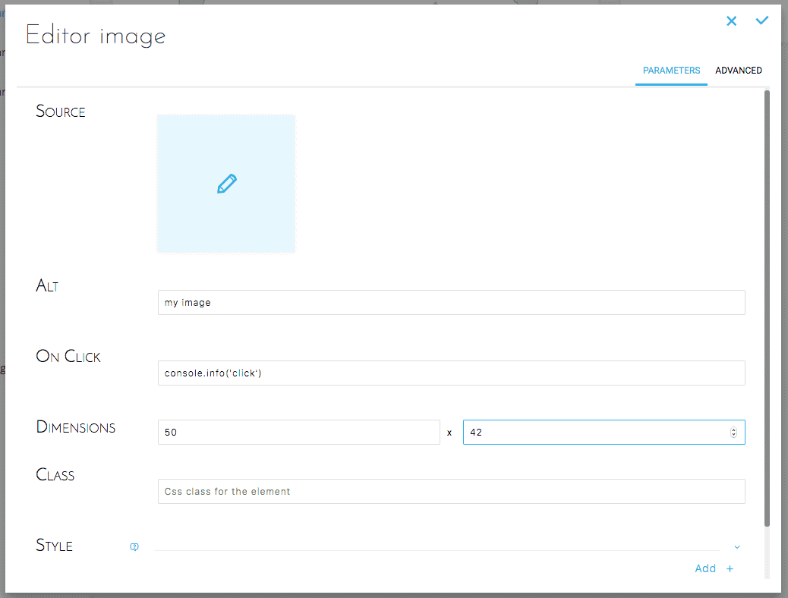
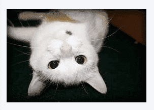

## Objective

Allows you to add an image to your dashboard.

## Add Image

Select Basic UI -> Image.

{.thumbnail}

## Configure Image

### Simple configuration

This configuration allows you to configure the image in a simple and intuitive way.

{.thumbnail}

{.thumbnail}

### Advanced configuration

Below is the equivalent JSON configuration :

```json
{
  "type": "image",
  "style": {},
  "alt": "my image",
  "onClick": "console.info('click')",
  "width": "50",
  "height": "42"
}
```

## Result

{.thumbnail}

## Go further

Join our [community of users](/links/community).