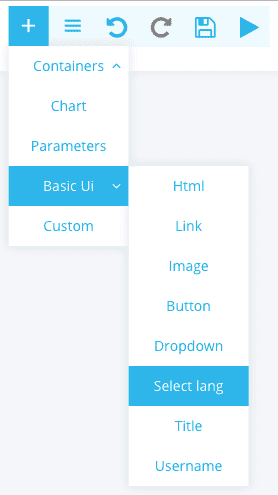
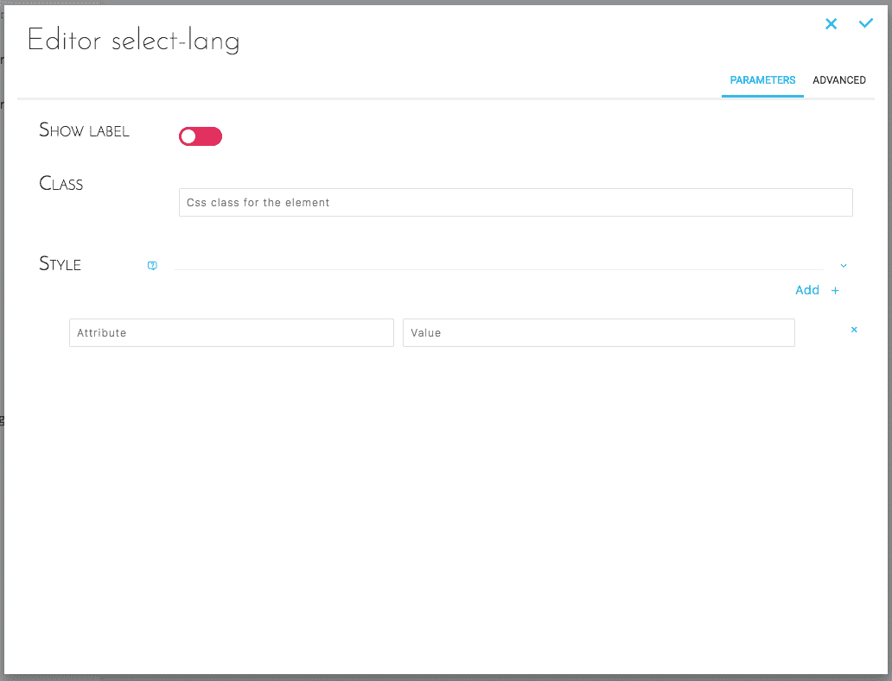
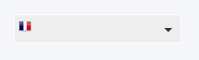

## Objective

Allows you to add a language selector for your dashboard.  
Available languages are defined in `./config/global.json` [at the key `i18n`](/pages/public_cloud/data_platform/getting-further/app-dev/configuration#global-configuration-file-globaljson).

## Add Select Lang

Select Basic UI -> Select lang.

{.thumbnail}

## Configure Select Lang

### Simplified configuration

This configuration allows you to configure the selector in a simple and intuitive way.

{.thumbnail}

### Advanced configuration

Below is the JSON configuration for **Select Lang** as created above :

```json
{
  "type": "select-lang",
  "style": {},
  "showLabel": false
}
```

## Result

{.thumbnail}

## Go further

Join our [community of users](/links/community).