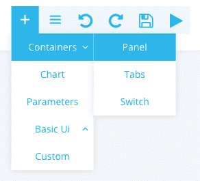
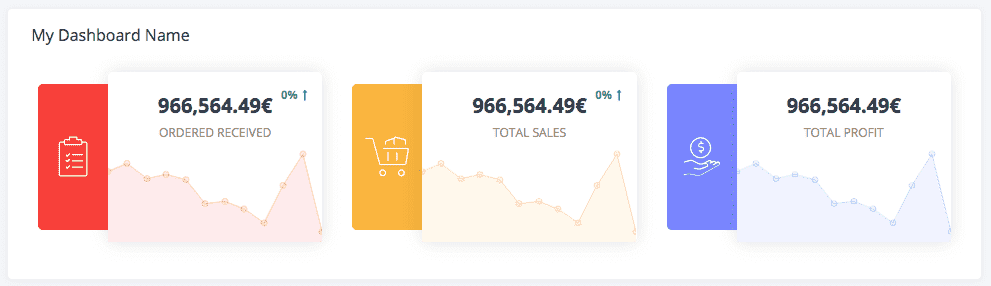

## Objective

Panels delimit an area on your application where you can group a title, graphics, etc. together. They should be used in order to bring clarity to an application.

## Add a Panel

Select Container -> Panel.

{.thumbnail}

In the following example, the panel (here the white background frame) contains all the graphs related to the sales of the company.

{.thumbnail}

## Go further

Join our [community of users](/links/community).