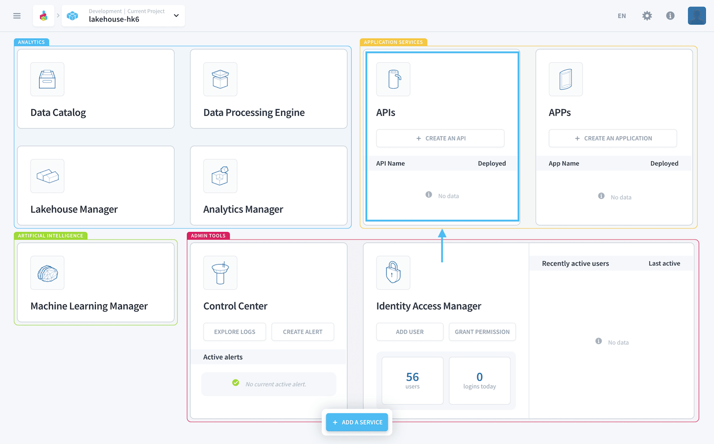
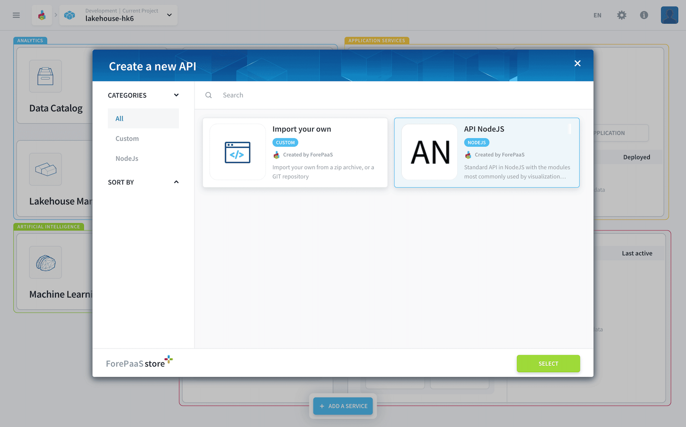
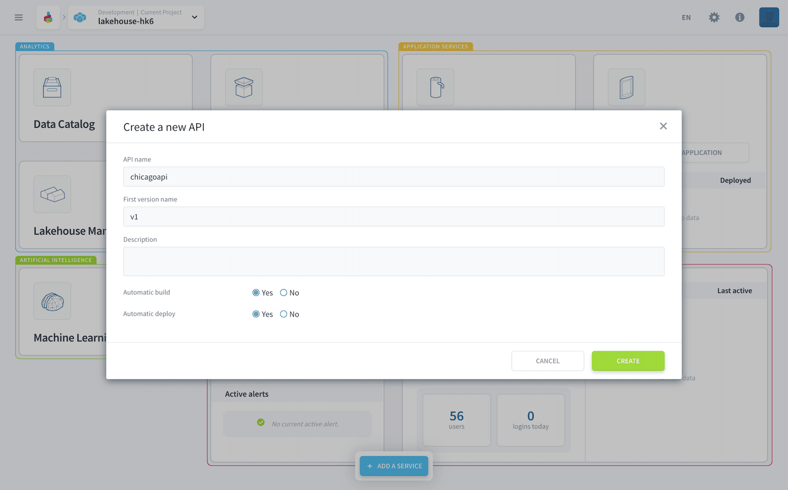
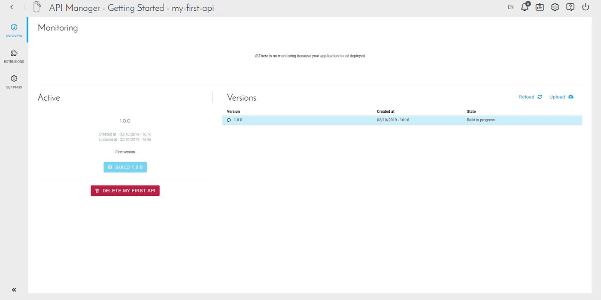
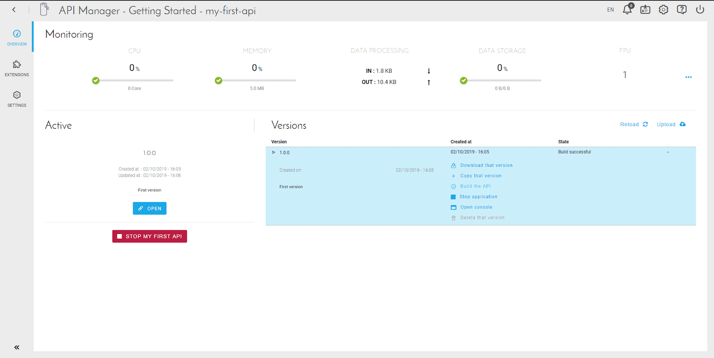
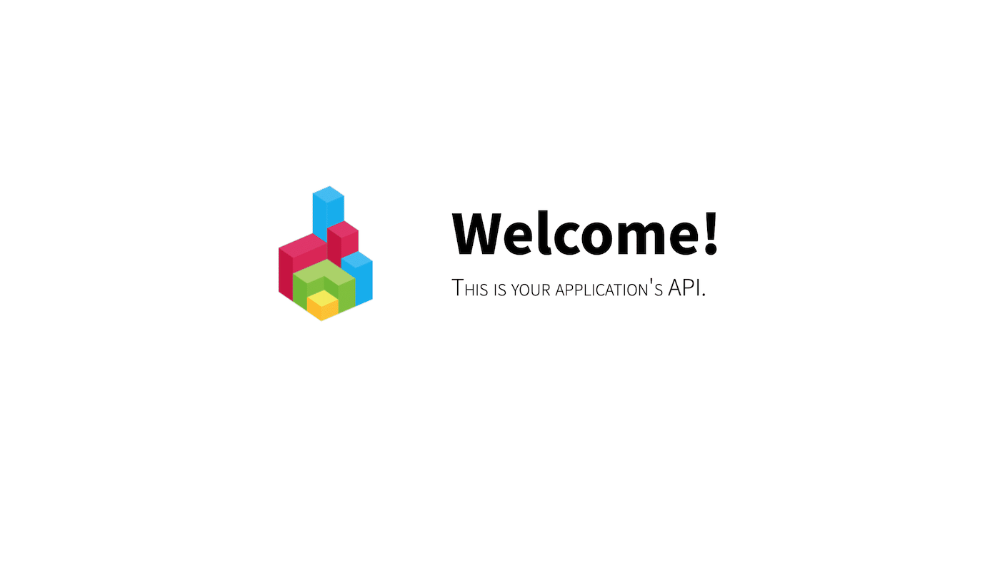

## Deploy your first API

An API is crucial as it is the interface between the external world (namely your applications) and the rest of your Project (i.e. your Data Manager and queries). You will have to call this API when building your application, in the next and final tutorial.

### Create a new API

From your Project's home page, click on **+** inside the API module.

You will be able to choose between **an existing API template** from the internal *Data Platform Store*, or to **import your own code** by linking a Git repository.

Since you're just starting, we've made a simple NodeJS template just for you. Proceed by selecting the only template available: *API NodeJS*.

Choose a name for your API, and enable the option **auto build** & **auto deploy**. This will download the source code of your API, automatically build it and deploy it for you.

From there, give it a couple of seconds as the creation of the API may take a moment.

When the deployment is complete, the **Open** button appears.

When you open your API, you will land on the screen below confirming that your API is alive & healthy. It's that easy!

The next and final step will consist of creating and deploying your first application on Data Platform in under 5 minutes.

<ul class="prevnext">
    <li>
        <h4>Make queries in the Analytics Manager</h4>
        
    </li>
    <li>
        <h4>Visualize it on the APP Manager</h4>
        
    </li>
</ul>